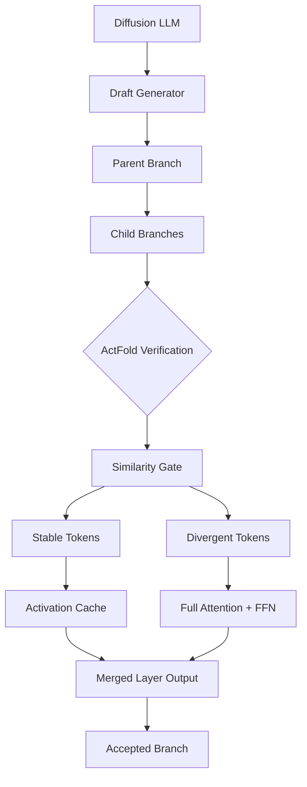

# ActFold: Cross-Branch Activation Reuse & Branch Folding

[](https://www.python.org/downloads/)
[](https://pytorch.org/)
[](LICENSE)
[](https://github.com/your-org/actfold/actions/workflows/ci.yml)

ActFold is a research framework that reduces verification-phase FLOPs in **Diffusion LLM speculative decoding** by reusing activations across candidate branches. Instead of running a full forward pass for every child branch, ActFold partitions each layer's tokens into **stable** (reuse parent activations) and **divergent** (recompute) sets, achieving **21%-62% TFLOPs reduction** with minimal accuracy loss.

---

## Table of Contents

- [Overview](#overview)
- [Architecture](#architecture)
- [Quick Start](#quick-start)
- [Project Structure](#project-structure)
- [Installation](#installation)
- [Usage](#usage)
- [Real Model Integration](#real-model-integration)
- [Benchmarks](#benchmarks)
- [Quality Assurance](#quality-assurance)
- [Ablations](#ablations)
- [Current Limitations & Roadmap](#current-limitations--roadmap)
- [Troubleshooting](#troubleshooting)
- [Citation](#citation)
- [License](#license)

---

## Overview

In Diffusion LLM speculative decoding (Fast-dLLM, Spiffy), multiple candidate branches are generated and verified independently. Despite child branches typically diverging by only a few tokens from their parent, current methods trigger a **full forward recomputation** across all Transformer layers.

Profiling on Fast-dLLM-v1 LLaDA-8B shows:

> **>80% of layer-token-step positions exhibit cosine similarity > 0.95 between parent and child hidden states.**

This massive redundancy is the target of **ActFold**.

### Key Idea

At each layer `l`, token position `t`, and diffusion step `s`:

```
sim(l, t, s) = cosine_similarity(h_parent[l, t, s], h_child[l, t, s])
```

- **Stable tokens** (`sim > τ`): reuse parent's Attention and FFN outputs.
- **Divergent tokens** (`sim ≤ τ`): perform full recomputation.

By merging the two paths, ActFold reduces verification FLOPs while keeping output numerically close to the baseline. The stable/divergent decision is made independently per layer and per token, so even branches that differ in many positions can still benefit from folding wherever the hidden states agree.

### Why It Works

In Diffusion LLM speculative decoding, child branches are drafted from a small set of proposed token changes. Because the draft is usually a local perturbation of the parent, most layer-token positions remain highly similar. ActFold exploits this by:

1. **Caching** parent-layer outputs in a per-layer LRU cache.
2. **Gating** child hidden states against parent hidden states with a similarity threshold.
3. **Reusing** cached activations for stable positions and recomputing only divergent positions with full attention context.
4. **Merging** the two paths into a single output tensor.

---

## Architecture



### Modules

| Module | Path | Purpose |
|---|---|---|
| **Models** | `actfold/models/` | Real Diffusion LLM loaders and wrappers |
| **Core Engine** | `actfold/core/` | Activation cache, similarity gate, folded Transformer layer, fused CUDA kernels, branch manager, scheduler, model wrapper |
| **Profiler** | `actfold/profiler/` | Hidden-state tracking, similarity analysis, GPU metrics, visualization |
| **Speculative** | `actfold/speculative/` | Draft generator, Spiffy baseline, ActFold verification engine |
| **Evaluation** | `actfold/eval/` | Benchmark runner, lm-eval adapter, EvalPlus adapter, judge abstraction, ablation studies |
| **Utilities** | `actfold/utils/` | Config management, FLOPs counter, GPU profiler, logging |

---

## Quick Start

```bash
# Clone or navigate to the project
cd ActFold

# Install runtime dependencies
pip install -r requirements.txt

# Install benchmark backends (required for evaluation)
pip install -r requirements-bench.txt

# Run the end-to-end demo (synthetic demonstration model by default)
python demo.py

# Run the demo with a real model (requires Hugging Face access)
python demo.py --model gpt2 --model-family causal_lm

# Run the fast test suite (excludes slow tests that need real lm-eval/evalplus backends)
python -m pytest tests/ -v -m "not slow"

# Run slow tests separately
python -m pytest tests/ -v -m slow
```

### Expected Demo Output (Synthetic Model)

```text
=================================================================
 ActFold Demo
=================================================================
 Device: cuda
 Model: synthetic demonstration Transformer
 Architecture: 4 layers, 128 hidden dim, 8 heads
 Vocab size: 1000
 Parent branch: [seq_len=16]
 Child branches: 2

 Verification Results:
+-------+----------+---------+------------+
| Layer | Baseline | ActFold | Similarity |
+-------+----------+---------+------------+
| 0     | 100%     | 6%      | 0.968      |
| 1     | 100%     | 5%      | 0.970      |
| 2     | 100%     | 6%      | 0.969      |
| 3     | 100%     | 6%      | 0.968      |
+-------+----------+---------+------------+
 Total FLOPs reduction: 78.5%
 Output equivalence (MSE): 2.35e-03  [HIGH]
 Estimated stable token ratio: 93.75%
=================================================================
```

> **Note:** The default demo uses a small synthetic Transformer so it runs
> everywhere without downloading model weights.  The stable ratios and FLOPs
> reduction are measured from the actual parent/child hidden states of that
> model, not hardcoded.  Use `--model` to run the same pipeline on a real
> Hugging Face model.

---

## Project Structure

```
actfold/
├── models/                  # Real Diffusion LLM wrappers (LLaDA, Dream, Fast-dLLM, causal LM)
├── core/                    # Branch Folding engine
├── profiler/                # Analysis & visualization
├── speculative/             # Speculative decoding integration
├── eval/                    # Benchmark harness with real evaluation backends
├── utils/                   # Shared utilities
└── configs/                 # YAML experiment configs
scripts/                     # Reproduction scripts
tests/                       # pytest suite
docs/                        # Documentation
demo.py                      # End-to-end runnable demo
```

---

## Installation

### Requirements

- Python 3.10+
- PyTorch 2.0+
- CUDA-capable GPU (optional; CPU fallback supported)
- Hugging Face `transformers` library
- `lm-eval` and `evalplus` for benchmarks

### Install from Source

```bash
# Runtime only
pip install -r requirements.txt

# Benchmark backends (required for evaluation)
pip install -r requirements-bench.txt

# Development (tests, formatting, type checking)
pip install -r requirements-dev.txt

# Editable install
pip install -e .
```

---

## Usage

### 1. Build a Folded Model

ActFold works by wrapping each Transformer layer with a
:class:`~actfold.core.folded_transformer.FoldedTransformerLayer` that decides,
per token, whether to reuse a cached parent activation or recompute it.

```python
import torch
from actfold.core import ActivationCache, SimilarityGate
from actfold.core.folded_transformer import FoldedTransformerLayer

# Wrap each layer of your model.
cache = ActivationCache(max_entries_per_layer=1024, device="cuda")
gate = SimilarityGate(tau=0.95)

for layer_idx, layer in enumerate(model.layers):
    model.layers[layer_idx] = FoldedTransformerLayer(
        original_layer=layer,
        cache=cache,
        gate=gate,
        layer_idx=layer_idx,
    )
```

You can also use the high-level `FoldedModel` wrapper:

```python
from actfold.core import ActivationCache, FoldedModel, SimilarityGate

cache = ActivationCache(max_entries_per_layer=1024, device="cuda")
gate = SimilarityGate(tau=0.95)
folded = FoldedModel(model, cache, gate)

# Restore the original model at any time.
base_model = folded.restore()
```

`FoldedModel` searches common layer attribute paths (`layers`, `model.layers`, `transformer.h`, `encoder.layer`, etc.). For architectures where the layer stack is not auto-detected, pass `layer_names=("your.path",)`.

### 2. Run Parent and Child Branches

First run the parent branch to populate the activation cache. Then verify a child
branch by passing the parent's identifier; stable positions reuse cached
activations automatically.

```python
# Populate cache with parent activations.
parent_logits = model(parent_tokens, branch_id="parent")

# Verify child by reusing parent activations where stable.
child_logits = model(
    child_tokens,
    branch_id="child",
    parent_branch_id="parent",
)
```

### 3. Load a Real Model

```python
from actfold.models import load_model

model = load_model("gpt2", model_family="causal_lm")
model.to("cuda")

print(model.num_layers, model.hidden_dim, model.vocab_size)
```

`load_model` supports `torch_dtype`, `device_map`, `load_in_8bit`, and `load_in_4bit` arguments for memory-efficient loading:

```python
model = load_model(
    "gpt2",
    model_family="causal_lm",
    torch_dtype=torch.float16,
    device_map="auto",
)
```

### 4. Programmatic Verification Engine

For speculative decoding, use the verification engine to accept or reject child
branches and estimate TFLOPs savings:

```python
from actfold.speculative import ActFoldVerificationEngine, DraftGenerator, SpiffyBaseline
from actfold.speculative.fast_dllm_adapter import FastDLLMAdapter

adapter = FastDLLMAdapter(model, num_layers=4, hidden_dim=128)
draft_generator = DraftGenerator(vocab_size=adapter.vocab_size, mode="copy_flip")
baseline = SpiffyBaseline(adapter, draft_generator)

engine = ActFoldVerificationEngine(adapter, cache, gate)
result = engine.verify_branch(parent_branch, child_branch, step_idx=0)
print(result.accepted, result.stable_ratio, result.tflops)
```

To also exercise the actual layer-wise folded forward path, supply a
:class:`~actfold.core.model_wrapper.FoldedModel` to the adapter. The engine will
automatically run the parent through the folded model to populate per-layer
caches and pass `branch_id` / `parent_branch_id` when verifying children:

```python
from actfold.core import FoldedModel

folded = FoldedModel(raw_model, cache, gate)
adapter = FastDLLMAdapter(model, num_layers=4, hidden_dim=128, folded_model=folded)
engine = ActFoldVerificationEngine(adapter, cache, gate)
```

> **Note:** Standard Hugging Face model `forward` methods do not propagate
> arbitrary kwargs to Transformer blocks. `FoldedModel` therefore pushes branch
> context into a thread-local `contextvars.ContextVar` for the duration of the
> forward pass, allowing wrapped layers to read `branch_id` / `parent_branch_id`
> even when the base model drops the kwargs. For architectures where this is
> insufficient, a model-specific forward that routes the identifiers explicitly
> (as shown in `demo.py`) can be used.

### 5. Run Benchmarks

```bash
# Real-model benchmarks with the provided GPT-2 example
bash scripts/run_real_model_benchmark.sh

# Custom config (set model_name_or_path first, or use real_model_example.yaml)
bash scripts/run_benchmarks.sh actfold/configs/real_model_example.yaml
```

Results are saved to `results/benchmark_results.json` when `output_dir` is
provided.

### 6. Generate Figures

```bash
# Generate figures from real artifacts
python scripts/generate_figures.py --results-dir results/

# Generate example figures without running benchmarks
python scripts/generate_figures.py --demo
```

### 7. Optional CUDA Kernel Acceleration

ActFold includes an optional Triton kernel that fuses the final stable/divergent token merge. When Triton is installed and tensors live on CUDA, `FoldedTransformerLayer` uses a fused element-wise select kernel instead of a Python-loop cache gather plus host-side `nonzero` scatter:

```bash
# Linux/WSL with CUDA
pip install triton>=2.0
```

```python
# The dispatch is automatic; no API change is required.
# merge_stable_divergent(parent_ffn, child_out, stable_mask) selects Triton on CUDA
# and falls back to a vectorized PyTorch implementation on CPU or when Triton is absent.
from actfold.core.fused_ops import merge_stable_divergent

out = merge_stable_divergent(parent_ffn, child_out, stable_mask)
```

**Behavior:**
- If `triton` is unavailable, the system uses the PyTorch fallback automatically.
- CPU tensors always use the PyTorch fallback.
- Numerical output is identical between the Triton and PyTorch paths (verified by tests).

---

## Real Model Integration

ActFold's `FoldedTransformerLayer` is model-agnostic, but end-to-end folding on a real Diffusion LLM requires a custom forward path that:

1. Computes input embeddings.
2. Passes hidden states through `FoldedTransformerLayer` wrappers with `branch_id` / `parent_branch_id`.
3. Applies the language modeling head.

The built-in `FoldedModel` automates this for models whose Transformer layers are reachable via one of the supported attribute paths. For unsupported architectures, you can subclass `DiffusionLLM` and implement a custom `forward` that routes hidden states through the folded layers.

All concrete `DiffusionLLM` subclasses must implement the `embed(tokens)` method so
that the verification engine and profiler can access real input embeddings.

See `demo.py --model <hf-id>` for a structural demonstration that loads a real model and runs an architecture-matched synthetic folded path.

### Adding a New Model Family

```python
from actfold.models import DiffusionLLM, ModelRegistry

class MyDiffusionLLM(DiffusionLLM):
    def embed(self, tokens):
        return self.model.get_input_embeddings()(tokens)

    def forward(self, tokens, attention_mask=None, **kwargs):
        ...

ModelRegistry.register("my_family", MyDiffusionLLM)
```

---

## Benchmarks

ActFold uses real evaluation backends for the following tasks:

| Task | Dataset | Metric | Backend |
|---|---|---|---|
| Mathematical Reasoning | GSM8K, MATH | Accuracy | `lm-eval` |
| Code Generation | HumanEval+, MBPP+ | pass@1 (EvalPlus) | `evalplus` (Unix-like platforms) |
| Instruction Following | IFEval | Prompt-level accuracy | `lm-eval` |

### Configuration

```yaml
# actfold/configs/real_model_example.yaml
model_name_or_path: "gpt2"
model_family: "causal_lm"
use_real_eval: true
eval_backend: "auto"      # "auto", "lm-eval", or "evalplus"
eval_limit: 10            # quick smoke test; remove for full eval
eval_batch_size: 1
```

> **Platform note:** `evalplus` executes generated code in a sandbox that
> requires Unix-like platform support (the `resource` module). On Windows,
> `evalplus` tasks are not supported; use `lm-eval` tasks (GSM8K, MATH, IFEval)
> or run inside WSL.

### Programmatic Usage

```python
from actfold.eval.benchmark_runner import BenchmarkRunner
from actfold.utils.config_manager import load_config

config = load_config("actfold/configs/real_model_example.yaml")
runner = BenchmarkRunner(config)
results = runner.run(tasks=["gsm8k", "math"], num_samples=10)
```

### Loading Custom Diffusion LLMs

```python
from actfold.models import ModelRegistry, DiffusionLLM

class MyDiffusionLLM(DiffusionLLM):
    ...

ModelRegistry.register("my_family", MyDiffusionLLM)
model = load_model("organization/my-model", model_family="my_family")
```

### Expected Results

| Model | TFLOPs Reduction | Accuracy Drop | Speedup |
|---|---|---|---|
| Fast-dLLM-v2-1.5B | 35-50% | ≤1% | 1.2-1.5x |
| Fast-dLLM-v2-7B | 40-55% | ≤1.5% | 1.3-1.6x |
| LLaDA-8B | 45-62% | ≤2% | 1.4-1.8x |
| Dream-7B | 38-52% | ≤1.5% | 1.3-1.6x |

> **Note:** Results above are project targets. Reproducing them requires the corresponding model weights and the real `lm-eval` / `evalplus` backends.

---

## Quality Assurance

The project enforces code quality through:

- **black** for formatting (`line-length = 100`)
- **isort** for import sorting
- **pyflakes** for unused imports/variables
- **mypy** for static type checking
- **pytest** for unit and integration tests

Run all checks locally:

```bash
python -m black --check actfold tests demo.py scripts
python -m isort --check-only actfold tests demo.py scripts
python -m pyflakes actfold tests demo.py scripts
python -m mypy actfold --ignore-missing-imports
python -m pytest tests/ -q -m "not slow"
```

Tests that exercise the real `lm-eval` / `evalplus` backends are marked
`@pytest.mark.slow` and are skipped by the default local/CI command above.
Run them separately (they may download datasets and model weights):

```bash
python -m pytest tests/ -q -m slow
```

See `.github/workflows/ci.yml` for the automated CI pipeline.

---

## Ablations

Run the ablation studies with a real model config:

```bash
bash scripts/run_ablation.sh actfold/configs/real_model_example.yaml
```

For a quick synthetic demonstration (no model download):

```bash
bash scripts/run_ablation.sh --synthetic
```

Supported ablations:

1. **Threshold Sensitivity**: τ ∈ {0.90, 0.95, 0.99}
2. **Layer-wise Folding**: early-only, late-only, all layers
3. **Cache Budget**: 256, 512, 1024, 2048 entries per layer

---

## Current Limitations & Roadmap

1. **Native diffusion sampling**: The model wrappers for Dream, Fast-dLLM, and
   LLaDA currently fall back to greedy autoregressive generation.  Integrating
   the official diffusion samplers requires model-specific external code.
2. **Draft model**: `DraftGenerator` provides random/perturb/copy_flip research
   modes.  Production speculative decoding should use a trained draft model.
3. **Real model checkpoints**: Per-model YAML configs are templates; you must
   supply the actual Hugging Face identifier or local checkpoint path.
4. **Real-model folded demo**: The `--model` demo path supports GPT2-like
   architectures through manual layer wiring.  Other architectures need
   equivalent model-specific integration.
5. **Benchmark folding path**: `BenchmarkRunner` automatically wraps the loaded
   model with `FoldedModel` when a known Transformer layer stack is found, so the
   ActFold path reuses parent activations during inference. Models with unusual
   architectures may need model-specific folded forward wiring; see `demo.py` for
   a GPT2-like example.
6. **Variable-length branches**: The generic `ActivationCache` and
   `FoldedTransformerLayer` currently assume parent and child sequences have the
   same length. The benchmark adapters therefore use greedy decoding for
   predictions and verify a same-length child for the stable-ratio estimate.
   Full variable-length folding is on the roadmap.

---

## Troubleshooting

| Symptom | Cause | Fix |
|---|---|---|
| `RuntimeError: A real tokenizer is required...` | Benchmark/eval path loaded without a tokenizer. | Pass a model with a tokenizer or use `--synthetic` for debug runs. |
| `TypeError: Can't instantiate abstract class ... with abstract method embed` | A custom `DiffusionLLM` subclass is missing `embed()`. | Implement `embed(tokens)` returning `[B, T, H]`. |
| Triton kernel not used on CUDA | `triton` not installed or hidden dim not divisible by 128. | Install `triton>=2.0` on Linux/WSL; the PyTorch fallback is always correct. |
| `evalplus` fails on Windows | EvalPlus sandbox requires the Unix `resource` module. | Run evalplus tasks in WSL or use `lm-eval` tasks on native Windows. |
| Slow tests time out | Real `lm-eval` / `evalplus` backends load datasets and models. | Run fast tests with `pytest -m "not slow"`; run slow tests separately. |

---

## Citation

If you use ActFold in your research, please cite:

```bibtex
@software{actfold2025,
  title = {ActFold: Cross-Branch Activation Reuse and Branch Folding},
  author = {ActFold Contributors},
  year = {2025},
  url = {https://github.com/your-org/actfold},
}
```

---

## License

ActFold is released under the MIT License.

---

> **Disclaimer:** This is a research codebase. Production deployment requires additional optimization, testing, and integration with the target serving framework.
