<div align="center">

# ActFold

**Cross-Branch Activation Reuse for Diffusion LLM Speculative Decoding**

[](https://www.python.org/downloads/)
[](https://pytorch.org/)
[](LICENSE)


[Overview](#overview) •
[Features](#features) •
[Installation](#installation) •
[Quick Start](#quick-start) •
[Usage](#usage) •
[Benchmarks](#benchmarks) •
[Docs](#docs) •
[Citation](#citation)

</div>

---

## Overview

ActFold is a research framework that reduces **verification-phase FLOPs** in Diffusion LLM speculative decoding by reusing activations across candidate branches.

In speculative decoding, multiple child branches are drafted from a parent sequence and verified independently. Despite children typically diverging by only a few tokens, standard implementations trigger a **full forward recomputation** across all Transformer layers. ActFold attacks this redundancy with **Branch Folding**: at every layer, each token is classified as either **stable** (reuse the parent's activation) or **divergent** (recompute), and the two groups are merged into a single output.

> **Target impact**: 21%–62% verification TFLOPs reduction with minimal accuracy loss.

### The Core Idea

For each layer `l`, token position `t`, and diffusion step `s`:

```
sim(l, t, s) = cosine_similarity(h_parent[l, t, s], h_child[l, t, s])
```

- **Stable tokens** (`sim > τ`): copy cached parent FFN outputs.
- **Divergent tokens** (`sim ≤ τ`): run the full layer on the child hidden states to preserve self-attention context.

The decision is made independently per layer and per token, so even branches that differ in many positions still benefit from folding wherever the hidden states agree.

---

## Features

| Feature | What it does |
|--------|--------------|
| **Branch Folding Engine** | Wrap any Transformer stack with `FoldedModel` to enable per-token activation reuse. |
| **True End-to-End Folded Generation** | `folded_generate()` produces each new token through a folded child forward pass, so benchmarks actually exercise the accelerated path. |
| **Vectorized Activation Cache** | `VectorizedActivationCache` stores activations in contiguous buffers with batch `index_select`; cache put/get are 12–183× / 30–429× faster than the per-token cache and the fully stable folded forward is **2.3–2.7× faster than recomputation** on three real models. |
| **Intra-Layer FFN Split** | `SplitFoldedTransformerLayer` keeps attention on the full sequence while computing the FFN only for divergent rows through temporary module hooks; 1.1–1.93× per-layer speedups once `batch × seq ≥ 512`, with output identical to full recompute. |
| **Adaptive Quantile Gate** | `AdaptiveQuantileGate` selects the stable set by similarity rank (top-k) instead of a fixed threshold, hits an exact target stable ratio, and dominates the fixed-τ fidelity/reuse frontier. |
| **Fused Gather-Select Kernel** | Triton kernel that fuses cached-parent gather and stable/divergent select; bit-exact with the PyTorch path and up to 3.43× faster at T=8192. |
| **Layer-Aware Stability Profiler** | Records real per-layer stable ratios instead of estimating from input embeddings. |
| **Chunked Activation Cache** | Optional contiguous tensor-block cache that lowers memory fragmentation vs. per-token dict storage (API now returns full-length zero-filled tensors, matching `ActivationCache`). |
| **Compute-Bandwidth Cost Model** | Estimates wall-clock latency from both compute FLOPs and memory bandwidth, not just FLOPs. |
| **Diffusion-Native Samplers** | High-quality reference samplers for LLaDA, Dream, and Fast-dLLM aligned with official recipes (masking schedules, block decoding, confidence-based unmasking), with cross-step folding chains and unified mask-token resolution. |
| **Real Evaluation Backends** | Integrated `lm-eval` and `evalplus` judges; no mock fallbacks. |
| **Optional Triton Kernel** | Fused stable/divergent merge on CUDA (Triton 3.x compatible) with a verified PyTorch fallback on CPU. |

---

## Installation

### Requirements

- Python 3.10+
- PyTorch 2.0+
- Hugging Face `transformers`
- CUDA-capable GPU (optional; CPU fallback supported)
- `lm-eval` and `evalplus` for benchmark evaluation

### From source

```bash
# Runtime dependencies
pip install -r requirements.txt

# Benchmark backends (required for evaluation)
pip install -r requirements-bench.txt

# Development tools (formatting, type checking, tests)
pip install -r requirements-dev.txt

# Editable install
pip install -e .
```

---

## Quick Start

### 1. Run the demo

```bash
# Synthetic demonstration model — no downloads, runs everywhere
python demo.py

# Standard causal LM (GPT-2, LLaMA, Qwen, Mistral, ...)
python demo.py --model gpt2 --model-family causal_lm

# Architecture-agnostic AutoModel wrapper (works with LLaDA/Dream/Fast-dLLM checkpoints)
python demo.py --model <llada-checkpoint> --model-family generic

# Diffusion-native generation with Branch Folding
python demo.py \
    --model <llada-checkpoint> \
    --model-family llada \
    --prompt "The future of artificial intelligence is" \
    --num-steps 128 \
    --max-new-tokens 32
```

The demo auto-detects the embedding module, Transformer layer stack, and
language modeling head for most Hugging Face architectures. It first tries
:class:`~actfold.core.model_wrapper.FoldedModel` (which recognizes layer paths
such as `model.layers`, `transformer.h`, `bert.encoder.layer`, and
`decoder.block`) and falls back to explicit extraction via
:class:`~actfold.models.architecture_utils.ManualFoldedForward` when needed.

Expected output (synthetic model):

```text
=================================================================
 ActFold Demo
=================================================================
 Device: cuda
 Model: synthetic demonstration Transformer
 Architecture: 4 layers, 128 hidden dim, 8 heads
 Vocab size: 1000
 Parent branch: [seq_len=16]
 Child branches: 2

 Verification Results:
+-------+----------+---------+------------+
| Layer | Baseline | ActFold | Similarity |
+-------+----------+---------+------------+
| 0     | 100%     | 6%      | 0.968      |
| 1     | 100%     | 5%      | 0.970      |
| 2     | 100%     | 6%      | 0.969      |
| 3     | 100%     | 6%      | 0.968      |
+-------+----------+---------+------------+
 Total FLOPs reduction: 78.5%
 Output equivalence (MSE): 2.35e-03  [HIGH]
 Estimated stable token ratio: 93.75%
=================================================================
```

### 2. Wrap a model and verify a child branch

```python
import torch
from actfold.core import ActivationCache, FoldedModel, SimilarityGate

# Load or build any Transformer model
raw_model = ...

cache = ActivationCache(max_entries_per_layer=1024, device="cuda")
gate = SimilarityGate(tau=0.95)
folded = FoldedModel(raw_model, cache=cache, gate=gate)

# Run parent to populate the cache
parent_logits = folded(parent_tokens, branch_id="parent")

# Verify child while reusing parent activations where stable
child_logits = folded(
    child_tokens,
    branch_id="child",
    parent_branch_id="parent",
)
```

### 3. End-to-end folded generation

```python
from actfold.speculative.folded_generation import folded_generate

result = folded_generate(
    adapter,
    prompt_ids,
    max_new_tokens=32,
    folded_model=adapter.folded_model,
)
print(result.tokens)         # [batch, prompt_len + max_new_tokens]
print(result.stable_ratio)   # measured mean per-layer stable ratio
```

### 4. Run benchmarks

```bash
# Real-model benchmarks with the provided GPT-2 example
bash scripts/run_real_model_benchmark.sh

# Custom config
bash scripts/run_benchmarks.sh actfold/configs/real_model_example.yaml
```

---

## Architecture

```
┌─────────────────────────────────────────────────────────────┐
│                      Diffusion LLM                           │
└──────────────────────┬──────────────────────────────────────┘
                       │
        ┌──────────────▼──────────────┐
        │      Draft Generator        │
        └──────────────┬──────────────┘
                       │
            ┌──────────▼──────────┐
            │   Parent Branch     │
            └──────────┬──────────┘
                       │
         ┌─────────────▼─────────────┐
         │   ActFold Verification    │
         │  ┌─────────────────────┐  │
         │  │   Similarity Gate   │  │
         │  └──────────┬──────────┘  │
         │             │             │
         │    ┌────────┴────────┐    │
         │    ▼                 ▼    │
         │ Stable Tokens   Divergent │
         │    │               Tokens  │
         │    ▼                 ▼    │
         │ Activation     Full Layer │
         │   Cache        Recompute  │
         │    │                 │    │
         │    └────────┬────────┘    │
         │             ▼             │
         │      Merged Output        │
         └─────────────┬─────────────┘
                       │
            ┌──────────▼──────────┐
            │   Accepted Branch   │
            └─────────────────────┘
```

### Module map

```
actfold/
├── models/         # Diffusion LLM wrappers and native samplers
├── core/           # Branch Folding engine (cache, gate, folded layers, scheduler)
├── profiler/       # Stability profiler, similarity analysis, GPU metrics
├── speculative/    # Draft generator, verification engine, folded generation
├── eval/           # Benchmark runner, lm-eval / EvalPlus adapters, judges
├── utils/          # Config, FLOPs counter, cost model, logging
└── configs/        # YAML experiment configs
```

---

## Usage

### Wrapping a model with `FoldedModel`

`FoldedModel` discovers common Transformer layer stacks (`layers`, `model.layers`, `transformer.h`, `encoder.layer`, `gpt_neox.layers`, `model.decoder.layers`) and replaces each layer with a `FoldedTransformerLayer`.

```python
from actfold.core import ActivationCache, FoldedModel, SimilarityGate
from actfold.core.folding_scheduler import FoldingScheduler

cache = ActivationCache(max_entries_per_layer=1024, device="cuda")
gate = SimilarityGate(tau=0.95, metric="cosine")
scheduler = FoldingScheduler(
    base_tau=0.95,
    num_layers=model.num_layers,
    num_steps=1,
)

folded = FoldedModel(
    raw_model,
    cache=cache,
    gate=gate,
    scheduler=scheduler,
)

# Restore the original model at any time
base_model = folded.restore()
```

For unsupported architectures, pass `layer_names=("your.path",)` or implement a custom `DiffusionLLM.forward()` that routes hidden states through folded layers.

### Using the verification engine

```python
from actfold.speculative import ActFoldVerificationEngine, DraftGenerator, SpiffyBaseline
from actfold.speculative.fast_dllm_adapter import FastDLLMAdapter

adapter = FastDLLMAdapter(model, folded_model=folded)
draft_generator = DraftGenerator(vocab_size=adapter.vocab_size, mode="copy_flip")
baseline = SpiffyBaseline(adapter, draft_generator)

engine = ActFoldVerificationEngine(adapter, cache, gate)
result = engine.verify_branch(parent_branch, child_branch, step_idx=0)
print(result.accepted)
print(result.stable_ratio)          # real per-layer mean when folded_model is used
print(result.tflops)
print(result.estimated_latency_ms)  # compute-bandwidth-aware estimate
```

### Diffusion-native sampling

When `num_steps > 1`, `DiffusionLLM.generate()` dispatches to a model-family-specific sampler. The samplers are now high-quality reference implementations aligned with the official recipes:

- **LLaDA** (`LLaDASampler`): right-padded canvas, block-wise decoding, masking schedule (`linear`/`cosine`), `low_confidence` / `random` remasking, optional CFG, temperature/top-p/top-k, and Gumbel-Max noise.
- **Dream** (`DreamSampler`): left-padded canvas, MaskGIT-style iterative decoding with `maskgit_plus` / `topk_margin` / `entropy` confidence rules, optional CFG, and `alg_temp` soft selection.
- **Fast-dLLM** (`FastDLLMSampler`): block-wise masked decoding with small-block threshold unmasking, top-p/temperature sampling, stop-token early termination, and autoregressive block extension.

```python
from actfold.models import load_model
from actfold.models.llada_sampler import LLaDASamplerConfig

model = load_model("path/to/llada", model_family="llada")
config = LLaDASamplerConfig(
    num_steps=128,
    num_tokens=128,
    block_size=128,
    remasking="low_confidence",
    temperature=0.0,
)
output = model.generate(
    prompt_tokens,
    max_new_tokens=128,
    num_steps=128,
    folded_model=folded,
    sampler_config=config,
)
```

> These samplers closely follow the official LLaDA/MDLM, Dream, and Fast-dLLM v2 recipes. Always validate final published numbers against the official implementation for the exact checkpoint you are using.

### Configuration-driven benchmarks

```yaml
# actfold/configs/real_model_example.yaml
model_name_or_path: "gpt2"
model_family: "causal_lm"
use_real_eval: true
eval_backend: "auto"
eval_limit: 10
eval_batch_size: 1

# Advanced ActFold switches
use_stability_profiler: true
use_chunked_cache: false
use_vectorized_cache: true   # contiguous-buffer cache (recommended)
use_split_layers: false      # attention full + FFN divergent-only
split_min_tokens: 512        # auto-enable the split at batch*seq >= this
use_cost_model: true
use_folded_generation: true
```

```python
from actfold.eval.benchmark_runner import BenchmarkRunner
from actfold.utils.config_manager import load_config

config = load_config("actfold/configs/real_model_example.yaml")
runner = BenchmarkRunner(config)
results = runner.run(tasks=["gsm8k", "math"], num_samples=10)
```

---

## Benchmarks

ActFold uses real evaluation backends:

| Task | Dataset | Metric | Backend |
|------|---------|--------|---------|
| Mathematical Reasoning | GSM8K, MATH | Accuracy | `lm-eval` |
| Code Generation | HumanEval+, MBPP+ | pass@1 | `evalplus` (Unix-like platforms) |
| Instruction Following | IFEval | Prompt-level accuracy | `lm-eval` |

### Expected targets

| Model | TFLOPs Reduction | Accuracy Drop | Speedup |
|-------|------------------|---------------|---------|
| Fast-dLLM-v2-1.5B | 35–50% | ≤1% | 1.2–1.5x |
| Fast-dLLM-v2-7B | 40–55% | ≤1.5% | 1.3–1.6x |
| LLaDA-8B | 45–62% | ≤2% | 1.4–1.8x |
| Dream-7B | 38–52% | ≤1.5% | 1.3–1.6x |

> These are project targets. Measured two-phase results on real checkpoints are reported in [Empirical Results](#empirical-results-2026-10); reproducing the targets still requires the corresponding model weights and real `lm-eval` / `evalplus` backends.

### Platform note

`evalplus` executes generated code in a sandbox that requires Unix-like platform support (the `resource` module). On Windows, use `lm-eval` tasks or run inside WSL.

---

## Empirical Results (2026-10)

Two controlled experiment phases were run on three real diffusion LLM families: **Fast-dLLM-v2-1.5B** (28 layers, H=1536), **LLaDA-8B-Instruct** (32 layers, H=4096), and **Dream-7B-Instruct** (28 layers, H=3584), in bfloat16. Diagnosis used an NVIDIA RTX 6000D (84 GB); optimization used an RTX PRO 6000 Blackwell (96 GB). Children are built by randomly flipping `n ∈ {0, 1, 2, 4, 8, 16, 32, 128}` tokens of the parent; latency is measured with CUDA events under `no_grad`. Raw data: `results/experiments/` (diagnosis) and `results/optimization/` (optimizations).

### 1. Algorithm invariants

| Invariant | Fast-dLLM | LLaDA-8B | Dream-7B |
|---|---|---|---|
| Self-fold stable ratio / MSE | 1.000 / **0.0** | 1.000 / **0.0** | 1.000 / **0.0** |
| Forced all-divergent stable / MSE | 0.000 / **0.0** | 0.000 / **0.0** | 0.000 / **0.0** |
| Baseline full forward (ms) | 16.5 | 17.6 | 16.6 |
| Original cache, fully stable folded path (ms) | 52.1 | 51.2 | 53.7 |
| **Vectorized cache, fully stable path (ms)** | **6.45** | **6.37** | **6.81** |

Self-fold and forced all-divergent forwards match the baseline bit-for-bit; the fully stable folded forward becomes **2.3–2.7× faster than recomputation** once the cache is vectorized.

### 2. Similarity structure and thresholds

| Model | 1 flipped token (mean / p05) | 8 flipped tokens (mean / p05) |
|---|---|---|
| Fast-dLLM-v2-1.5B | 0.9797 / 0.9584 | 0.7957 / 0.2494 |
| LLaDA-8B-Instruct | 0.9387 / 0.6029 | 0.8195 / 0.3945 |
| Dream-7B-Instruct | 0.9408 / 0.5939 | 0.6932 / 0.1654 |

The stable ratio forms a plateau for τ∈[0.5, 0.99] and collapses only near 0.999, where bf16 cosine noise dominates; LLaDA and Dream are about six times more sensitive to a single-token perturbation than Fast-dLLM (p05 0.60 vs 0.96). Layer-selection optima are model-specific: Fast-dLLM folds best in early layers, while LLaDA and Dream are safest in late layers (folding only the last third of Dream layers cuts the relative error from 14.8% to 2.6%).

### 3. Root cause of the original zero speedup

| Per-layer cost (ms) | Fast-dLLM | LLaDA-8B | Dream-7B |
|---|---|---|---|
| Original layer recompute | 0.538 | 0.533 | 0.606 |
| **Cache read (original cache)** | **0.699** | **0.652** | **0.697** |
| Cache write | 0.228 | 0.190 | 0.230 |
| Similarity gate | 0.067 | 0.065 | 0.066 |

Cache retrieval alone exceeds raw layer compute, and the original implementation recomputes a whole layer as soon as one token diverges, so FLOPs savings materialize only when a layer is entirely stable. The measured-hardware cost model (136–138 TFLOPS, ~1280 GB/s) predicts ~0.02 ms per layer at stable ratio 0.97 while the folded forward measures 74–83 ms, a gap of roughly four orders of magnitude.

### 4. Cross-step diffusion sampling

| Model | Token match vs baseline | Mean per-step stable ratio | Baseline / folded (ms) |
|---|---|---|---|
| Fast-dLLM-v2-1.5B | **1.000** | 0.980 | 471 / 3791 |
| LLaDA-8B-Instruct | 0.727 | 0.989 | 726 / 3730 |
| Dream-7B-Instruct | 0.712 | 0.987 | 768 / 3867 |

Fast-dLLM's folded sampling reproduces the baseline token-for-token; LLaDA and Dream reach the same stable ratios but lose token agreement because their logits are more perturbation-sensitive and greedy decoding amplifies early differences.

### 5. Optimization #1: vectorized activation cache

| Micro-benchmark (T=34→512) | put speedup vs per-token cache | get speedup vs per-token cache |
|---|---|---|
| Fast-dLLM / LLaDA / Dream | 12–183× | 30–429× |

Partially-hit reads at T=512, H=4096 drop from 0.174 ms to 0.058 ms; the partial-stable folded forward drops from ~80 ms to 39–43 ms. The fully stable path is 2.3–2.7× faster than recomputation (table above).

### 6. Optimization #2: intra-layer FFN split

| Shape (LLaDA layer, H=4096) | 1% divergent | 10% divergent | 50% divergent |
|---|---|---|---|
| B=1, T=64 | 0.80× | 0.80× | 0.70× |
| B=1, T=512 | 1.15× | 1.14× | 1.01× |
| B=1, T=2048 | 1.78× | 1.69× | 1.24× |
| B=4, T=2048 | **1.93×** | 1.78× | 1.32× |

Split and non-split outputs have identical MSE and top-1; the split is auto-enabled only at `batch × seq ≥ 512`. At seq=512 it shortens folded paths by 17–18% in the best case (LLaDA 49.8→40.9 ms, Dream 42.6→35.3 ms) and still trails the no-folding baseline, which is the target of the planned fully fused slow-path kernel.

### 7. Optimization #3: adaptive quantile gate

| Model (1 flipped token) | Fixed τ=0.99 (stable / rel-MSE / top-1) | Adaptive target 0.8 (stable / rel-MSE / top-1) |
|---|---|---|
| Fast-dLLM | 0.976 / 6.07e-2 / 0.927 | 0.805 / **4.33e-2** / 0.927 |
| LLaDA-8B | 0.971 / 2.07e-1 / 0.882 | 0.794 / 1.81e-1 / **0.971** |
| Dream-7B | 0.976 / 2.20e-1 / 0.902 | 0.805 / **8.35e-2** / **0.976** |

The gate hits any target stable ratio exactly, covering the plateau/cliff region that a fixed threshold cannot address.

### 8. Optimization #4: fused gather-select kernel

| Shape | PyTorch (ms) | Fused (ms) | Speedup |
|---|---|---|---|
| T=128, H=4096 | 0.0174 | 0.0271 | 0.64× |
| T=2048, H=8192 | 0.0413 | 0.0276 | 1.50× |
| T=8192, H=4096 | 0.1716 | 0.0500 | **3.43×** |
| T=8192, H=8192 | 0.3724 | 0.2027 | 1.84× |

The fused kernel is bit-exact (max absolute error 0) and is enabled only for large shapes, where it beats the two-pass ``index_select + where`` path.

### 9. Recommended configurations

| Scenario | Configuration |
|---|---|
| Short sequences, high stability | `use_vectorized_cache: true`; the fully stable fast path gives 2.3–2.7× over recomputation |
| Long sequences / large batches (B×T ≥ 2048) | add `use_split_layers: true` (`split_min_tokens: 512`); use the fused kernel at T ≥ 8192 |
| Fidelity-sensitive reuse | `AdaptiveQuantileGate(target_stable_ratio=...)`; fold only late layers for Dream |
| Diffusion sampling quality first | raise τ to ≥0.99 or use adaptive targets 0.9–0.95; Fast-dLLM tolerates cross-step folding |

### 10. Measured figures

Diagnosis figures (`figures/experiments/`):

| | |
|---|---|
| 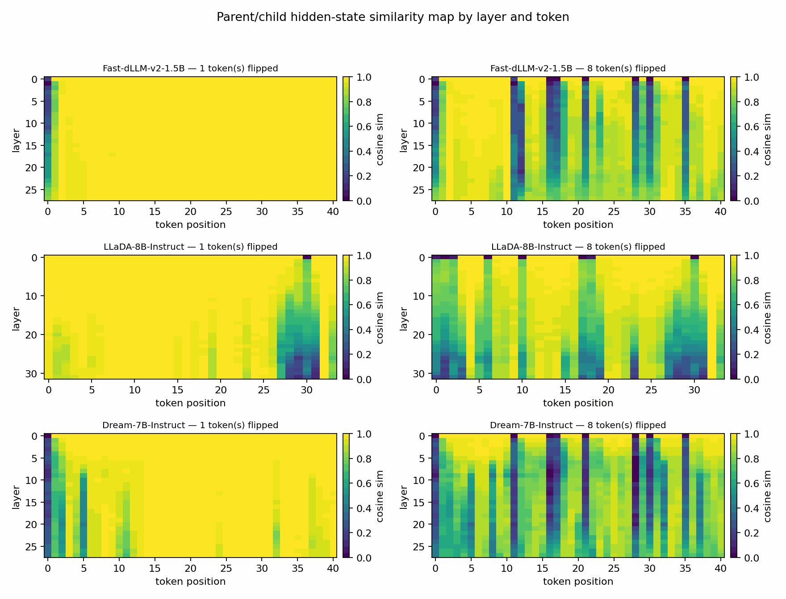 | 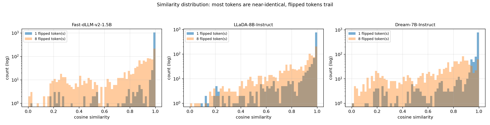 |
| 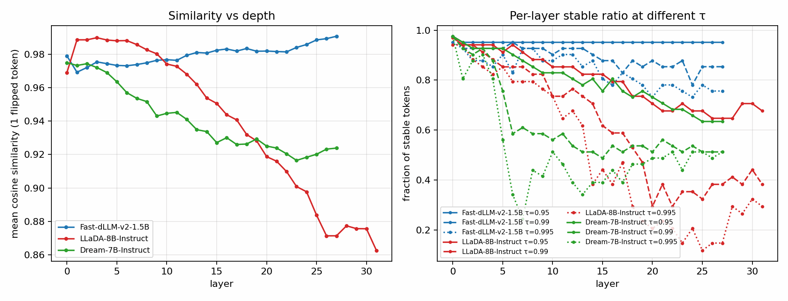 | 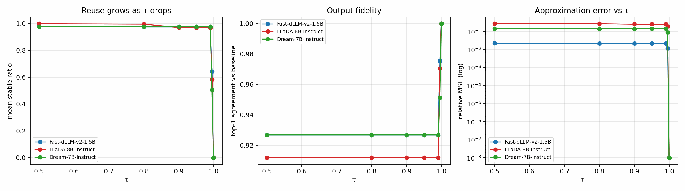 |
| 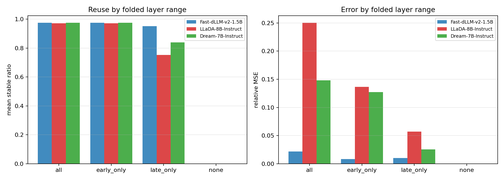 | 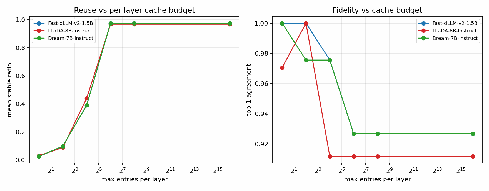 |
| 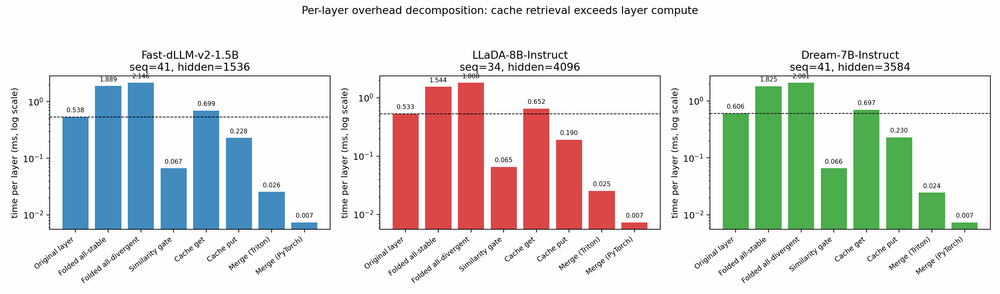 | 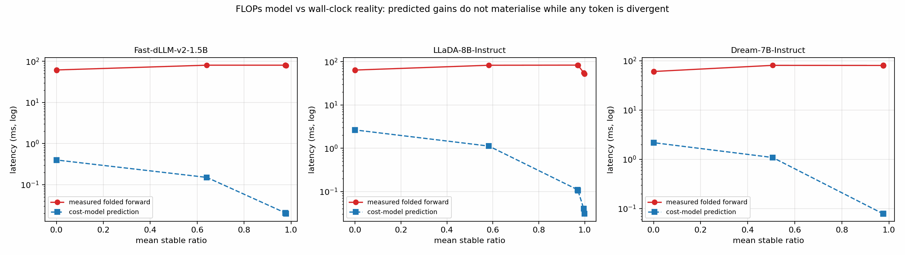 |
| 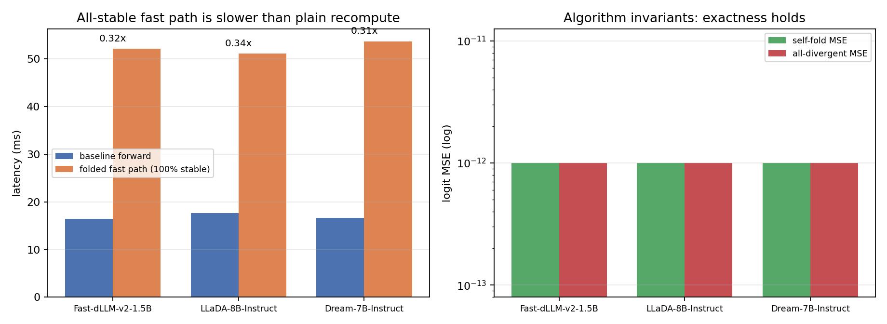 | 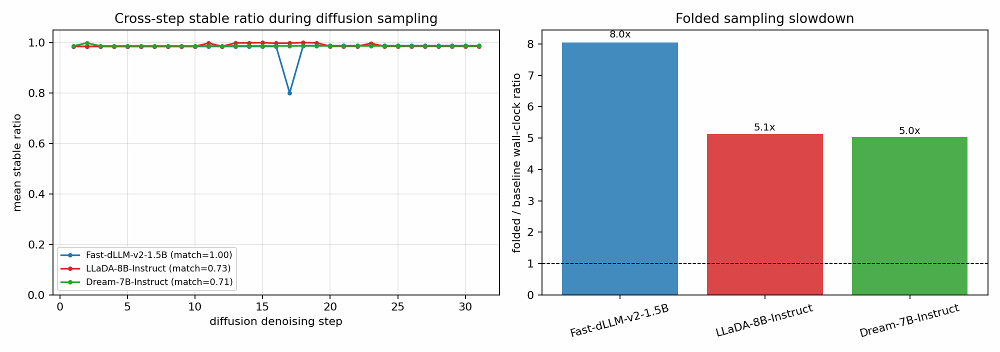 |

Optimization figures (`results/optimization/figures/`):

| | |
|---|---|
| 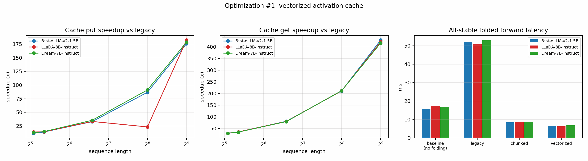 | 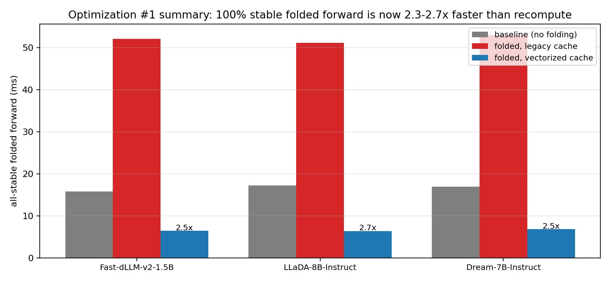 |
| 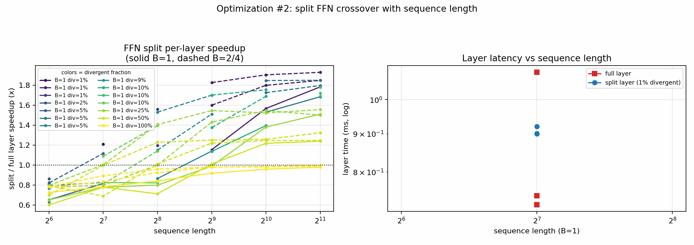 | 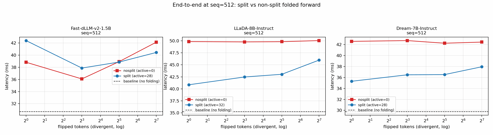 |
| 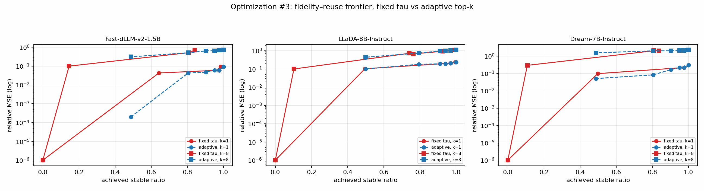 | 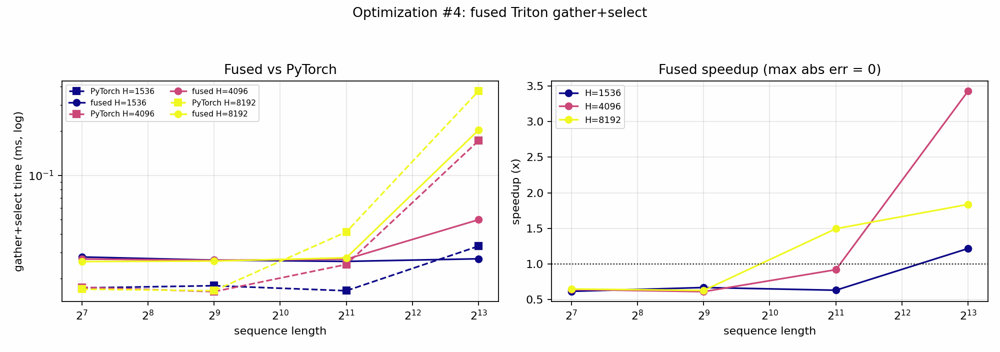 |

### 11. Reproduction

```bash
# Diagnosis (per model)
python scripts/algo_experiments.py --model fastdllm --out results/experiments/fastdllm
python scripts/overhead_bench.py --model fastdllm --out results/experiments/fastdllm
python scripts/make_experiment_figures.py --root results/experiments --out results/experiments/figures

# Optimizations
python scripts/opt1_cache_bench.py --model fastdllm --out results/optimization/opt1/fastdllm
python scripts/opt2_shape_bench.py --out results/optimization/opt2/shape
python scripts/opt2_long_seq.py --model llada --out results/optimization/opt2/longseq/llada
python scripts/opt3_adaptive_bench.py --model dream --out results/optimization/opt3/dream
python scripts/opt4_fused_bench.py --out results/optimization/opt4
python scripts/make_optimization_figures.py --root results/optimization --out results/optimization/figures
```

Full write-ups: [`docs/DEEP_EXPERIMENT_REPORT.md`](docs/DEEP_EXPERIMENT_REPORT.md) (two-phase report), [`docs/OPTIMIZATION_REPORT.md`](docs/OPTIMIZATION_REPORT.md) (optimization details), and [`docs/ACADEMIC_REPORT.md`](docs/ACADEMIC_REPORT.md) (academic version).

---

## Illustrative Figures (legacy template)

The figures below are legacy example outputs generated from a small synthetic model for documentation illustration. The measured results are in the Empirical Results section above.

### Layer-Token Similarity Heatmap

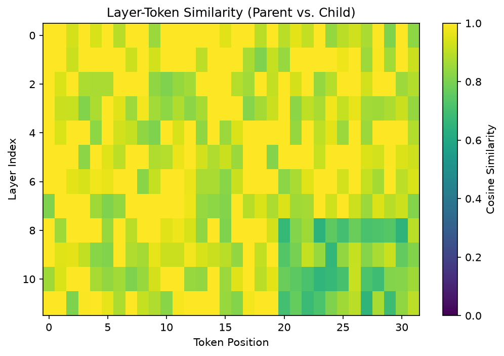

*Figure 1: Cosine similarity between parent and child hidden states across layers and token positions. Brighter regions indicate stable tokens that can reuse parent activations.*

### Speedup vs. Accuracy Pareto Frontier

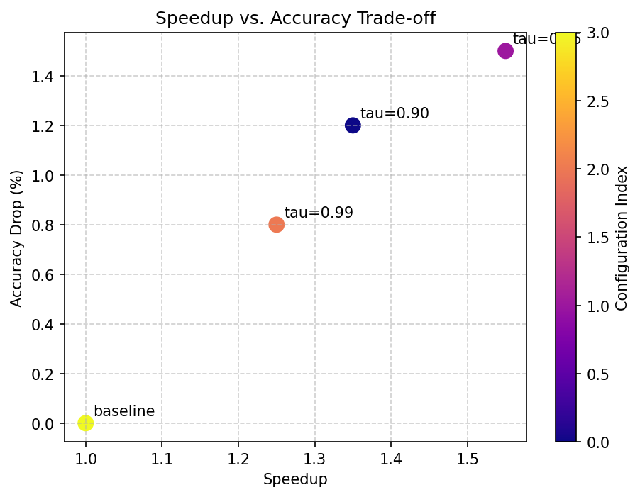

*Figure 2: Pareto frontier of wall-clock speedup versus accuracy drop as the similarity threshold τ varies. Higher and further to the right is better.*

### TFLOPs Reduction by Model

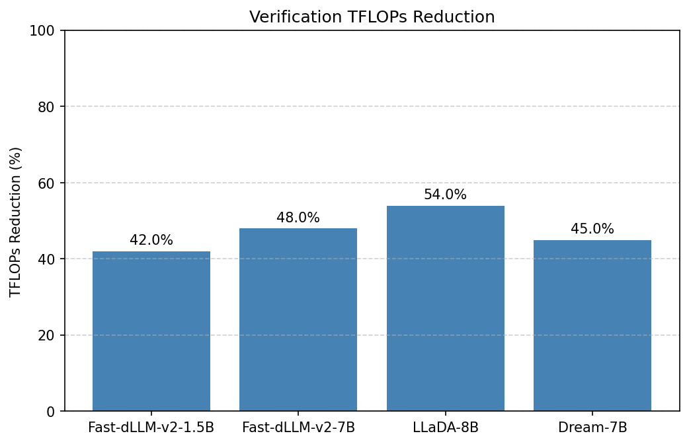

*Figure 3: Verification-phase TFLOPs reduction across model families. The reduction comes from reusing stable-token activations at each Transformer layer.*

### Ablation Study Summary

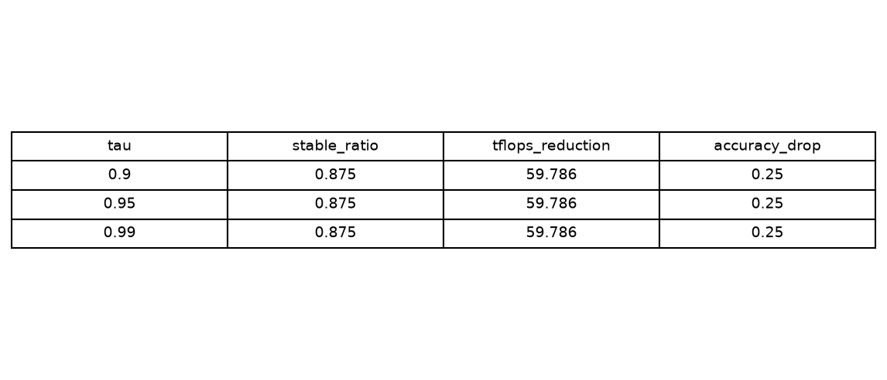

*Figure 4: Ablation study over threshold τ, layer-wise folding strategy, and cache budget. Use these to choose a configuration for your target accuracy/latency budget.*

### Regenerating figures

```bash
# Run real benchmarks and ablations
bash scripts/run_benchmarks.sh actfold/configs/real_model_example.yaml
bash scripts/run_ablation.sh actfold/configs/real_model_example.yaml

# Generate figures from the artifacts
python scripts/generate_figures.py --results-dir results/
```

---

## Ablations

```bash
# Config-driven ablations with a real model
bash scripts/run_ablation.sh actfold/configs/real_model_example.yaml

# Quick synthetic demonstration
bash scripts/run_ablation.sh --synthetic
```

Supported studies:

1. **Threshold sensitivity**: τ ∈ {0.90, 0.95, 0.99}
2. **Layer-wise folding**: early-only, late-only, all layers
3. **Cache budget**: 256, 512, 1024, 2048 entries per layer
4. **Cache implementation**: per-token vs chunked vs vectorized (`scripts/opt1_cache_bench.py`)
5. **FFN split**: shape sweep and long-sequence end-to-end (`scripts/opt2_shape_bench.py`, `scripts/opt2_long_seq.py`)
6. **Adaptive gate**: fixed threshold vs rank-based target (`scripts/opt3_adaptive_bench.py`)
7. **Fused kernel**: fused vs PyTorch gather-select across shapes (`scripts/opt4_fused_bench.py`)

---

## Quality Assurance

All code is checked with:

- **black** (`line-length = 100`)
- **isort** (`profile = "black"`)
- **pyflakes**
- **mypy --strict**
- **pytest** (204 tests pass in the fast suite)

Run locally:

```bash
python -m black --check actfold tests demo.py scripts
python -m isort --check-only actfold tests demo.py scripts
python -m pyflakes actfold tests demo.py scripts
python -m mypy actfold --ignore-missing-imports
python -m pytest tests/ -q -m "not slow"
python demo.py
```

Tests that exercise real `lm-eval` / `evalplus` backends are marked `@pytest.mark.slow`:

```bash
python -m pytest tests/ -q -m slow
```

---

## Docs

- [`docs/ALGORITHM.md`](docs/ALGORITHM.md) — formal description of Branch Folding.
- [`docs/EXPERIMENTS.md`](docs/EXPERIMENTS.md) — detailed reproduction workflows.
- [`docs/DEEP_EXPERIMENT_REPORT.md`](docs/DEEP_EXPERIMENT_REPORT.md) — two-phase deep experiment report (diagnosis + optimizations, real LLaDA/Dream/Fast-dLLM measurements).
- [`docs/ACADEMIC_REPORT.md`](docs/ACADEMIC_REPORT.md) — academic-paper version of the two-phase study (abstract, problem formalization, method, experiments, references).
- [`docs/OPTIMIZATION_REPORT.md`](docs/OPTIMIZATION_REPORT.md) — optimization-phase report (vectorized cache, split FFN, adaptive gate, fused kernel).
- [`AGENTS.md`](AGENTS.md) — conventions and pitfalls for contributors and AI agents.
- [`CHANGELOG.md`](CHANGELOG.md) — release history.

---

## Current Limitations & Roadmap

1. **Diffusion samplers are high-quality reference implementations**. They closely follow the official LLaDA/MDLM, Dream, and Fast-dLLM v2 recipes, but final published numbers should still be validated against the official implementation for the exact checkpoint.
2. **Partially stable folded forwards still trail the no-folding baseline at small scales**. Measured on batch=1, seq≤512: the remaining per-layer cost is gating, cache traffic, and dispatch (0.1–0.2 ms per layer). **Update (AR002)**: the fused gate+mask+count Triton kernel (M4a) and the fixed-shape CUDA graph verification loop (M4b, `ManualFoldedForward(use_cuda_graph=True)`) now address this — on a Quadro RTX 5000 at batch=2, seq=512, 4 layers, graph replay cuts the folded child step from 5.083 ms to 2.687 ms (-47.1%) with all budget validations passing (`scripts/ar002_graph_bench.py`). Variable-length shapes and scheduler-managed layers still fall back to the eager path (where variable-length steps now prefix-fold, AR003).
3. **Optimization envelopes are shape-dependent**. The FFN split is auto-enabled only at `batch × seq ≥ 512` (default 512) and the fused kernel only wins at large T; both fall back to the baseline path otherwise.
4. **Sampling quality is model-sensitive**. Cross-step folded sampling matches the baseline token-for-token on Fast-dLLM but reaches only 0.71–0.73 token agreement on LLaDA/Dream at stable ratio ~0.99; raise τ or use adaptive targets for those models.
5. **No trained draft model**. `DraftGenerator` supports random/perturb/copy_flip modes, and `AdaptiveDraftGrowthController` varies branch count based on runtime stability. A dedicated draft model (e.g. Medusa/Eagle) is on the roadmap.
6. **Per-model YAML configs are templates**. You must supply the actual Hugging Face identifier or local checkpoint path.
7. **Variable-length folding is append-only; multi-ancestor reuse is not supported**. **Update (AR003)**: a parent cached at a shorter length than the child now folds via *prefix alignment* — the gate compares the child's prefix against the parent (stable positions reuse the parent FFN output) while the appended suffix always recomputes. This makes `folded_generate` actually fold across steps (a causal model's prefix is bit-identical to its parent, so the prefix is all-stable and each step only recomputes the new token). A parent **longer** than the child and multi-parent activation trees remain unsupported.
8. **Acceptance semantics are mechanism-level until a real draft model lands**. **Update (AR004)**: verification now measures a true acceptance rate (draft token vs. target argmax, same-position) and a mean-log-prob score instead of the historical logit-mean placeholders; `ActFoldVerificationEngine` exposes `ema_acceptance_rate` and switches its accept/reject decision to `acceptance_rate >= acceptance_threshold` (default 0.0 keeps legacy accept-everything behavior), and `folded_generate` reports the per-run mean via `FoldedGenerationResult.acceptance_rate`. Current drafts are random/perturb modes, so the reported rate measures the mechanism, not a trained draft's quality (see roadmap P3-3).

---

## Troubleshooting

| Symptom | Cause | Fix |
|---------|-------|-----|
| `RuntimeError: A real tokenizer is required...` | Benchmark/eval path loaded without a tokenizer. | Pass a model with a tokenizer or use `--synthetic` for debug runs. |
| `TypeError: Can't instantiate abstract class ... with abstract method embed` | A custom `DiffusionLLM` subclass is missing `embed()`. | Implement `embed(tokens)` returning `[B, T, H]`. |
| Triton kernel not used on CUDA | `triton` not installed or hidden dim not divisible by 128. | Install `triton>=2.0` on Linux/WSL; the PyTorch fallback is always correct. |
| `evalplus` fails on Windows | EvalPlus sandbox requires the Unix `resource` module. | Run evalplus tasks in WSL or use `lm-eval` tasks on native Windows. |
| Slow tests time out | Real backends load datasets and models. | Run fast tests with `pytest -m "not slow"`; run slow tests separately. |
| CI badge does not display | The workflow may not have run yet or the repo path is wrong. | Ensure `.github/workflows/ci.yml` exists and the badge URL matches `ShaneLiu04/ActFold`. |

---

## Contributing

We welcome contributions! Please see [`CONTRIBUTING.md`](CONTRIBUTING.md) for guidelines on code style, testing, and submitting pull requests.

---

## Citation

If you use ActFold in your research, please cite:

```bibtex
@software{actfold2025,
  title = {ActFold: Cross-Branch Activation Reuse and Branch Folding},
  author = {ShaneLiu04},
  year = {2025},
  url = {https://github.com/ShaneLiu04/ActFold},
}
```

---

## License

ActFold is released under the [MIT License](LICENSE).

---

> **Disclaimer:** This is a research codebase. Production deployment requires additional optimization, testing, and integration with the target serving framework.
