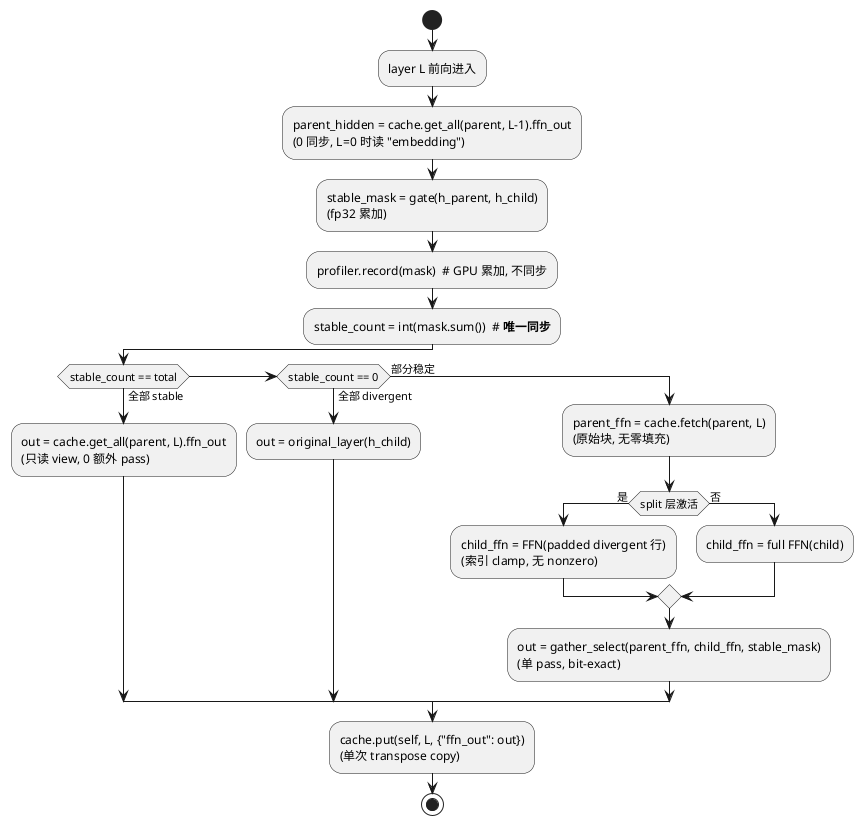
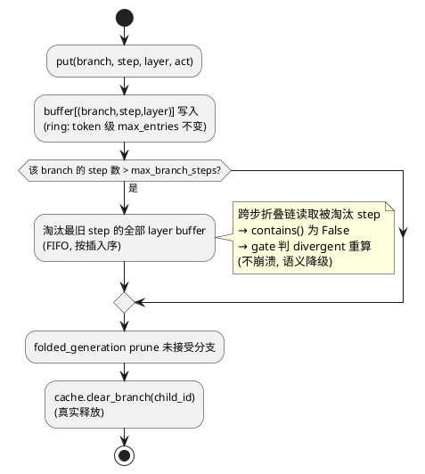
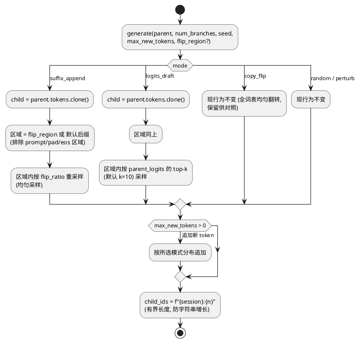

# AR001 详细设计 — ActFold 深度优化（M1+M2+M3+M5）

# 1 AR概述

| 组件名称 | ActFold（actfold Python 包：Diffusion LLM 投机解码 Branch Folding 框架） |
| --- | --- |
| AR系统流水号 | AR001 |
| AR描述 | 在不依赖大显存的前提下：清零正确性 bug B1–B11（B12 做 lite 防护）；将 folded 前向每层阻塞同步从 5–7 次降至 ≤1 次、全张量内存 pass 从 10–14 降至 ≤6；cache 显存 −50%；实验脚本方法学修复与可移植性改造，使高算力机器可开箱完整复现。M4（单 kernel 融合/CUDA graph）排除，留 AR002。 |

**设计基线**：`docs/OPTIMIZATION_GUIDE.md`（深度分析，含全部 bug 的 file:line 与量化证据）；需求见 `./srs.md`；任务见 `./tasks.md`（T001–T027）。

**选定方案**：方案 A（就地渐进式改造）+ `ActivationCacheProtocol`（typing.Protocol）共享契约，三个 cache 实现以参数化契约测试保证行为一致（完整对比见下节）。

## 方案对比与决策记录

| 维度 | 方案 A：就地渐进式改造 | 方案 B：统一缓存后端（单一 Backend，三类变 facade） | 方案 C：框架级优化先行（torch.compile / CUDA graph 驱动 API 重构） |
|---|---|---|---|
| 思路 | 三个 cache 各自实现统一协议方法；legacy 内部重写为连续布局；其余按 tasks 逐项就地修改 | 抽象单一 `CacheBackend`，三个 cache 类退化为薄 facade | 先消除全部 graph break 点并把 API 围绕可捕获计算图重建，再谈 pass/同步 |
| 满足"26 任务每任务测试全绿"（srs §5） | ✅ 一一对应，可分别提交回滚 | ❌ T012/T014/T015 必须大爆炸合并 | ❌ 与 M4 排除决议冲突（srs Out of Scope） |
| 满足 bit-exact NFR | ✅ 逐项对拍 | ✅ 但中间态难验证 | ⚠️ compile/graph 引入数值重排风险 |
| 16GB 显存/本机开发约束 | ✅ 全部可在合成模型验证 | ✅ | ❌ CUDA graph 需要稳定大 shape 验证环境 |
| 为 AR002（M4）打地基 | ⚠️ 协议面干净但后端仍三套 | ✅ 最干净 | —（本 AR 即 M4） |
| 开发周期 | 基线 | +~40% | 不可比（范围外） |
| 风险 | 低（每步可测） | 高（一次性集成） | 高 |

**决策 D1**：选方案 A。理由：srs §5"每任务以测试全绿为完成标志"直接排斥 B 的大爆炸集成；C 与 M4 排除决议冲突。吸收 B 的元素：`ActivationCacheProtocol` + 三实现参数化契约测试（`tests/test_cache_contract.py`），以测试代替继承获得大部分一致性收益，为 AR002 留下收敛接口面。
**决策 D2**：legacy `ActivationCache` 内部重写保留公开 API（srs 澄清结论），LRU 粒度变化在 CHANGELOG 登记。
**决策 D3**：`gather_select` 主路径接入阈值定为 **T≥2048 且 H≥4096**（较 AGENTS.md #30 的 H≥8192 放宽）。依据：本机 Quadro RTX 5000 实测（4.4 TFLOPS 降频态）kernel 收益拐点提前，且 `fused_ops` 内 `merge` 路径历史上同样在中等 shape 有正收益（README 优化 #4：T=2048,H=8192 即 1.5×）；该阈值以常量暴露可调，AGENTS.md #30 随 T026 同步修订。
**决策 D4**：错误处理约定——本项目无错误码体系，统一以 Python 异常类型表达（KeyError=缓存缺失、ValueError=参数校验、RuntimeError=环境/前置条件不可满足、UserWarning=语义降级），见 §4.3 各接口。
**决策 D5**：`BranchManager`（core/branch_manager.py）本轮零改动——srs In Scope 原列名系范围声明冗余，无任何 §3.x 需求触及（已在 srs 修正）；其重构（变量长度折叠）属 P3，留后续 AR。
**决策 D6**：B12 完整重构（不替换式 ManualFoldedForward 常态化）随 M4 留 AR002（req 门控 G4 修复时确定），本轮仅 B12-lite。

# 2 动态行为

## 交互时序图

优化后一次 folded 慢路径前向（parent 已缓存，profiler 开启）的关键交互——对比基线：同步点从 5–7 次/层降至 ≤1 次/层（仅 D 判定一次），cache 读写不再零填充，merge 由 gather_select 单 pass 完成：

```plantuml
@startuml
title Folded Layer L 慢路径前向（优化后）

box "Host (Python)"
participant FT as FoldedTransformerLayer
participant G as SimilarityGate
participant P as StabilityProfiler\n(GPU 累加,无同步)
end box
box "Device (GPU)"
participant C as VectorizedActivationCache\n(连续 buffer)
participant K as gather_select\n(Triton/PyTorch)
end box

FT -> C : get_all(parent, L-1)\n[取父 hidden=上层 ffn_out, 0 同步 view]
FT -> G : cosine(h_parent, h_child)\n[fp32 累加, dtype 感知 eps]
G --> FT : stable_mask [B,T]
FT -> P : record(mask)\n[GPU sum/count 累加, 不同步]
FT -> FT : stable_count = mask.sum()\n**唯一同步点①**\n三路判定(0/全部/部分)
alt 全部 stable
  FT -> C : get_all(parent, L).ffn_out\n[0 同步 view]
  FT --> FT : out = 该 view（快路径）
else 全部 divergent
  FT -> FT : out = recompute_all(child)
else 部分稳定（慢路径）
  FT -> C : fetch(parent, L)\n[原始块, 无零填充]
  FT -> FT : child_ffn = FFN(divergent 行)\n[split 层: padded gather, 无 nonzero]
  FT -> K : gather_select(parent_ffn,\nchild_ffn, stable_mask)
  K --> FT : out [B,T,H]（bit-exact）
end
FT -> C : put(self, L, {"ffn_out": out})\n[单次 transpose copy]
@enduml
```

# 3 功能点分解

| 序号 | 功能点名称 | 功能点描述 | 对应任务 |
| --- | --- | --- | --- |
| 1 | 正确性修复包 | B1 stable_ratio 均值、B2 final norm、B3 随机 head 报错、B4 try/finally、B5 attention_mask、B6 异常窄化、B7 dtype eps/fp32 累加、B8 CPU 计时 | T001–T006 |
| 2 | cache 生命周期 | (branch,step) ring 淘汰 + prune 真实 clear_branch + miss 走 divergent | T007 |
| 3 | draft 分布修复 | suffix_append / logits_draft 双模式 + flip_region + 默认切换 | T008 |
| 4 | FoldedModel lite 防护 | context manager + `__del__` 兜底 + wrap 告警 | T027 |
| 5 | 同步清零（层内） | profiler 异步化、三路判定合并、get_all、mask/signature 缓存 | T009/T010 |
| 6 | 同步清零（gate） | adaptive gate bottom-k + last_tau 异步 | T011 |
| 7 | legacy cache 重写 | 连续布局内部重写保留 API，0 per-token 同步 | T012 |
| 8 | Triton kernel 改进 | 单边读、stride 寻址、放宽 %128、独立降级 | T013 |
| 9 | 冗余 hidden_states 删除 | 只存 ffn_out + layer0 embedding，跨层读取 | T014 |
| 10 | fetch/fetch_masked 拆分 | 三 cache 协议化，merge 去零填充 | T015 |
| 11 | gather_select 主路径接入 | 慢路径 get+merge 两步并为单 kernel | T016 |
| 12 | split scatter 合并 | parent_ffn.clone + 仅 divergent 行 scatter | T017 |
| 13 | samplers 向量化 | transfer 向量化+对拍、批量 topk、LLaDA 早停 | T018 |
| 14 | 脚本可移植性 | CLI 参数化 HF 路径、统计方法、RNG 隔离 | T019/T020 |
| 15 | cost model / flops 修正 | 硬件查表、T²/KV 项、SwiGLU/intermediate_dim | T021/T022 |
| 16 | eval 修复 | max_new_tokens 配置化、墙钟、metric key、tokenize 去重 | T023 |
| 17 | 消融实测化 | disabled_layers 实测、cache 驱逐、suffix draft | T024 |
| 18 | 数据处置 | INVALIDATED 标注 + RERUN_CHECKLIST | T025 |
| 19 | 全量收尾 | lint/mypy/全测试/demo 对拍/CHANGELOG | T026 |

# 4 实现设计

## 4.1 功能实现思路

1. **正确性优先**（M1 组）：所有 bug 修复不改变公开语义的，直接修；改变语义的（B3 随机 head → raise、B6 静默 greedy → warn+异常）在文档与 CHANGELOG 登记。每个修复先写失败测试（Red）再修（Green）。
2. **同步消除的核心手法**：把"热路径上的信息回读"全部改为 **GPU 端累积、读取端一次性回读**（profiler）；把"多次标量同步"合并为**一次计数同步**（三路判定）；把"构造 mask 再走通用路径"改为**专用无 mask API**（get_all）。所有改动保持数值 bit-exact 或文档化的等价。
3. **内存 pass 压缩的核心手法**：(a) 删除跨层恒等的冗余存储（hidden_states = 上层 ffn_out）；(b) 拆分"选择语义"与"零填充语义"，慢路径不再写马上被覆盖的零；(c) 用单 pass gather_select kernel 替代 get（含零填充）+ merge 两步；(d) split 的输出直接以 parent_ffn 为底板只 scatter divergent 行。
4. **协议化而非继承**：新增 `ActivationCacheProtocol`（typing.Protocol）+ 三实现参数化契约测试，替代抽象基类强制，保持各实现的独立可测性（方案 A 决策）。
5. **方法学修复不动业务语义**：脚本参数化、统计字段、查表常数、SwiGLU 计量修正都是让数字变准，不改变测量对象。

## 4.2 功能实现设计

### 4.2.1 流程图

**A. FoldedTransformerLayer.forward 三路判定（T010，同步 5–7→1）**



**B. VectorizedActivationCache ring 淘汰（T007）**



**C. DraftGenerator 模式分派（T008）**



### 4.2.2 流程说明

- **流程 A**：三路判定的合并依赖 `stable_count` 一次同步覆盖原 `all()`+`any()` 两次；`get_all` 返回 buffer 的只读 view（无 mask 判定 → 无 `bool(mask.all())` 同步）。F6 落地后 `get_all(parent, L-1)` 直接复用上层 `ffn_out` buffer，无需单独的 hidden_states 存储。
- **流程 B**：淘汰粒度是 (branch, step) 键而非 token（token 级 ring 已有）；`max_branch_steps` 默认 4（覆盖跨步折叠链的最近 3 个 parent + 当前）。miss 语义：`contains()` 返回 False 后 folded 层将整个 parent 视为 divergent（等价于不折叠的正确路径），保证正确性不受淘汰影响。
- **流程 C**：`logits_draft` 需要 parent logits —— 由调用方（benchmark_runner/ablation）先跑一次 parent forward 拿 logits 传入；DraftGenerator 不持有模型引用（保持纯函数性）。seed 经 `torch.Generator` 传递（T020 一并修 RNG 隔离），不再污染全局。

## 4.3 接口描述

### 4.3.1 新增：`actfold/core/cache_protocol.py`

```python
class ActivationCacheProtocol(Protocol):
    """三个激活缓存实现的统一契约（typing.Protocol，无运行时强制）。"""

    def put(self, branch_id: str, layer_idx: int,
            activations: dict[str, torch.Tensor], step_idx: int = 0) -> None: ...
    def fetch(self, branch_id: str, layer_idx: int, step_idx: int = 0)
            -> dict[str, torch.Tensor]:
        """返回该 (branch, layer, step) 的原始缓冲块 [B,T,H]。
        契约：未缓存位置内容未定义；调用方只允许使用其已验证 mask 的位置。
        缺失时 raise KeyError。"""

    def fetch_masked(self, branch_id: str, layer_idx: int,
                     token_mask: torch.Tensor, step_idx: int = 0)
            -> dict[str, torch.Tensor]:
        """旧 get() 语义：mask 选择 + 缺失/未选位置零填充。兼容层。"""

    def get_all(self, branch_id: str, layer_idx: int, step_idx: int = 0)
            -> dict[str, torch.Tensor]:
        """全量只读视图（0 同步快路径）。vectorized 实现返回非连续 view，
        调用方必须只读。缺失时 raise KeyError。"""

    def contains(self, branch_id: str, layer_idx: int, step_idx: int = 0) -> bool: ...
    def clear_branch(self, branch_id: str) -> None: ...
    def clear_all(self) -> None: ...
```

| 成员 | 参数 | 返回 | 异常 |
|---|---|---|---|
| fetch | branch/layer/step | 原始块 dict | KeyError（未缓存） |
| fetch_masked | + token_mask [B,T] bool | 零填充块 dict | KeyError |
| get_all | branch/layer/step | 只读 view dict | KeyError |
| contains | branch/layer/step | bool | — |

现有 `get(token_mask)` 保留为 `fetch_masked` 的别名（过渡期），全部内部调用方在 T015 迁移后标记 `get` deprecated。

### 4.3.2 修改：`VectorizedActivationCache`（T007/T014/T015）

```python
def __init__(self, max_entries_per_layer: int = 1024,
             max_branch_steps: int = 4, device: str = "cuda") -> None: ...
```
- 新增 `(branch, step)` FIFO 淘汰（`max_branch_steps`）；
- 存储裁剪：folded 层只 put `{"ffn_out": out}`；layer 0 由 wrapper 额外 put `{"embedding": emb}`（同键不同名，互不冲突）；
- 实现协议四方法；`fetch` 返回 `[B,T,H]` transpose view（只读）。

### 4.3.3 修改：`ActivationCache`（legacy，T012）

公开签名不变（put/get/clear_*），内部 `_caches: dict[int, OrderedDict[...]]` 重写为 `dict[int, dict[(branch, step), ContiguousBlock]]`：put 单次 transpose copy；get 一次 index_select；LRU 语义改为 (branch, step) 键级（token 级 LRU 语义随 per-token 存储一并移除，CHANGELOG 登记）。同时实现协议方法。

### 4.3.4 修改：`ChunkedActivationCache`（T015）

实现协议四方法；`fetch_masked` 消除 `torch.where(zeros_like)` 的额外分配（改为先 dense 拷贝后 `masked_fill_` 原地）；删除每次 get 的 `sorted()`。

### 4.3.5 修改：`SimilarityGate`（T005）

```python
@staticmethod
def _eps_for(dtype: torch.dtype) -> float:
    # fp16→1e-4, bf16→1e-2, fp32/fp64→1e-8

def __call__(self, h_parent, h_child) -> torch.Tensor:
    # 内部 .float() 上计算 dot/norm（fp32 累加）→ sim
    # sim = torch.where(torch.isfinite(sim), sim, -1.0)  # NaN→divergent
```

### 4.3.6 修改：`AdaptiveQuantileGate`（T011）

```python
def __call__(self, h_parent, h_child) -> torch.Tensor:
    # k_stable = ceil(ratio * N)；改 bottom-k 选取 divergent 候选：
    # k_div = N - k_stable；vals, idx = torch.topk(-sim_flat, k_div)
    # stable_mask.scatter 后返回；不写 self.tau
    # last_tau 记录延后到 get_profile 类读取端
```

### 4.3.7 修改：`StabilityProfiler`（T009）

```python
def record(self, branch_id: str, layer_idx: int,
           stable_mask: torch.Tensor, step_idx: int = 0) -> None:
    """GPU 累加：self._gpu_sums[key] += stable_mask.sum()（惰性建零），
    self._gpu_counts[key] += mask.numel()。不 .item()、不 nonzero。
    debug_enabled=True 时才收集 divergence_positions。"""

def get_profile(self, branch_id: str) -> StabilityProfile:
    """读取端：一次性 .item() 回读全部层并聚合（每 branch 一次同步）。"""
```

### 4.3.8 修改：`fused_ops.py`（T013/T016）

```python
def merge_stable_divergent(parent, child, stable_mask) -> Tensor:
    # kernel 内按行 uniform 分支单边读（3→2 pass）
    # 寻址 base + h * hidden_stride（使用已传参数），调用方不再 .contiguous()
    # 删除 hidden_dim % 128 禁用；保留 dtype/shape 静默 fallback
    # _MERGE_DISABLED 与 _GATHER_SELECT_DISABLED 两个独立标志

def gather_select(parent_ffn, child_ffn, stable_mask) -> Tensor:
    # 主路径接入（T016）：folded 慢路径直接调用；
    # 阈值：T >= 2048 且 H >= 4096 时走 Triton，否则 PyTorch 等价路径
```

### 4.3.9 修改：`DraftGenerator`（T008）

```python
def __init__(self, vocab_size: int, mode: str = "suffix_append",
             flip_ratio: float = 0.1, top_k: int = 10,
             prompt_length: int | None = None) -> None: ...
def generate(self, parent: Branch, num_branches: int = 2,
             seed: int | None = None, max_new_tokens: int = 0,
             parent_logits: torch.Tensor | None = None,
             flip_region: tuple[int, int] | None = None) -> list[Branch]: ...
```
`parent_logits` 仅 `logits_draft` 模式需要（None 时 **RuntimeError**）；`prompt_length` 用于默认排除 prompt 区域。校验异常：`flip_region` 越界（start<0 或 end>seq_len 或 start≥end）→ **ValueError**；`max_new_tokens<0` → **ValueError**；`flip_ratio=0` 合法（零分歧对照，srs §3.3 边界）；`top_k≤0` → **ValueError**。

### 4.3.10 修改：`FoldedModel`（T027）

```python
def __enter__(self) -> "FoldedModel": return self
def __exit__(self, *exc) -> None: self.restore()
def __del__(self) -> None:
    # 若仍处于 wrapped 状态则 restore（兜底）
# __init__ wrap 成功后 logger.warning(
#   "FoldedModel replaces layers in place: state_dict keys change "
#   "(layers.N.* -> layers.N.original_layer.*); raw model calls without "
#   "branch context will raise.")
```

### 4.3.11 修改：`folded_generation.py`（T001/T007/T010 配合）

- `ratios: list[float]` 逐步累积，结束取均值；
- prune 调用 `cache.clear_branch(child_id)`（cache 引用经 adapter 注入）；
- branch_id 改 `{session_uuid}:{counter}` 有界格式；
- EOS 早停（`eos_token_id: int | None` 参数，None 不启用）。

### 4.3.12 修改：`utils/cost_model.py`（T021）

```python
_DEVICE_TABLE: dict[str, tuple[float, float]] = {
    # 归一化设备名子串 → (bf16 dense TFLOPS, 显存 GB/s)
    "A100": (312.0, 1555.0), "H100": (989.0, 3350.0),
    "RTX 6000": (136.0, 1280.0), "RTX PRO 6000": (400.0, 1600.0),
    "Quadro RTX 5000": (60.0, 448.0), "4090": (165.0, 1008.0), ...
}
@classmethod
def from_device(cls, device, calibrate: bool = False) -> "HardwareProfile": ...
# calibrate=True 时跑 5s micro-bench（matmul+copy）覆盖查表值
```
attention 项补 `2·(1−r)·T²·h` FLOPs 与 KV 读 `2·T·h·bytes` 带宽；gate/merge 成本移入带宽项。

### 4.3.13 修改：`utils/flops_counter.py`（T022）

```python
def count_flops(..., ffn_intermediate_dim: int | None = None,
                ffn_type: Literal["mlp", "swiglu"] = "mlp",
                include_attention_t2: bool = False) -> int: ...
# None 时从 config.intermediate_size 自动读取（wrapper 传入）
# swiglu: 每 token FFN = 2·3·intermediate·h；mlp: 2·2·intermediate·h
# embedding 项减半（只计 LM head）；T² 项可选
# 非法 ffn_type → ValueError
```

### 4.3.14 修改：`ActFoldConfig`（T023）

新字段：`max_new_tokens: int = 256`、`draft_mode: str = "suffix_append"`、`flip_region: tuple[int, int] | None = None`；`config_manager` 校验（`draft_mode` 不在白名单 → **ValueError**；`max_new_tokens≤0` → **ValueError**；`flip_region` 非法区间 → **ValueError**）；`benchmark_runner` 透传全部 adapter 构造。

### 4.3.15 修改：`models/architecture_utils.py`（T002）

`detect_architecture` 返回值新增 `final_norm: nn.Module | None`（发现路径 `model.norm`/`transformer.ln_f`/`encoder.norm`/`decoder.norm`）；`ManualFoldedForward.forward` 在 layer 循环后、head 前应用。

### 4.3.16 修改：`core/split_layer.py` hook 常驻注册（T010/T017，F4 第 8 项）

```python
class SplitFoldedTransformerLayer(...):
    def __init__(self, ...) -> None:
        # 构造时一次性注册 pre_hook/post_hook（永久绑定），
        # 移除原 forward 内每次 register_hook/remove_hook 的模式
        self._pre_handle = pre_module.register_forward_hook(self._pre_hook)
        self._post_handle = post_module.register_forward_hook(self._post_hook)

    def _pre_hook(self, module, args, kwargs, output) -> None:
        # 守护：self._split_state is None 时直接返回（无折叠上下文，
        # 行为等价于未挂 hook 的原始层）
        ...

    def _post_hook(self, module, args, kwargs, output) -> torch.Tensor:
        # 同上守护；激活时执行 padded gather + 仅 divergent 行 scatter
        #（见 4.2.1 A 与 5.重构设计）
        ...
```

| 行为点 | 设计 |
|---|---|
| 常驻 vs 动态 | 构造时注册、对象生命周期内常驻；靠 `_split_state` 空值守护保证无折叠上下文时零侵入 |
| 与 T017 的配合 | `_post_hook` 内即为 scatter 合并改造点（`out = parent_ffn 底板 + 仅 divergent 行 index_copy`），两项在同文件但独立测试判据、可分别提交 |
| 异常安全 | `restore()`/`__del__` 时 `handle.remove()` 防句柄泄漏（与 FoldedModel T027 联动） |
| 测试判据 | ① 连续两次 folded 前向无 hook 注册/移除调用（monkeypatch 计数为 0）；② 无折叠上下文直接调用原层，输出与未包装模型 bit-exact；③ 异常退出后句柄已移除 |

## 4.4 代码设计

**包结构不变**（actfold/models|core|profiler|speculative|eval|utils），新增 1 个文件：

```
actfold/core/cache_protocol.py          ← 新增（Protocol + 共享契约测试基类）
tests/test_cache_contract.py            ← 新增（三实现参数化契约测试）
tests/test_sync_semantics.py            ← 新增（同步计数回归，torch profiler）
tests/test_draft_modes.py               ← 新增（suffix/logits 模式 + τ 可区分性）
tests/test_flops_cost_model.py          ← 新增（SwiGLU/查表/T² 项）
docs/RERUN_CHECKLIST.md                 ← 新增（T025）
results/**/INVALIDATED.md               ← 新增标注（T025）
```

**受影响文件清单**（与 tasks.md 一致）：

| 层 | 文件 | 任务 |
|---|---|---|
| core | folded_transformer.py | T010/T014/T015/T016/T017 |
| core | vectorized_cache.py / activation_cache.py / chunked_cache.py / cache_protocol.py(新) | T007/T012/T015 |
| core | similarity_gate.py / adaptive_gate.py | T005/T011 |
| core | fused_ops.py | T013/T016 |
| core | split_layer.py | T017 |
| core | model_wrapper.py | T027/T010(signature 缓存) |
| speculative | folded_generation.py / draft_generator.py / verification_engine.py | T001/T004/T007/T008/T015/T016 配合 |
| models | architecture_utils.py / generic.py / 3×sampler / sampling_utils.py | T002/T003/T004/T018 |
| profiler | stability_profiler.py / metrics_collector.py | T006/T009 |
| eval | base_adapter.py / benchmark_runner.py / ablation_study.py / judges.py | T008/T023/T024 |
| utils | cost_model.py / flops_counter.py / gpu_profiler.py / config_manager.py | T006/T021/T022/T023 |
| scripts | 11 个实验脚本 | T019/T020 |
| tests/docs/results | 见上 | T001–T027 |

**文档同步事项**（T026 收尾清单内执行）：AGENTS.md #22/#27（cache API 契约更新为 fetch/fetch_masked/get_all/contains 协议，view 只读契约保留）、#30（gather_select 阈值修订为 T≥2048 且 H≥4096，见决策 D3）需随代码合入同步修订；`docs/OPTIMIZATION_GUIDE.md` 追加 AR001 完成情况回链。

**模块化要点**：cache 协议是本轮唯一新增公共面；gate/profiler/sampler 的修改全部内部化（签名不变或参数带默认值）；所有 breaking change（ActivationCache LRU 语义、GenericDiffusionLLM 随机 head、benchmark 默认 draft 模式）集中登记 CHANGELOG。

# 5 重构设计

**Legacy `ActivationCache` 内部重写（T012）**：per-token 4 元组键 → (branch, step) 键连续块。行为差异两点（CHANGELOG 登记）：(1) LRU 淘汰粒度从 token 级变为 (branch, step) 级；(2) `get` 对部分淘汰 step 的零填充语义由"逐 token 淘汰"变为"整块淘汰"（整块存在→全量有效；不存在→全零填充）。对外签名与返回形状不变。重写后 legacy 与 chunked 共享 contiguous 块工具函数（`actfold/core/_block_utils.py`，私有），不强行统一类。

# 6 测试设计

**覆盖率目标**：(1) 本轮全部修改行（`git diff` 范围）语句覆盖率 ≥90%（`pytest --cov=actfold`，开发会话内逐任务度量）；(2) §3 每个功能点 ≥1 个正常路径用例 + 其声明的每条边界/异常 ≥1 个用例；(3) srs.md 每条 Given/When/Then 验收标准 ≥1 个追溯用例（追溯表见 6.1"任务"列）；(4) 原 202 项测试 100% 保持通过。

## 6.1 单元测试（UT）

| 覆盖点 | 断言 | 任务 |
|---|---|---|
| stable_ratio 均值 | 3 步各 1.0/0.5/0.25 → 0.75（非末步 0.25） | T001 |
| ManualFoldedForward final norm | LLaMA 结构 top-1 一致率 100% | T002 |
| 随机 head 防护 | 默认 raise；`allow_random_head=True` 通过 | T003 |
| B4/B5/B6 | 异常后 profiler 状态不变；pad 不进注意力；NaN logits 显式报错 | T004 |
| gate dtype eps | fp16 零向量 → 无 NaN mask；bf16 τ=0.95 重复 100 次分类全一致 | T005 |
| CPU 计时 | perf_counter 非零延迟 | T006 |
| cache ring 淘汰 | 512 步生成后 buffer 键数 ≤ max_branch_steps×层数；被淘汰读取 → divergent | T007 |
| draft 双模式 | suffix 模式下 τ∈{0.9,0.95,0.99} stable_ratio 两两差异 ≥0.02；同 seed 复现 | T008 |
| FoldedModel 防护 | with 语法退出后 state_dict key 恢复；异常退出同；wrap 有 WARNING | T027 |
| profiler 异步 | record 1000 次、无读取 → 0 次 D2H；get_profile 数值与同步版一致 | T009 |
| 三路判定 | 全稳/全散/混合三场景输出与基线 bit-exact；**profiler 开启的 4 层 folded 前向，torch profiler 统计 cudaStreamSynchronize/D2H 每层 ≤1 次（对照基线 5–7 次，srs §3.4 验收 1）**（tests/test_sync_semantics.py） | T010 |
| adaptive gate | bottom-k 与原 topk 结果 mask 一致；调用后 `gate.tau` 不变 | T011 |
| legacy 重写 | put/get 数值与旧实现对拍（保留的旧实现作为测试内参考）；T=512 时 0 同步 | T012 |
| Triton 改进 | H=3584、非连续输入 bit-exact；分配计数不增 | T013 |
| hidden_states 删除 | 数值等价（MSE ≤ fast-path 容差）；缓冲字节 ~50% | T014 |
| fetch 契约 | fetch 不零填充（缺失位置≠0 断言失效位）；fetch_masked 保持旧语义；**merge 慢路径 folded forward 张量分配计数较修改前每层减少 ≥2 个 [B,T,H]（srs §3.7 验收 2）** | T015 |
| gather_select 主路径 | 与 get+merge 输出 bit-exact；T<2048 走 PyTorch | T016 |
| split scatter | bit-exact；每层少 ≥2 个 [B,T,H] 分配 | T017 |
| samplers 向量化 | get_num_transfer_tokens 对拍矩阵（B∈{1,8}×steps∈{8,128}×schedule∈{linear,cosine}×stochastic∈{T,F}）逐值一致；LLaDA 早停使 forward 次数减少；**B=8、steps=32 的单次 generate D2H 同步 ≤32 次（srs §3.10 验收）** | T018 |
| 统计方法（T020） | `time_forward` 返回 dict 含 mean/std/p50/n 四键且 n≥3；RNG 隔离：同 seed 复现一致 + 调用后全局 RNG state 不变（`torch.get_rng_state()` 对拍）；图题函数输出含数据派生数值（monkeypatch matplotlib 验证 title 字符串含计算值） | T020 |
| 数据处置（T025） | `results/` 下受影响文件（或父目录）INVALIDATED.md 覆盖检索无遗漏；RERUN_CHECKLIST.md 全文无 `/root/autodl-tmp`、无 `hf-mirror.com` 硬编码（正则断言） | T025 |
| cost model | Quadro RTX 5000 查表命中 (60,448)；T² 项数值 | T021 |
| flops_counter | SwiGLU 3.375h → 20.25h²/tok；embedding 减半 | T022 |
| eval | max_new_tokens 透传；latency_ms 字段存在；gsm8k metric key 正确；每 prompt tokenize 1 次 | T023 |
| 消融实测 | layerwise 实测值 ≠ 线性推演值（至少一组）；cache 扫描出现驱逐后 ratio 变化 | T024 |

## 6.2 接口测试

按 §4.3 接口表逐项：参数边界（`max_branch_steps=1`、`flip_region` 越界 → ValueError、`top_k=1`/`top_k=0` → ValueError、`parent_logits=None`+logits_draft → RuntimeError、空 activations put → ValueError、`max_new_tokens=0` 合法/负值 → ValueError、`flip_ratio=0` 零分歧对照合法、`ActFoldConfig` 校验违反（draft_mode 非白名单 / max_new_tokens≤0 / flip_region 非法）→ ValueError）、返回值（fetch view 只读、get_all 非连续性）、异常（KeyError 语义、Triton 编译失败 → 独立降级且另一 kernel 不受影响）、协议辅助方法边界（`contains` 不存在分支 → False、`clear_branch` 重复调用幂等、`clear_all` 后 `contains` 全 False）、cost model（未知设备名 → 保守默认 + UserWarning、`calibrate=True` 返回实测覆盖查表值）、hook 常驻（连续两次前向注册/移除调用计数为 0、无折叠上下文输出与未包装 bit-exact、restore 后句柄移除）、`eos_token_id`（None 时输出与不传等价；指定后命中 EOS 提前终止且输出不含后续 token）、branch_id 有界性（生成 512 token 后 branch_id 长度 ≤64 字符，并入 T007 用例）、`count_flops` 的 `ffn_type="invalid"` → ValueError。

## 6.3 业务场景测试

1. **端到端 folded 生成**：合成模型 32 token 生成，输出与优化前一致（golden 对拍），stable_ratio 为均值。
2. **跨步 diffusion 采样**：FastDLLM 合成 sampler 跑 4 步折叠链，token match 与基线一致；显存峰值有界（T007 生效）。
3. **benchmark 干跑**：`--synthetic` 配置下 benchmark_runner 全链路（draft=suffix_append）出 accuracy/tflops/latency 三字段。
4. **脚本干跑**：干净环境（无 HF_HOME env）`opt1_cache_bench.py --help` 与 synthetic 干跑不触碰 `/root/autodl-tmp`。

## 6.4 异常场景测试

| 场景 | 预期 |
|---|---|
| cache 淘汰后跨步链读取 | divergent 重算，输出正确，无异常 |
| fp16 零向量/极端 hidden | gate 无 NaN，全判 divergent |
| Triton 编译失败（模拟） | 该 kernel 独立降级，另一 kernel 仍走 Triton，全程正确 |
| generate 循环中抛异常（注入） | profiler 全局状态不变（B4）；cache 无泄漏增长 |
| parent_logits 缺失的 logits_draft | 显式 RuntimeError |
| max_branch_steps=1 的跨步链 | 每步都 miss → 等价不折叠，输出仍正确 |
| wrapped 模型在 FoldedModel GC 后 | 基模型可独立调用（restore 兜底） |
