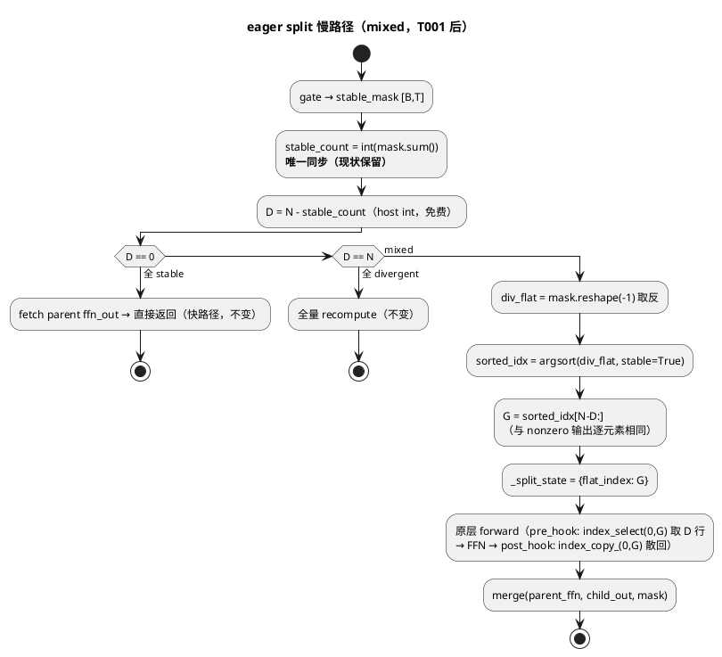
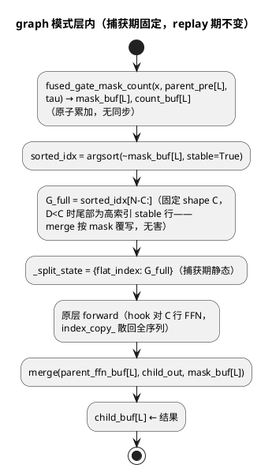

# AR002 详细设计 — M4 单 kernel 融合 + CUDA graph 验证循环 + B12 完整重构

# 1 AR概述

| 组件名称 | ActFold（投机解码 Branch Folding 框架） |
| --- | --- |
| AR系统流水号 | AR002 |
| AR描述 | 在 AR001（同步 ≤1、pass ≤6、cache −50%）基础上完成 M4 与 B12：eager 慢路径以 argsort 精确 gather 根除 split 层 `nonzero` 同步；相似度+阈值+计数融合为单个 Triton kernel（launch 链 6–7 → 1）；`ManualFoldedForward` 常态化为不替换式 folded 前向（state_dict 零漂移）；新增 `FoldedGraphRunner` 对固定 shape 的 diffusion 验证 folded 前向做 CUDA graph capture/replay（每步 ≤1 次 readback 校验、超预算 eager 重算）；并完成 2 项 Minor 跟进（DraftGenerator seed 隔离、LMEvalAdapter per-task 生成长度表）。 |

**设计基线**：`docs/OPTIMIZATION_GUIDE.md`（P2-1/P2-2/P2-3、M4 战略）；需求见 `./srs.md`；任务见 `./tasks.md`（T001–T010）；AR001 决策 D1–D6 沿用（方案 A 就地渐进、错误处理约定、D3 阈值风格）。

## 方案对比与决策记录

| 维度 | 方案 A：分层静态化 + 手动 graph 捕获（选定） | 方案 B：torch.compile 全模型编译 | 方案 C：仅 kernel 融合，不做 graph |
|---|---|---|---|
| 思路 | 逐层消除捕获阻断（nonzero→argsort、上下文 kwargs 化、host 分支静态化），`FoldedGraphRunner` 手动 capture/replay 固定 shape 前向 | `torch.compile(model, mode="reduce-overhead")`（内置 cudagraph） | 只做 T001/T006，graph 留 AR003 |
| srs §3.5 覆盖 | ✅ 完整（capture/replay/校验/降级） | ⚠️ compile 的 cudagraph 对含 host 字典 cache 查找、thread-local 的折叠路径会频繁 graph break；不可控 | ❌ 不满足 §3.5 |
| bit-exact NFR | ✅ replay vs eager 可逐位断言 | ❌ compile 引入融合/重排，bit-exact 不可承诺 | ✅ |
| 16GB 本机可验证 | ✅ 合成模型 + RTX 5000 实测 | ⚠️ 编译时间长、调试不可见 | ✅ |
| 风险 | 中（graph 与 cache/branch-id 的交互需静态 buffer 设计，见 §4.2.2） | 高（黑盒、依赖版本） | 低 |

**决策 D1**：选方案 A。理由：srs §4 将 bit-exact 列为 Must（compile 不可承诺）；折叠路径的 host 侧动态性（cache 字典、branch_id 字符串、三路判定）正是 graph break 根源，方案 A 顺带完成 P2-2/P2-3 前置并沉淀可测的静态化层；方案 C 直接不满足 §3.5。

**决策 D2（srs §3.1 细化）**：eager split 采用 **argsort 精确 gather**（精确 D 行，无预算参数），固定容量 padded gather 仅用于 graph 路径（§3.5）。理由：eager 路径 divergent 数 D 由既有 `stable_count` 同步**免费**导出（host int），`sorted_idx = argsort(divergent, stable=True)[N-D:]` 与 `nonzero` 输出**逐元素相同**（stable sort 保序），故同步 ≤1、bit-exact、零浪费，且省去 budget_ratio 配置面；srs §3.1 的验收标准全部满足并严格优于预算方案（预算语义中"超预算全量 recompute"分支对应 graph 路径的预算校验，见 §4.2.2）。
> argsort 为 O(N log N) GPU 排序（N=B·T ≤ 64K 量级时微秒级），对比被消除的每层 host 同步（~10–100 µs），净收益为正；此代价在 T009 性能代理包中实测记录。

**决策 D3（srs §3.3 细化）**：M4a 融合交付物为**单 kernel `fused_gate_mask_count`**（cosine 相似度 + 阈值判定 + stable 计数，一次读 h_child/h_parent，写 mask + count buffer）；merge 沿用既有单 kernel（`merge_stable_divergent`/`gather_select`）。"gate+merge 合并为单 kernel" 物理不可行：gate 输出 mask 是 split 重计算（attention+FFN）的**输入**，二者之间存在被 hook 的原始层计算，合并意味着先无条件全量重计算——这会摧毁 all-stable 快路径（demo 93.75% stable 时该路径跳过整个重计算，是最大单项收益）。融合后慢路径 launch 链：gate 5–7 + sum 1 + merge 1 ≈ 7–9 → **2**（fused gate + merge），满足 srs "减少 ≥3" 并超出。
> 融合 kernel 仅覆盖默认 `metric="cosine"`；`l2`/`pearson` 走现行链（非默认、非热路径）。

**决策 D4（graph 与 cache/branch-id 的交互）**：branch_id/parent_branch_id 是 host 侧字典键，cache `fetch/put` 是 host 字典操作——graph 内不可出现。`FoldedGraphRunner` 自持静态 buffer：replay 前 host 从 cache **批量预取** parent 各层 `ffn_out`（含 embedding）并 `copy_` 进静态 parent buffer；replay 后 host 将静态 child buffer **clone** 进 cache（防静态 buffer 被下轮 replay 覆盖）。graph 本体只含纯 GPU op。
> 由此 graph 模式约束：`scheduler` 必须为 None（`get_tau` 是 host 每层调用；tau 恒定才可捕获），`attention_mask` 走静态 buffer（None 或固定 shape），gate `metric="cosine"`，split 层容量 C 捕获期固定。

**决策 D5**：`FoldedModel` 不删除，标注 deprecated（docstring + CHANGELOG），行为零改动；`AblationStudy` 内部栈切换为 `ManualFoldedForward`（消除测量期 in-place 突变，重复 sweep 更安全）；`folded_generate`/`base_adapter` 的 `folded_model` 形参类型放宽为 `FoldedModel | ManualFoldedForward`（鸭子类型，调用面签名已一致）。

**决策 D6**：错误处理沿用 AR001 D4：`KeyError`=缓存缺失、`ValueError`=参数校验、`RuntimeError`=环境/前置条件不可满足、`UserWarning`=语义降级（一次性）。

**决策 D7**：`ActFoldConfig` 新增字段（AGENTS #5：加字段而非散落魔法值）：`use_cuda_graph: bool = False`、`graph_capacity_ratio: float = 0.5`（校验 `0 < r ≤ 1`）、`split_layers`/`split_min_tokens` 已有则沿用。

# 2 动态行为

## 交互时序图

graph 模式一次 diffusion 验证步（capture 已完成后）——host 只做字典查找、buffer 拷贝与一次校验 readback：

```plantuml
@startuml
title Graph 模式验证步（replay）
box "Host (Python)"
participant FG as folded_generate
participant MFF as ManualFoldedForward
participant R as FoldedGraphRunner
participant C as ActivationCache
end box
box "Device (GPU)"
participant SB as 静态 buffers\n(tokens/parent[L+1]/masks[L]/counts[L]/logits)
participant G as CUDA Graph
end box
FG -> MFF : forward(tokens, branch_id, parent_branch_id, step_idx)
MFF -> R : replay_or_eager(...)
R -> C : fetch parent 各层 ffn_out（host 字典）
R -> SB : copy_ parent → 静态 parent buffer
R -> SB : copy_ tokens → 静态 input
R -> G : graph.replay()
activate G
G -> G : L×[fused_gate(mask,count)\n→ argsort→G_full[N-C:]\n→ hook gather C 行\n→ 原层 attention+FFN\n→ scatter→ merge]
deactivate G
R -> SB : counts.read()（**每步唯一同步**）
alt 任一层 D > C
  R -> MFF : 预算超限 → eager 重算该步（UserWarning 一次）
else 全部 D ≤ C
end
R -> C : clone 静态 child buffers → cache.put(child branch)
R --> MFF : logits（静态输出 copy 出）
MFF --> FG : logits
@enduml
```

# 3 功能点分解

| 序号 | 功能点名称 | 功能点描述 | srs | 任务 |
| --- | --- | --- | --- | --- |
| 1 | argsort 精确 split | split 层 gather 索引由 `nonzero` 改为 stable argsort，消除每层第 2 次 host 同步；超界行为不变 | §3.1 | T001 |
| 2 | DraftGenerator seed 隔离 | `generate(seed=)` 用局部 `torch.Generator`，全局 RNG 不受污染；同 seed 可复现 | §3.6 | T002 |
| 3 | per-task 生成长度表 | `LMEvalAdapter._TASK_MAX_NEW_TOKENS`（humaneval 512），显式 override 优先 | §3.7 | T003 |
| 4 | branch 上下文显式化 | Manual 路径逐层显式 kwargs（现状已有，补强测试与文档）；`FOLDING_CONTEXT` 降级 legacy 兜底 | §3.2 | T004 |
| 5 | ManualFoldedForward 常态化 | 不替换式 folded 前向补齐 split 支持，state_dict 零漂移；FoldedModel 标 deprecated；三处接入面适配 | §3.4 | T005 |
| 6 | fused gate 单 kernel | cosine+阈值+计数融合 Triton kernel + PyTorch fallback；launch 链 7–9 → 2 | §3.3 | T006 |
| 7 | FoldedGraphRunner | 静态 buffer capture/replay，CUDA-only opt-in，捕获失败/CPU/shape 变化降级 eager | §3.5 前半 | T007 |
| 8 | 预算校验 + 验证循环集成 | replay 后单次 counts readback，超预算 eager 重算；`use_cuda_graph` 接入 | §3.5 后半 | T008 |
| 9 | 性能代理验证包 | 同步/launch 计数断言、graph 收益本机实测、demo 基线复跑 | §4 NFR | T009 |
| 10 | 文档收口 | README 局限 #2 声明、GUIDE M4 勾选、CHANGELOG、AGENTS #19/#23、graph 用法 | §2 文档项 | T010 |

# 4 实现设计

## 4.1 功能实现思路

三条主线相互解锁：**(a) 静态化**（T001 argsort、T004 kwargs、T006 融合 kernel）消除捕获阻断与残余同步；**(b) 不替换式前向**（T005）让 base model 始终纯净、分支上下文全程显式；**(c) graph 捕获**（T007/T008）在 (a)(b) 之上对固定 shape 验证负载复用整图。Minor 两项（T002/T003）独立并行。

## 4.2 功能实现设计

### 4.2.1 流程图

eager split 慢路径（T001）——以既有 `stable_count` 同步为唯一 host 依赖：



graph 捕获路径每层静态化（T007）——无任何 host 数据分支：



### 4.2.2 流程说明

**T001（argsort 精确 split）**：`SplitFoldedTransformerLayer._recompute_merged` 中 `flat_index = divergent.reshape(-1).nonzero(...)` 替换为 `_exact_divergent_index(stable_mask, num_tokens)`：`div_flat = (~stable_mask).reshape(-1)`；`sorted_idx = torch.argsort(div_flat.to(torch.int8), stable=True)`；`G = sorted_idx[num_tokens - D:]`（D 为 host int）。stable argsort 对相等键保序 → G 与 nonzero 序完全一致 → `index_select`/`index_copy_` 行为逐位不变。`min_split_tokens` 阈值、异常降级（`RuntimeWarning` + `_recompute_all`）、resident hooks 全部不变。graph 变体 `_padded_divergent_index(mask, C)`：`sorted_idx[N-C:]`（D2/D4 论证：尾部含 (C-D) 个高索引 stable 行，其 FFN 重算结果被 merge 按 mask 覆写，正确性不受影响；D>C 时部分 divergent 行未被重算，由 T008 校验兜底）。

**T006（fused gate kernel）**：`fused_ops.py` 新增 `fused_gate_mask_count(h_child, h_parent, tau, eps, out_mask, out_count)`。Triton kernel 每程序处理一个 token 行：分块加载 h_child/h_parent（fp32 累加 dot 与两范数）→ `sim = dot / (max(n_c·n_p, eps²)^0.5)` → clamp(-1,1) → `stable = sim > tau` → 写 mask（u8/bool）→ `tl.atomic_add(out_count, stable)`。数学与 `SimilarityGate._compute_similarity`（cosine 分支）+ `sum` 一致：fp32 累加、dtype eps floor（fp16 1e-4/bf16 1e-2）、clamp、NaN→False（divergent）。dispatch 条件：CUDA + Triton + `metric=="cosine"` + dtype ∈ {fp32,fp16,bf16} + T≥`_FUSED_GATE_MIN_TOKENS`（D3 风格常量，默认 1024，可调）；否则现行 `SimilarityGate` 链。编译失败 → 模块级禁用标志 + 一次 `RuntimeWarning` + fallback（AGENTS #9）。`FoldedTransformerLayer.forward` 在满足条件时改调融合函数（mask 与 count 同时获得，省 `mask.sum()` 的独立 kernel）。

**T004（上下文显式化）**：代码现状已满足显式优先（`FoldedTransformerLayer.forward` 仅在 `branch_id is None` 时读 `FOLDING_CONTEXT`；`ManualFoldedForward` 逐层显式传参，且自身不进 `folding_scope`）。本任务交付：① 测试证明 Manual 路径在 `FOLDING_CONTEXT` 被污染/置空时折叠照常激活（monkeypatch）；② `folding_context.py` 模块 docstring 标注 legacy 兜底语义；③ graph 路径（T007）零 contextvars 依赖的断言。

**T005（Manual 常态化）**：`ManualFoldedForward` 新增 `split_layers: bool = False`、`split_min_tokens: int = 512`（构造 `SplitFoldedTransformerLayer`，spec 检测复用）与 T007/T008 的 graph 入口参数（`use_cuda_graph: bool = False`、`graph_capacity_ratio: float = 0.5`）；forward 签名不变。`FoldedModel.__init__/class` docstring 加 deprecation 注记（指向 Manual，不改行为）；`AblationStudy` 内部 `with FoldedModel(...)` 改为直接构造 `ManualFoldedForward`（cache/gate/scheduler 原样，无 restore 需要）；`folded_generation.folded_model` 与 `base_adapter` 相关注解类型放宽为 union。bit-exact 对拍：同配置下 Manual vs FoldedModel 逐层输出一致（二者语义同为"包装原层+同一 fold 逻辑"）。

**T007（FoldedGraphRunner）**：新模块 `actfold/core/cuda_graph.py`：
- 静态 buffer 组：`tokens[B,T]`、`parent_ffn[L+1,B,T,H]`（index 0 存 parent embedding）、`mask_buf[L]`、`count_buf[L]`（int32）、`child_buf[L]`（供 replay 后 clone 入 cache）、`logits` 输出 buffer、可选 `attention_mask` 静态 buffer。
- `capture()`：side-stream warmup（2 次）后 `torch.cuda.graph(g)` 捕获"静态 folded 前向"：每层 `fused_gate_mask_count`（或 cosine 链 fallback）→ `_padded_divergent_index` → 设 `_split_state`（host dict，捕获期固定）→ `original_layer(x)`（hook 生效）→ merge → 写 `child_buf`；最后 final_norm + head → `logits_buf`。捕获体只含纯 GPU op。
- `replay(tokens, parent_cache_tensors)`：host 预取 parent 全层 `ffn_out`（缺失 → 返回 None 触发 eager）；`copy_` 进静态 buffer；`graph.replay()`；返回静态输出（调用方 copy/clone）。
- 降级矩阵：非 CUDA / Triton 不可用且无 fallback 链 / `scheduler is not None` / `metric != "cosine"` / capture 抛异常 → `UserWarning`（一次性）+ eager；shape 变化（B/T 不同）→ 不重捕获，直接 eager（记录首次 warning）。runner 以 `(B, T)` 为 key 惰性构建，至多持有一个实例（验证循环 shape 恒定）。

**T008（校验与集成）**：replay 后 `counts = count_buf.tolist()`（**每步唯一 readback**，L 个 int）；任一层 `D > C` → 丢弃 replay 输出，eager 重算该步（`UserWarning` 一次/runner）；通过 → child_buf 逐层 clone → `cache.put`（child branch）→ profiler `record`（GPU 累加，读 static mask buffer，不新增同步）。接入：`ManualFoldedForward.forward` 首行检查 `use_cuda_graph` 且 CUDA 且 shape 命中 → 走 runner，否则现行 eager 路径；`ActFoldConfig` 字段经 `FastDLLMAdapter`/config manager 流转（`use_cuda_graph`、`graph_capacity_ratio` 校验 `0 < r ≤ 1`）。

**T002（seed 隔离）**：`DraftGenerator.generate(seed=)` 构造 `g = torch.Generator(device=tokens.device)` + `g.manual_seed(seed)`；所有采样调用（`_sample_topk` 已有 generator 形参；其余 `randint/rand/multinomial` 点）统一传 `generator=g`；`self._counter = 0` 保留。无 seed → `generator=None`（全局 RNG，行为不变）。

**T003（长度表）**：`LMEvalAdapter` 新增类常量 `_TASK_MAX_NEW_TOKENS: ClassVar[dict[str, int]] = {"humaneval": 512}`；`__init__` 中 `max_new_tokens is None` → `self.max_new_tokens = _TASK_MAX_NEW_TOKENS.get(task, 256)`；显式传参优先不变。

## 4.3 接口描述

### 4.3.1 新增：`actfold/core/fused_ops.py::fused_gate_mask_count`

```python
def fused_gate_mask_count(
    h_child: torch.Tensor,      # [B, T, H]
    h_parent: torch.Tensor,     # [B, T, H]（device/dtype 对齐由调用方负责）
    tau: float,                 # 阈值 [0,1]
    eps: float,                 # 与 SimilarityGate.eps 同义（dtype floor 在此之上）
    out_mask: torch.Tensor,     # [B, T] bool，输出
    out_count: torch.Tensor,    # [] int32/int64 标量 buffer，输出（原子累加，调用方负责先置 0）
) -> None
```

| 项 | 说明 |
|---|---|
| 行为 | cosine + `sim > tau` + stable 计数，单 kernel；数学等价 `SimilarityGate(metric="cosine")` + `mask.sum()` |
| dispatch | CUDA + Triton + fp32/fp16/bf16 + `B*T ≥ _FUSED_GATE_MIN_TOKENS`(默认 1024，模块级常量可调)；否则走 `SimilarityGate` 链（函数内 fallback，返回时 mask/count 已填充） |
| 异常 | 编译/启动失败 → 模块级禁用 + 一次 `RuntimeWarning` + fallback；形状不匹配 → `ValueError` |
| 边界 | eps floor（fp16 1e-4 / bf16 1e-2）；NaN sim → False；tau=1.0 时 clamp 保证不误判 |

### 4.3.2 修改：`SplitFoldedTransformerLayer`（T001）

| 成员 | 变更 |
|---|---|
| `_recompute_merged` | `nonzero` 行替换为 `_exact_divergent_index(stable_mask)`；其余逻辑（min_split_tokens、异常降级、finally 清理）不变 |
| `_exact_divergent_index(mask) -> Tensor`（新，模块级函数） | `argsort(int8(~mask), stable=True)[N-D:]`；输入 [B,T] bool，输出 [D] int64，与 nonzero 序逐元素相同 |
| `_padded_divergent_index(mask, C) -> Tensor`（新，模块级函数） | `argsort(...)[N-C:]`，固定 shape C，供 graph 捕获；语义见 §4.2.2 |
| 异常 | 不变（`RuntimeWarning` + 全量 recompute） |

### 4.3.3 修改：`ManualFoldedForward`（T005）

```python
ManualFoldedForward(
    model, cache, gate, scheduler=None,
    split_layers: bool = False,          # 新增：构造 SplitFoldedTransformerLayer
    split_min_tokens: int = 512,         # 新增
    use_cuda_graph: bool = False,        # 新增（T008 接线）
    graph_capacity_ratio: float = 0.5,   # 新增，校验 0 < r ≤ 1
)
```

forward 签名不变（tokens/branch_id/parent_branch_id/attention_mask/step_idx）。新增属性 `graph_runner`（惰性）。异常语义不变（未发现 layer 栈/head → 现行 `RuntimeError`/warning）。

### 4.3.4 新增：`actfold/core/cuda_graph.py::FoldedGraphRunner`

```python
class FoldedGraphRunner:
    def __init__(
        self,
        wrapped_layers: nn.ModuleList,   # Manual 的 SplitFoldedTransformerLayer 列表
        embed_fn: Callable[[Tensor], Tensor],        # 替代 ArchitectureProfile 依赖，保持 core 纯净（§4.4）
        final_norm_fn: Callable[[Tensor], Tensor] | None,
        head_fn: Callable[[Tensor], Tensor] | None,
        cache: ActivationCacheType,
        gate_tau: float, gate_eps: float,
        capacity_ratio: float,           # C = ceil(r * N)
        attention_mask_static: torch.Tensor | None,
    ) -> None
    def capture(self, tokens: torch.Tensor, branch_id: str, parent_branch_id: str) -> None
        # RuntimeError：CUDA 不可用 / scheduler 存在 / metric != cosine / capture 失败
        # （由上层转 UserWarning + eager）
    def replay(self, tokens: torch.Tensor, parent_branch_id: str, branch_id: str) -> torch.Tensor | None
        # None = parent cache 不完整 → 上层 eager
    def validate_budgets(self) -> bool
        # count_buf.tolist() 唯一 readback；False = 某层 D > C
    @property
    def budget_exceeded(self) -> bool    # 最近一次 replay 的校验结果
```

### 4.3.5 修改：`ActFoldConfig`（T008）

| 新字段 | 类型/默认 | 校验 |
|---|---|---|
| `use_cuda_graph` | `bool = False` | — |
| `graph_capacity_ratio` | `float = 0.5` | `0 < r ≤ 1` 否则 `ValueError` |

### 4.3.6 修改：`DraftGenerator.generate` / `LMEvalAdapter`（T002/T003）

```python
# DraftGenerator.generate —— 签名不变，内部采样全部线程化 generator
def generate(
    self,
    parent: Branch,
    num_branches: int = 2,
    seed: int | None = None,          # 非 None 时构造局部 torch.Generator（device 对齐 parent.tokens）
    max_new_tokens: int = 0,
    parent_logits: torch.Tensor | None = None,
    flip_region: tuple[int, int] | None = None,
) -> list[Branch]
# 异常：seed 为负/非法 → torch.Generator.manual_seed 原生异常透传（与现行 manual_seed 行为一致）；
# 其余异常行为（ValueError/RuntimeError）不变。

# LMEvalAdapter
_TASK_MAX_NEW_TOKENS: ClassVar[dict[str, int]] = {"humaneval": 512}
# __init__(task, ..., max_new_tokens: int | None = None, ...)：
#   None → _TASK_MAX_NEW_TOKENS.get(task, 256)；显式传参优先。异常行为不变。
```

### 4.3.7 修改（仅注记/类型）：`FoldedModel`、`folded_generation`、`base_adapter`、`AblationStudy`

deprecation docstring（FoldedModel）、union 类型注解（folded_generation/base_adapter）、内部栈切换（AblationStudy）。无行为变更。

## 4.4 代码设计

```
actfold/
├── core/
│   ├── split_layer.py        # T001：两个 index 构造函数 + _recompute_merged 改写
│   ├── fused_ops.py          # T006：fused_gate_mask_count + kernel + 禁用标志
│   ├── cuda_graph.py         # T007/T008：FoldedGraphRunner（新文件）
│   └── folding_context.py    # T004：docstring legacy 注记（零逻辑改动）
├── models/architecture_utils.py  # T005：ManualFoldedForward 扩参 + split/graph
├── speculative/draft_generator.py # T002：generator 线程化
├── eval/lm_eval_adapter.py       # T003：长度表
├── eval/ablation_study.py        # T005：内部栈切 Manual
└── utils/config_manager.py       # T008：ActFoldConfig 两字段
tests/
├── test_split_layer.py       # T001 扩展（同步计数/等价/边界）
├── test_fused_gate.py        # T006 新增
├── test_cuda_graph.py        # T007/T008 新增（CUDA skipif + CPU fallback）
├── test_draft_generator.py   # T002 扩展
├── test_eval_fixes.py        # T003 扩展
├── test_architecture_utils.py# T005 扩展（state_dict 零漂移/对拍）
└── test_integration.py       # graph 端到端 + ablation 回归
```

单仓改动，无跨仓影响；模块边界遵守"core 不依赖 models/eval"（`cuda_graph.py` 依赖 `architecture_utils.ArchitectureProfile` 的类型注记 → 以 `TYPE_CHECKING` + 结构化鸭子参数解耦，或把 runner 的 profile 依赖收缩为三个 callable（embed_fn/final_norm_fn/head_fn）——**取后者**，保持 core 纯净）。

# 5 重构设计

**B12 迁移**：`FoldedModel`（in-place 替换式）→ `ManualFoldedForward`（不替换式）为推荐主路径。迁移面：文档（AGENTS #19 改写为"推荐 ManualFoldedForward；FoldedModel 为 legacy，行为不变但会原地替换层"；#23 补充 Manual 支持 split/graph）、`AblationStudy` 内部栈、类型注解 union。**不做**：`FoldedModel` 移除、调用方 API 改签名。

# 6 测试设计

> 覆盖率目标：srs §3.1–§3.7 每条验收标准 ≥1 用例（G14 追溯矩阵见 §6.5）；§4.3 每个接口参数边界/异常 ≥1 用例（G15）；每个分支（§4.2 流程图 if/异常）≥1 用例（G13）。CUDA 专属用例 `@pytest.mark.skipif(not torch.cuda.is_available())`，CPU fallback 用例常开。

## 6.1 单元测试（UT）

| 用例 | 覆盖点 | 判据 |
|---|---|---|
| UT-001a `_exact_divergent_index` 等价性 | T001 | 随机 mask（含全 0/全 1/单 True/单 False）下与 `nonzero` 输出逐元素相等 |
| UT-001b 同步计数 | srs §3.1 | monkeypatch `torch.Tensor.item`/`.cpu()` 计数：mixed+split 生效时每层 ≤1；对照现行路径为 2 |
| UT-001c bit-exact | srs §3.1 | 重构前后同 seed 同输入，慢路径输出逐位相等（含恰好 D=C、D=C+1 注入；参考实现以 `_exact_divergent_index` 的 nonzero 等价构造保留于测试内） |
| UT-001d `_padded_divergent_index` | §4.3.2 | D<C 时 G_full 尾部为高索引 stable 行且 shape 恒为 C；D==C 时与 `_exact_divergent_index` 相同；D>C 时含 divergent rank（D-C)..(D-1)（后 C 个，超预算由 T008 校验兜底） |
| UT-001e 全 stable 快路径 | §4.2.1 分支 | D==0 前向走 cache 快路径（不进 split/merge），输出与现行全 stable 路径 bit-exact |
| UT-001f 全 divergent | §4.2.1 分支 | D==N 前向等价全量 recompute（split 状态不激活），输出 bit-exact |
| UT-001g min_split_tokens 边界 | §4.3.2/§4.3.3 | N == min−1 走全量 recompute、N == min 走 split（现行语义回归锁定）；split 运行期异常注入 → `RuntimeWarning` + 全量 recompute 结果正确 |
| UT-002a RNG 隔离 | srs §3.6 | `generate(seed=s)` 前后 `torch.get_rng_state()` 相等；两次 seed=s 分支 tokens 一致 |
| UT-002b 无 seed 回归 | srs §3.6 | 无 seed 调用行为与基线一致 |
| UT-002c seed 边界值 | §4.3.6 | seed=0 可复现；seed 为负 → 现行异常语义透传（与 `torch.manual_seed` 负值行为一致）；极大 seed（2^63-1）正常 |
| UT-003 长度表 | srs §3.7 | humaneval 默认 512；gsm8k 默认 256；显式 override 生效；非法 task 名仍由现行校验拒绝 |
| UT-006a kernel 等价 | srs §3.3 | fp32/fp16/bf16、tau∈{0,0.5,0.95,1.0}、含零范数行：mask 与 `SimilarityGate` 逐元素相等，count 与 `sum()` 相等 |
| UT-006b launch 计数 | srs §3.3/NFR | torch profiler：满足阈值时慢路径 launch 较现行链减少 ≥3 |
| UT-006c fallback | srs §3.3 | CPU / 小 shape / `metric="l2"` 走现行链且结果一致；模拟编译失败 → 一次 `RuntimeWarning` + fallback + 后续调用不再尝试 |
| UT-007a capture/replay 等价 | srs §3.5 | CUDA 合成模型：同输入同分支上下文，replay 输出与 eager 逐位一致（连续 ≥3 步） |
| UT-007b 降级矩阵 | srs §3.5 | CPU（skipif 保护外的 CPU 分支用例）/ scheduler 存在 / capture 注入失败 / shape 变化 → `UserWarning`（各一次）+ eager，结果正确 |
| UT-004a context 隔离 | srs §3.2 | monkeypatch `FOLDING_CONTEXT.get` 抛错/返回哨兵，Manual 路径折叠照常激活且输出 bit-exact；graph 捕获体零 contextvars 依赖（同法断言） |
| UT-004b legacy 兜底回归 | srs §3.2 | `FoldedModel` thread-local 路径现行用例（test_folded_transformer.py / test_model_wrapper.py 中 context 相关）全绿不回归 |

## 6.2 接口测试

| 用例 | 接口 | 边界 |
|---|---|---|
| IT-431 `fused_gate_mask_count` | §4.3.1 | 形状不匹配 → `ValueError`；eps=0 仍受 dtype floor 保护；`out_count` 非 0 初值时累加语义如声明；**前置违反**：h_child/h_parent device 或 dtype 不一致 → `ValueError`（函数入口显式校验） |
| IT-432 `ManualFoldedForward` 新参 | §4.3.3 | `graph_capacity_ratio=0`/`>1` → `ValueError`；`split_layers=True` 但链不可检测 → 静默全量（现行语义）；无 head → 现行 warning；`split_min_tokens` 边界（N==min−1/min）由 UT-001g 覆盖 |
| IT-433 `FoldedGraphRunner` | §4.3.4 | `capture` 前置违规 → `RuntimeError`；`replay` parent cache 缺层 → `None`；`validate_budgets` 边界：D==C 通过、D==C+1 拒绝；`attention_mask_static` 为 `None` 与固定张量两形态各自 capture/replay 等价（与 eager 同 mask 输入对拍） |
| IT-434 `ActFoldConfig` | §4.3.5 | `graph_capacity_ratio` 越界 → `ValueError`；YAML 未知键告警现状不变 |

## 6.3 业务场景测试

| 用例 | 场景 | 判据 |
|---|---|---|
| BS-001 graph 验证循环 | `folded_generate` + Manual + `use_cuda_graph=True`（CUDA 合成模型，固定 shape，≥4 步） | 生成 tokens 与 eager 模式完全一致；每步 host 同步 ≤1（monkeypatch 断言） |
| BS-002 预算超限 | 注入一步高 divergent（大 tau 扰动） | 该步 eager 重算，最终输出 = 纯 eager 基线；`UserWarning` 恰一次 |
| BS-003 Manual vs FoldedModel 对拍 | srs §3.4 | 同配置两路径输出逐位相等；Manual 构造前后 base `state_dict()` keys 集相等；wrap 后 raw model 直接前向正常 |
| BS-004 AblationStudy 回归 | srs §3.4 | 现有 `test_ablation_measured.py` 全绿（内部栈切换不改测量语义） |
| BS-005 demo 基线 | srs §4 NFR | demo 对拍：FLOPs 85.5% / MSE 2.35e-03 / stable 93.75% |
| BS-006 profiler/graph 共存 | srs §3.5 | graph 模式下 profiler 逐层 stable 比例与 eager 一致 |
| BS-007 graph 收益实测记录 | 功能点 9 | CUDA 本机固定 shape 验证循环：replay vs eager 的 wall-clock（每步均值）与 launch 计数对比，产物写入 `results/optimization/ar002_graph_bench.json`；判据：文件存在、含两路径数字、replay 每步 ≤ eager 每步 |

## 6.4 异常场景测试

| 用例 | 异常 | 预期 |
|---|---|---|
| EX-001 Triton 缺失 | 模拟 `import triton` 失败 | gate/split/merge 全走 PyTorch 链，结果 bit-exact |
| EX-002 capture 中途失败 | 注入层内异常于捕获期 | `UserWarning` + runner 永久禁用 + 该步 eager，循环不中断 |
| EX-003 parent cache 部分缺失 | replay 时缺某层 ffn_out | 返回 None → eager；不抛 KeyError 到生成循环 |
| EX-004 shape 漂移 | 第二步 B/T 变化 | 不重捕获，eager + warning（一次） |
| EX-005 graph 输出后 cache 污染 | 连续两步 replay | 第一步 child activation 已 clone，第二步 replay 不改写第一步 cache 内容 |
| EX-006 生成循环异常安全 | eager 重算路径自身抛错 | 现行异常语义上抛（不吞），graph 状态可复用 |

## 6.5 srs 验收追溯矩阵（G14）

| srs 验收条目 | 用例 |
|---|---|
| §3.1 同步 ≤1 / bit-exact（含边界） | UT-001a/b/c、UT-001d/e/f/g |
| §3.2 context 不可用仍折叠 / legacy 不回归 | UT-004a、UT-004b |
| §3.3 bit-exact / launch ≥3 降 / fallback | UT-006a/b/c |
| §3.4 state_dict 零漂移 / raw 可用 / 对拍 / 集成 | BS-003、BS-004、UT-004b（现行集成回归） |
| §3.5 replay 逐位一致 / 超预算重算 / CPU 降级 / 每步同步 ≤1 | UT-007a/b、BS-001/002、EX-003/004 |
| §3.6 RNG 不变 + 复现 / 无 seed 回归 | UT-002a/b |
| §3.7 512 / override | UT-003 |
