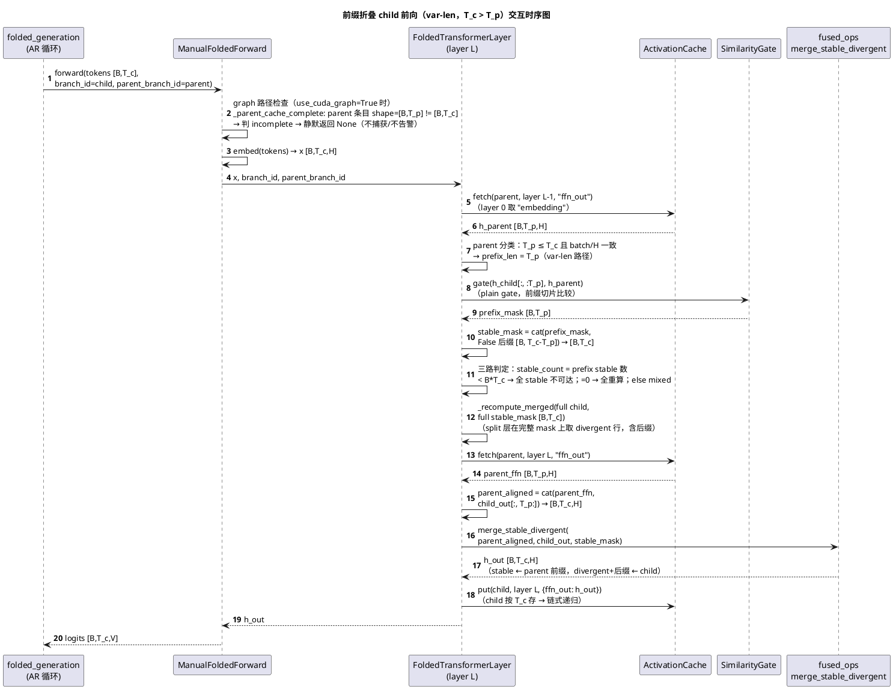
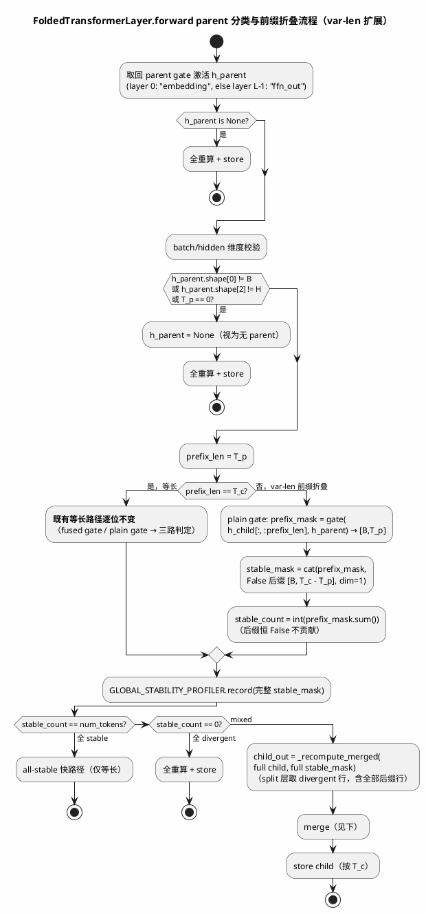
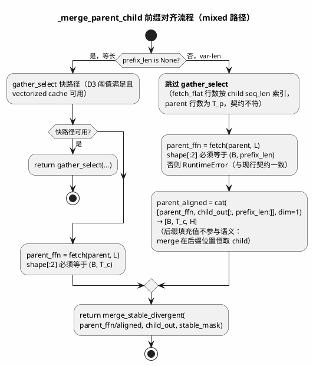
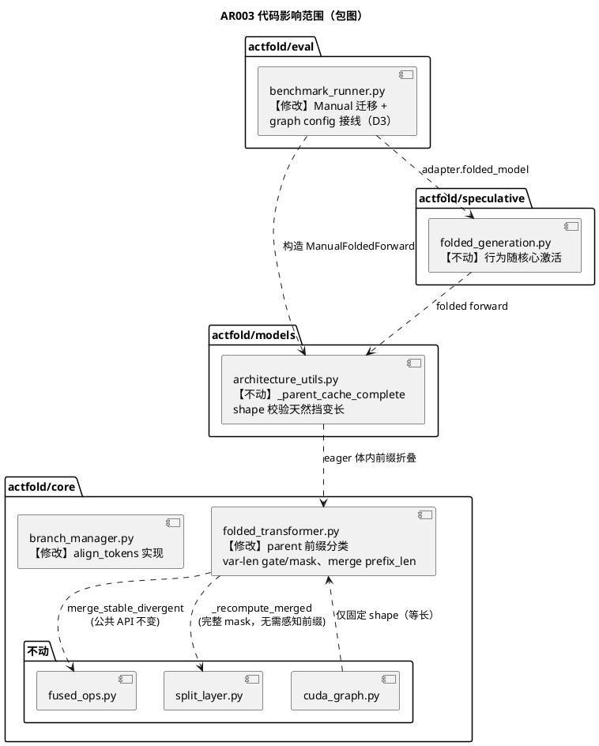

# AR003 详细设计 — 变量长度前缀折叠（P3-1）+ AR002 遗留接线

# 1 AR概述

| 组件名称 | ActFold 折叠引擎（actfold/core）+ 评估接线（actfold/eval） |
| --- | --- |
| AR系统流水号 | AR003 |
| AR描述 | 实现 append-only 前缀折叠：parent `[B, T_p]` 与 child `[B, T_c]`（`T_c ≥ T_p`、batch 相同）共享前缀时，前缀位置走既有相似度门控复用 parent 激活、后缀位置恒 divergent 全量重算；使 `folded_generate` 在 AR 生成中真正折叠（因果模型前缀 stable ≈ 1）；完成 AR002 遗留接线（`BenchmarkRunner` 迁移 `ManualFoldedForward` + 消费 `ActFoldConfig.use_cuda_graph/graph_capacity_ratio`）；实现 `BranchManager.align_tokens` 前缀对齐。 |

## 需求/设计变更记录

| 日期 | 变更 | 说明 |
| --- | --- | --- |
| 2026-10-10 | 初版 | 基于 srs.md v1（req 门控 PASS 第 1 轮） |
| 2026-10-10 | W1–W4 消解 | design 门控第 1 轮 PASS 后：补独立测试用例（§6.2/6.4）、增补集中决策记录表（§4.5）、EC-6 落定直传 None 单分支、docstring 笔误修正 |

## 决策记录

| 编号 | 决策 | 理由 | 影响面 |
| --- | --- | --- | --- |
| D1 | 采用方案 A（层内前缀切片），拒绝方案 B（零填充归一化）/ C（KV-cache 增量重算） | B 在 `tau<0` 时零向量 cosine=0 被误判 stable 并复制零（静默数值污染），且破坏 all-stable 快路径形状检查、每层额外 zero-fill；C 改变数学路径属 P2-4 邻接超范围。A 是唯一同时满足"等长零回归"与"任意 tau 稳健"的方案 | folded_transformer.py |
| D2 | var-len 前缀 gate 不走 `fused_gate_mask_count`，走 plain gate | fused 契约要求同形连续输入（fused_ops.py shape 校验），前缀切片非连续；`B*T_p ≥ 1024` 阈值在 AR 变长负载几乎不可达；plain gate stride 感知天然支持切片 | folded_transformer.py（等长 fused 路径逐位不变） |
| D3 | `config.use_cuda_graph=True` 时 `_build_folded_model` 不构造 FoldingScheduler | graph 契约（AGENTS #37）要求无 scheduler；恒挂 scheduler 使 use_cuda_graph 永远静默降级 = 假接线。动态 tau 与 graph 互斥，CHANGELOG/AGENTS 声明 | benchmark_runner.py |
| D4 | `align_tokens` 返回前缀对齐对，不改三元组契约 | 签名不变；未对齐后缀长度由调用方从 tokens 形状自行获知；本方法无生产消费者（API 完整性交付） | branch_manager.py |

# 2 动态行为

## 2.1 交互时序图



# 3 功能点分解

| 序号 | 功能点名称 | 功能点描述 |
| --- | --- | --- |
| 1 | parent 前缀分类 | gate 取回 parent 激活后按 `T_p` vs `T_c`、batch、hidden 维度分类：可前缀对齐（`1 ≤ T_p ≤ T_c` 且 batch/H 一致）→ `prefix_len`；不可用（`T_p > T_c` / batch 或 H 不匹配 / 缺失）→ 视为无 parent 全重算（srs §3.1） |
| 2 | 前缀 gate + 完整 mask 组装 | plain gate 在前缀切片上比较得 `prefix_mask [B,T_p]`；完整 mask = `cat([prefix_mask, False 后缀], dim=1)`；后缀恒 divergent 与 tau 无关（srs §3.1，决策 D2） |
| 3 | 前缀三路判定与 merge | 全 stable 快路径仅 `T_p == T_c` 可达（`stable_count ≤ B*T_p < B*T_c`）；mixed 路径 parent ffn 前缀对齐（后缀以 child 重算值填充）后走既有 `merge_stable_divergent`；`gather_select` 快路径 var-len 跳过；child 激活按 `T_c` 存储支持链式递归（srs §3.1） |
| 4 | `BranchManager.align_tokens` 前缀对齐 | `T_c ≥ T_p` 返回前缀对齐 `(h_parent, h_child)`；`T_c < T_p` / batch 不同 → `ValueError`；等长行为逐位不变（srs §3.2，决策 D4） |
| 5 | `folded_generate` 端到端真正折叠 | AR 每步 child = parent+1 → 前缀折叠激活；因果合成模型 tokens 与 eager 全重算完全一致、stable_ratio > 0.5；graph 模式零干扰（不捕获、零告警、不禁用）（srs §3.3） |
| 6 | benchmark_runner 迁移 Manual + graph config 接线 | `_build_folded_model` 构造 `ManualFoldedForward`（消费 `use_cuda_graph`/`graph_capacity_ratio`）；架构检测失败 → `None`；`use_cuda_graph=True` 时不构造 FoldingScheduler（决策 D3）；deprecated `FoldedModel` 退出生产路径（srs §3.4） |

# 4 实现设计

## 4.1 功能实现思路

核心洞察：**前缀折叠不是新机制，而是既有折叠机制的前缀对齐实例化**。既有等长折叠 = "全部位置可对齐" 的特例（`prefix_len == T_c`）；本 AR 把 parent 可用性判定从"形状全等"泛化为"前缀可对齐"（`T_p ≤ T_c` + batch/hidden 一致），gate/merge/三路判定/store 全部复用既有代码，仅在两个点做前缀适配：

1. **gate 输入与 mask 组装**（功能点 2）：比较在前缀切片上进行，完整 mask 显式拼接全 False 后缀——显式 False 保证语义对任意 `tau` 稳健（对比方案 B 零填充：`tau<0` 时零向量 cosine=0 会被误判 stable 并复制零，静默污染）；
2. **merge 的 parent ffn 对齐**（功能点 3）：parent ffn `[B,T_p,H]` 与 child 重算后缀 `cat` 成 `[B,T_c,H]` 后走既有 merge（后缀位置 mask=False 本就取 child 值，填充值仅为形状合规，不参与语义）。

数学依据（因果模型）：AR 生成中 child 前缀 token 与 parent 相同 → causal attention 下前缀各层 hidden 与 parent 逐位一致 → cosine ≈ 1 → 前缀全 stable → merge 取 parent ffn（== baseline 重算值）→ 折叠输出与全重算逐位一致，仅省去前缀位置的重复计算。非因果/玩具模型下相似度由 gate 实际判定，折叠决策保守正确（divergent 全重算）。

**等长路径零回归保证**：`prefix_len == T_c` 时走现有代码路径逐位不变（分类分支显式短路）；fused gate、`gather_select`、graph 捕获、all-stable 快路径均只在等长路径出现。

**graph 零改动**：`ManualFoldedForward._parent_cache_complete` 的 shape 校验（AR002）天然把变长 parent 判为 incomplete → 静默 eager（不捕获、不告警、不禁用）→ eager 体内前缀折叠生效。`cuda_graph.py` 不动。

**修改文件清单**：

| 文件 | 变更类型 | 内容 |
| --- | --- | --- |
| `actfold/core/folded_transformer.py` | 修改 | parent 前缀分类（替换 :170 形状守卫）、var-len gate/mask 组装、`_merge_parent_child`/`_get_parent_ffn_output` 增可选 `prefix_len` |
| `actfold/core/branch_manager.py` | 修改 | `align_tokens` 实现（替换 NotImplementedError） |
| `actfold/eval/benchmark_runner.py` | 修改 | `_build_folded_model` 迁移 Manual + config 接线（D3） |
| `tests/test_branch_manager.py` | 修改 | align_tokens 前缀用例 |
| `tests/test_folded_transformer_varlen.py` | 新增 | 前缀折叠核心用例（参考合成语义对拍） |
| `tests/test_folded_generation.py` | 修改 | folded_generate 真折叠 + graph 零干扰用例 |
| `tests/test_benchmark_runner.py`（或既有位置） | 修改 | Manual 迁移 + config 接线用例 |
| `README.md` / `AGENTS.md` / `CHANGELOG.md` / `docs/OPTIMIZATION_GUIDE.md` / `docs/ALGORITHM.md` | 修改 | 文档收口（T006） |

不修改：`fused_ops.py`（公共 API 不动，var-len 在调用侧适配）、`split_layer.py`（`_recompute_merged` 在完整 mask 上工作，无需感知前缀）、`cuda_graph.py`、`architecture_utils.py`、`folded_generation.py`（行为随核心激活，无代码变更）、`config_manager.py`（字段已定义已校验）。

## 4.2 功能实现设计

### 4.2.1 流程图





### 4.2.2 流程说明

**正常流程：** parent 取回 → 前缀分类（batch/H/T_p 校验）→ 等长走现有路径（逐位不变）/ 变长走前缀 gate + False 后缀 mask → 三路判定 → mixed 路径全 child 重算（attention 上下文完整，AGENTS #1 不变）→ parent ffn 前缀对齐 → 既有 merge → child 按 `T_c` 存储（下一步 parent = 本 child，链式递归天然成立）。

**异常/降级流程：**
- parent 缺失 / batch 或 H 不匹配 / `T_p > T_c` / `T_p == 0` → 视为无 parent，全重算（与 cache miss 同语义，**从不抛错**）；
- mixed 路径 parent ffn（layer L）缺失但 gate h_parent（layer L-1）存在 → `RuntimeError`（与现行等长 mixed 路径契约一致，不吞错）；
- scheduler 禁用层 → 全重算（现行）；
- graph 模式变长步骤 → `_parent_cache_complete` shape 校验判 incomplete → **静默** eager（不捕获、零 UserWarning、不禁用未来捕获）；固定 shape 场景 graph 契约不变；
- `attention_mask` 非 None → 按 child 长度照常传给 original layer（既有行为），gate/merge 不感知 mask。

**分支语义自洽性：** 全 stable 快路径要求 `stable_count == B*T_c`，而 var-len 时 `stable_count ≤ B*T_p < B*T_c`（后缀恒 False）→ 数学上不可达，无需额外守卫；等长时 `prefix_len == T_c` 分支显式短路到现有代码。

### 4.3 接口描述

#### 4.3.1 修改：`FoldedTransformerLayer.forward`（`actfold/core/folded_transformer.py`）

公共签名不变。内部变更：

1. **parent 分类**（替换现行 :170 形状守卫）：
   ```python
   # h_parent 取回后：
   if h_parent is not None and (
       h_parent.shape[0] != hidden_states.shape[0]          # batch 不匹配
       or h_parent.shape[2] != hidden_states.shape[2]       # hidden 不匹配
       or h_parent.shape[1] == 0                            # 空序列防御
       or h_parent.shape[1] > hidden_states.shape[1]        # T_p > T_c：不支持截断复用
   ):
       h_parent = None  # 视为无 parent，全重算（cache miss 同语义）
   prefix_len = h_parent.shape[1] if h_parent is not None else None
   ```
2. **var-len gate/mask**（`prefix_len is not None and prefix_len < T_c` 时）：
   ```python
   prefix_mask = self.gate(hidden_states[:, :prefix_len], h_parent)  # [B, T_p]
   stable_mask = torch.cat(
       [prefix_mask, torch.zeros(B, T_c - prefix_len, dtype=torch.bool, device=dev)],
       dim=1,
   )  # [B, T_c]，后缀恒 False
   ```
   决策 D2：var-len **不调用** `fused_gate_mask_count`——其 shape 契约要求 `h_child.shape == h_parent.shape` 的连续输入（fused_ops.py 校验），前缀切片非连续且 `B*T_p ≥ 1024` 阈值在 AR 变长负载几乎不可达；plain gate（PyTorch 算子）stride 感知，天然支持切片。等长路径的 fused gate 调用逐位不变。
3. `stable_count = int(stable_mask.sum())`（var-len 无 count buffer；等长路径 fused count buffer 机制不变）。

#### 4.3.2 修改：`FoldedTransformerLayer._merge_parent_child` / `_get_parent_ffn_output`

```python
def _merge_parent_child(
    self,
    parent_branch_id: str,
    stable_mask: torch.Tensor,
    child_out: torch.Tensor,
    prefix_len: int | None = None,   # 新增可选参数；None = 等长（现行行为逐位不变）
) -> torch.Tensor:
    """... var-len: 跳过 gather_select 快路径，parent ffn 前缀对齐后走既有 merge。"""

def _get_parent_ffn_output(
    self,
    parent_branch_id: str,
    stable_mask: torch.Tensor,
    prefix_len: int | None = None,   # 新增可选参数
) -> torch.Tensor:
    """... var-len: 校验 ffn.shape[:2] == (B, prefix_len) 而非 mask 形状；
    缺失仍 raise RuntimeError（契约一致）。"""
```

var-len 对齐：
```python
parent_aligned = torch.cat([parent_ffn, child_out[:, prefix_len:]], dim=1)
return merge_stable_divergent(parent_aligned, child_out, stable_mask)
```
`cat` 的一次 `[B,T_c,H]` 分配仅在 var-len mixed 路径发生（非 graph、非热路径），可接受。

`gather_select` 快路径（`_GATHER_SELECT_*` 阈值）在 `prefix_len is not None` 时跳过：`fetch_flat(branch, layer, batch, seq_len)` 按 child `seq_len` 索引 parent 行，而 var-len parent 行数为 `T_p`，契约不符。等长快路径逐位不变。

#### 4.3.3 实现：`BranchManager.align_tokens`（`actfold/core/branch_manager.py`）

签名不变，替换 `NotImplementedError`（决策 D4）：

```python
def align_tokens(self, parent: Branch, child: Branch) -> tuple[torch.Tensor, torch.Tensor]:
    """Return prefix-aligned parent and child layer-0 hidden states.

    append-only 前缀语义：T_c >= T_p 时返回前缀对齐对
    (parent.hidden_states[0], child.hidden_states[0][:, :T_p])，
    两者均为 [B, T_p, H]；未对齐后缀长度 T_c - T_p 由调用方从
    tokens 形状获知。T_p == T_c 时与现行返回逐位一致。

    Raises:
        ValueError: T_c < T_p（child 非 parent 的前缀扩展，不做截断）
            或 batch 维度不一致。
    """
```

校验：`child.tokens.shape[0] != parent.tokens.shape[0]` → `ValueError`；`child.tokens.shape[1] < parent.tokens.shape[1]` → `ValueError`；返回前缀对齐对。本方法无生产消费者（API 完整性交付，`tests/test_branch_manager.py` 消费）。

#### 4.3.4 修改：`BenchmarkRunner._build_folded_model`（`actfold/eval/benchmark_runner.py`）

```python
def _build_folded_model(self, diffusion_model: Any) -> ManualFoldedForward | None:
    """Wrap the underlying nn.Module with ManualFoldedForward if possible.

    架构检测失败（detect_architecture 抛 RuntimeError）→ None，
    对齐现行 folding_applied=False → None 语义。
    """
    raw_model = getattr(diffusion_model, "model", None)
    if raw_model is None:
        return None
    cache = make_activation_cache(...)      # 现行不变
    gate = SimilarityGate(tau=..., metric=...)  # 现行不变
    scheduler = None if self.config.use_cuda_graph else FoldingScheduler(...)  # 决策 D3
    try:
        return ManualFoldedForward(
            raw_model,
            cache=cache,
            gate=gate,
            scheduler=scheduler,
            split_layers=self.config.use_split_layers,
            split_min_tokens=self.config.split_min_tokens,
            use_cuda_graph=self.config.use_cuda_graph,
            graph_capacity_ratio=self.config.graph_capacity_ratio,
        )
    except RuntimeError:
        return None  # 无 layer 栈 / 无 embedding（AGENTS #23 检测失败语义）
```

- **决策 D3**：`use_cuda_graph=True` 时不构造 `FoldingScheduler`——graph 契约（AGENTS #37）要求无 scheduler，恒挂 scheduler 会使 `use_cuda_graph=True` 永远静默降级（假接线）。动态 tau 与 graph 互斥，CHANGELOG/AGENTS 声明。
- `_build_engine` 属性兼容：`ManualFoldedForward.cache/gate/scheduler` 均存在，读法不变；**EC-6 已落定**：`ActFoldVerificationEngine.__init__(scheduler: FoldingScheduler | None = None)`（verification_engine.py:58）且使用处 None-safe（:233-234）→ D3 下 `folded.scheduler` 为 None 时**直传 None**，engine 构造与行为均合规，无需备用分支。
- import 清理：`FoldedModel` 从 `actfold.core` import 中移除（pyflakes 零未用）。
- `BenchmarkRunner` 类 docstring 中 `FoldedModel` 表述改为 `ManualFoldedForward`。
- 返回类型注解 `FoldedModel | None` → `ManualFoldedForward | None`。

### 4.4 代码设计



分层不变：折叠引擎（core）独立于模型加载（models）与评估（eval）；本 AR 无跨层 API 新增，仅 eval 层消费既有 core 构造器。

# 5 重构设计

`BenchmarkRunner._build_folded_model` 从 deprecated `FoldedModel` 迁移到 `ManualFoldedForward` 属生产路径切换（AR002 既定方向）：无 in-place 变异（Manual 不改 base model）、`state_dict` 零漂移、行为等价性由 AR002 bit-exact 测试保证。deprecated `FoldedModel` API 本身保留（仅退出 benchmark_runner 生产构造路径），移除计划不变（随 AR002 CHANGELOG 已声明）。

# 6 测试设计

| 测试点描述 | 选择测试专项 | 测试因子描述 | 组合方式 | 逻辑覆盖程度 |
|--|--|--|--|--|
| 前缀折叠核心语义 | UT | T_p vs T_c（</==/>）、batch（同/异）、H（同/异）、prefix 相似度（全 stable/全 divergent/mixed）、后缀长度（1/>1） | 全遍历（因子空间小） | 判定覆盖 |
| 三路判定 + 链式递归 | UT | stable_count（0/部分/全前缀）、代数（parent→child→grandchild）、split 层开/关 | 全遍历 | 路径覆盖 |
| align_tokens API | UT | T_c（</==/> T_p）、batch（同/异） | 全遍历 | 判定覆盖 |
| folded_generate 端到端 | 接口/集成 | 因果合成模型、步数 ≥4、graph on/off、折叠 vs eager 全重算 | 全遍历 | 路径覆盖 |
| benchmark_runner 接线 | 接口 | use_cuda_graph（T/F）、架构可检测/不可检测、graph_capacity_ratio 传播 | 全遍历 | 判定覆盖 |
| 等长零回归 | 全量回归 | 既有 628 用例 + demo 基线 | 全遍历 | 语句覆盖 |

## 6.1 单元测试（UT）

新增 `tests/test_folded_transformer_varlen.py`（参考合成语义对拍 = `mask = concat(gate(child_prefix, parent), False_suffix)`；`out = merge(parent_ffn_prefix_aligned, child_recompute, mask)`）：

| 用例 | 覆盖功能点 | 断言 |
| --- | --- | --- |
| UT-101 align 等长不变 | 4 | 与现行返回逐位一致 |
| UT-102 align 前缀对齐 | 4 | `T_c > T_p` → `(parent[0], child[0][:, :T_p])` 形状/值一致 |
| UT-103 align 非法 | 4 | `T_c < T_p` → ValueError；batch 异 → ValueError |
| UT-201 mixed 前缀折叠参考对拍 | 1,2,3 | `T_p < T_c` mixed → 输出 == 参考合成语义逐位一致 |
| UT-202 后缀恒 divergent | 2 | 后缀位置输出 == child 重算值（即使 tau 极低/极高） |
| UT-203 T_p > T_c 全重算 | 1 | 输出 == baseline 全重算；无异常 |
| UT-204 batch/H 不匹配全重算 | 1 | 输出 == baseline 全重算 |
| UT-205 前缀全 stable 走 mixed | 3 | 输出 == parent 前缀 ∪ child 后缀（参考语义）；**不**走 all-stable 快路径（后缀存在） |
| UT-206 前缀全 divergent 全重算 | 3 | 输出 == baseline |
| UT-207 链式递归 | 3 | T4→T5→T6 三代：各代 cache 条目 shape 正确、输出 == 各代参考 |
| UT-208 split 层 var-len | 3 | `B*T_c ≥ 512` + split 开：divergent 索引含全部后缀行；FFN 仅算 divergent；输出 == 参考 |
| UT-209 等长对照 | 1,2,3 | `T_p == T_c` 显式用例：行为与迁移前逐位一致（含 fused gate 路径） |
| UT-210 `T_p == 0` 防御 | 1 | 空 parent 条目 → 视为无 parent 全重算，输出 == baseline，无异常 |

`tests/test_branch_manager.py` 追加 UT-101~103（或置于 varlen 文件，按既有文件归属）。

## 6.2 接口测试

| 用例 | 覆盖 | 断言 |
| --- | --- | --- |
| IT-301 folded_generate 因果真折叠 | 5 | 因果合成模型 ≥4 步：tokens 与 eager 全重算**完全一致**；`stable_ratio > 0.5`；每步 cache 长度递增 |
| IT-302 graph 零干扰 | 5 | `use_cuda_graph=True` + folded_generate：`graph_runner is None`、**零 UserWarning**（`pytest.warns` 反向断言）、tokens 一致 |
| IT-303 BenchmarkRunner Manual 迁移 | 6 | config 驱动：`folded_model` isinstance `ManualFoldedForward`；`use_cuda_graph`/`graph_capacity_ratio` 从 config 传播 |
| IT-304 架构不可检测 → None | 6 | 无 layer 栈模型 → `folded_model is None`（不抛） |
| IT-305 D3 scheduler 策略 | 6 | `use_cuda_graph=True` → folded.scheduler is None；False → isinstance FoldingScheduler |
| IT-306 raw_model 缺失早退 | 6 | `diffusion_model.model` 不存在 → `folded_model is None`（现行早退保留） |

## 6.3 业务场景测试

| 用例 | 断言 |
| --- | --- |
| BS-401 AR002 等长固定 shape 验证循环回归 | graph 捕获/replay 全部既有用例不回归（变长不触碰该路径） |
| BS-402 demo 基线 | 85.5% / 2.35e-03 / 93.75% 精确匹配（等长路径零回归的全局证据） |
| BS-403 全量测试 | 628 passed 基线不回归 + 新增用例全绿 |

## 6.4 异常场景测试

| 用例 | 场景 | 断言 |
| --- | --- | --- |
| EX-501 parent ffn 缺失 | gate h_parent（L-1）存在但 layer L ffn 被逐出 | RuntimeError（契约与现行等长 mixed 一致，不吞错） |
| EX-502 cache 完全 miss | parent_branch_id 无条目 | 全重算，无异常 |
| EX-503 attention_mask 非 None 变长 | child 长度 mask | 输出 == 参考（mask 正常传 original layer） |
| EX-504 scheduler 禁用层 | disabled_layers 含 L | 该层全重算（现行） |
| EX-505 var-len parent ffn shape 不符 | gate h_parent 存在但 layer L ffn shape[:2] != (B, prefix_len) | RuntimeError（§4.3.2 声明契约的独立触发用例） |
| EX-506 EC-9 逐出致链断裂 | `max_entries_per_layer` 逐出 parent 条目后继续生成 | 该代视 cache miss 全重算，无异常，后续步骤可重新建链 |

## 6.5 srs 验收追溯矩阵（G14）

| srs 验收标准 | 追溯用例 |
| --- | --- |
| §3.1-1 mixed 前缀 == 参考逐位 | UT-201 |
| §3.1-2 等长零回归 | UT-209 + BS-401 + BS-402 + BS-403 |
| §3.1-3 T_p > T_c 全重算 | UT-203 |
| §3.1-4 后缀分布正确性 | UT-202 + UT-205 + UT-206 |
| §3.2-1 前缀对齐无 NotImplementedError | UT-102 |
| §3.2-2 等长逐位一致 | UT-101 |
| §3.2-3 非法 ValueError | UT-103 |
| §3.3-1 tokens 一致 + ratio > 0.5 | IT-301 |
| §3.3-2 graph 零干扰 | IT-302 + BS-401 |
| §3.3-3 AR002 等长循环不回归 | BS-401 |
| §3.4-1 Manual + config 传播 | IT-303 |
| §3.4-2 不可检测 → None | IT-304 |
| §3.4-3 graph flag 行为 | IT-305 + IT-302（§3.3 契约约束） |
| NFR（§4） | BS-402 + BS-403 + T007 质量门（mypy/pyflakes/100 列） |

> 门控补强（W1）：EC-10/11/12 与逐出链断裂（EX-505/506、UT-210、IT-306）为 design 门控第 1 轮后补充的独立触发用例，归并理由不再适用。

> Review 第 1 轮（S5 修复）：异常用例测试函数落点（tests/test_folded_transformer_varlen.py）——
> EX-501 → `test_varlen_parent_ffn_missing_raises`（`_DictActivationCache` 只存 embedding，mixed 路径 RuntimeError）；
> EX-503 → `test_varlen_attention_mask_passthrough`（`MaskSensitiveLayer`，child 长度 mask 正常传 original layer，输出 == mask 感知参考合成）；
> EX-505 → `test_varlen_parent_ffn_shape_mismatch_raises`（既有）；
> EX-506 → `test_varlen_cache_eviction_breaks_and_rebuilds_chain`（`max_entries_per_layer=T_PARENT` 预算下 sibling put 逐出 parent：该代 miss 全重算无异常，孙代对新建链正常折叠）。
> 全量 not-slow 基线更新为 652 passed / 3 skipped / 3 deselected。

## 边界条件矩阵（开发/评审对照）

| # | 场景 | 行为 | 用例 |
| --- | --- | --- | --- |
| EC-1 | `T_p == T_c` | 等长路径逐位不变 | UT-209 |
| EC-2 | `1 ≤ T_p < T_c`，batch/H 同 | 前缀折叠 | UT-201 |
| EC-3 | `T_p > T_c` | 无 parent，全重算 | UT-203 |
| EC-4 | batch 或 H 不匹配 / `T_p == 0` | 无 parent，全重算 | UT-204 |
| EC-5 | 后缀长度 ≥ 1 任意分布 | 恒 divergent | UT-202/205/206 |
| EC-6 | `scheduler=None` 传入 `ActFoldVerificationEngine` | **已落定**：engine 签名 `scheduler: FoldingScheduler \| None = None`（verification_engine.py:58），使用处 None-safe（:233-234）→ D3 下直传 None，无备用分支 | IT-303/305 |
| EC-10 | `_build_folded_model` 早退：`diffusion_model.model` 不存在 | 返回 None（现行行为保留） | IT-306 |
| EC-11 | `T_p == 0`（空序列防御） | parent 无效，全重算 | UT-210 |
| EC-12 | var-len parent ffn shape 与 `(B, prefix_len)` 不符 | RuntimeError（与现行等长 mixed 契约一致，不吞错） | EX-505 |
| EC-7 | graph 变长步骤 | `_parent_cache_complete` False → 静默 eager | IT-302 |
| EC-8 | `B*T_p ≥ 1024` + CUDA（var-len） | 仍走 plain gate（D2：fused 契约 + 切片非连续）；行为正确性优先 | UT-201（CPU 即可断言语义） |
| EC-9 | `max_entries_per_layer` 逐出致链断裂 | 该代视 cache miss 全重算，无异常 | EX-506（`test_varlen_cache_eviction_breaks_and_rebuilds_chain`） |
