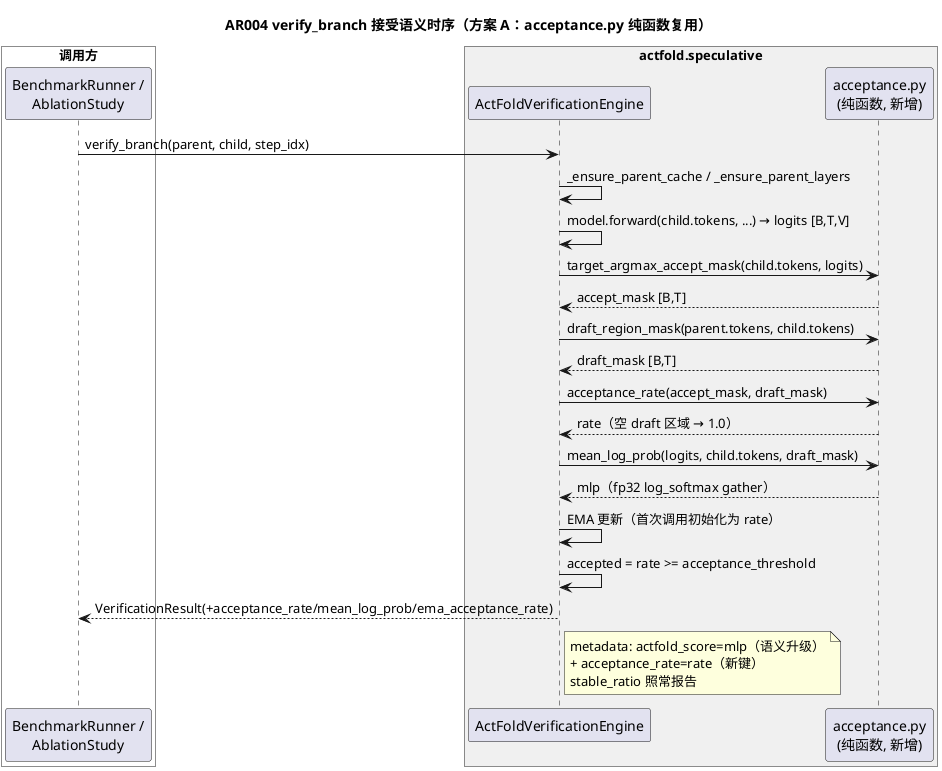
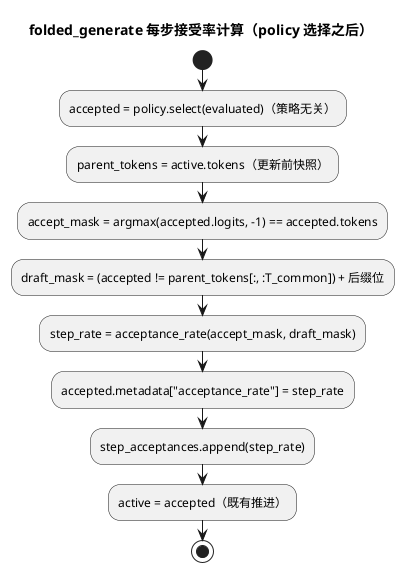

# [AR004] AR 详细设计

# 1 AR 概述

| 组件名称 | actfold.speculative（投机解码验证子系统） |
| --- | --- |
| AR 系统流水号 | AR004 |
| AR 描述 | 真投机解码接受语义（P2-5）：target-argmax 接受率（同位置预测约定）、draft 区域 mean log-prob 分数替换两处占位、EMA[r] 跨调用追踪、接受判定切换至真语义、`TargetMatchAcceptancePolicy` 与 `folded_generate` 接受率报告 |

**现状锚点（已 req 门控实证）：**
- `verification_engine.py:122` `score = logits.float().mean().item()` 占位 → `actfold_score`；
- `verification_engine.py:126` `accepted = stable_ratio >= acceptance_threshold`（默认 0.0 全接受）；
- `spiffy_baseline.py:77` 同类占位 → `baseline_score`；
- `VerificationResult`（:20-31）无接受率/log-prob/EMA 字段；`FoldedGenerationResult`（folded_generation.py:40-45）无 acceptance_rate；
- `actfold_score` 唯一代码消费点 test_integration.py:169 为序数比较（语义升级安全）。

# 2 动态行为

## 交互时序图



# 3 功能点分解

| 序号 | 功能点名称 | 功能点描述 | srs 追溯 |
| --- | --- | --- | --- |
| F1 | 接受语义纯函数库 | `acceptance.py`：同位置 argmax 接受 mask、draft 区域 mask、接受率、mean log-prob | §3.1/§3.2 |
| F2 | 引擎接入与结果字段 | `verify_branch` 计算 rate/mlp/EMA，`VerificationResult` 三新字段，`:122` 占位替换 | §3.1/§3.2/§3.3 |
| F3 | 接受判定切换 | `accepted = acceptance_rate >= threshold`（默认 0.0 零变化） | §3.4 |
| F4 | target-match 策略 | `TargetMatchAcceptancePolicy` 按候选 appended-token 接受率选择 | §3.5 |
| F5 | folded_generate 接受率报告 | per-step metadata + `FoldedGenerationResult.acceptance_rate` 跨步均值 | §3.5 |
| F6 | SpiffyBaseline 分数替换 | `baseline_score` = 全位置 mean log-prob | §3.2 |
| F7 | 文档收口 | AGENTS #40、CHANGELOG、OPTIMIZATION_GUIDE P2-5 ✅ + 回链 | §3.6 |

# 4 实现设计

## 4.1 功能实现思路

新增 `actfold/speculative/acceptance.py` 承载全部接受语义纯函数（方案 A）；
`verification_engine` / `acceptance_policy` / `spiffy_baseline` / `folded_generation`
四方通过 import 复用，形状校验单一来源。核心契约：**同位置预测约定**
（target 前向 `logits[:, i]` 预测位置 i 的 token——Fast-dLLM/SPIFFY 并行验证
契约，合成 TinyModel 的 token-wise head 同构）；**draft 区域** = child 与
parent 公共前缀 `[:, :min(T_p, T_c)]` 的差异位 + child 变长后缀位
（`T_p < T_c` 时 `[T_p, T_c)`）；纯复用位不计入。

## 4.2 功能实现设计

### 4.2.1 流程图

```plantuml
@startuml
title verify_branch 接受语义与判定流程（替换 :122-:130）

start
:logits = model.forward(child.tokens, ...)  # 既有;
:accept_mask = argmax(logits, dim=-1) == child.tokens
（target_argmax_accept_mask, 同位置）;
:draft_mask = (child != parent[:, :T_common])
             + 变长后缀位（T_c > T_p 时）;
if (draft_mask 无 True 位?) then (是)
  :rate = 1.0（无新 draft，全部已接受语义）;
  :mlp = 0.0（无可评分位，文档化约定）;
else (否)
  :rate = accept_mask[draft_mask].float().mean();
  :mlp = fp32 log_softmax(logits)[child.tokens]
        在 draft_mask 上的均值;
endif
:EMA 更新（首次: ema=rate; 之后: ema=α·rate+(1-α)·ema）;
:metadata["actfold_score"] = mlp（语义升级）;
:metadata["acceptance_rate"] = rate（新键）;
if (rate >= acceptance_threshold?) then (是)
  :child.accepted = True;
else (否)
  :child.accepted = False;
  :cache.clear_branch(child.branch_id)（既有不变）;
endif
:return VerificationResult(… + rate/mlp/ema);
stop
@enduml
```



### 4.2.2 流程说明

- **同位置约定**是全链唯一预测约定，不做按模型类型分发（真实 checkpoint
  接入时再评估）；文档显式声明（AGENTS #40）。
- **draft 区域泛化**：`T_c < T_p`（child 短于 parent）时公共前缀 = `T_c`，
  draft = 其中差异位（无后缀位）——与 folded 层 no-parent 语义
  （AGENTS #20）不冲突：接受语义只关心"child 的哪些位是新主张"。
- **EMA 首次初始化**：`ema_acceptance_rate` 属性初值 0.0（benchmark 可读
  空闲值）；首次 verify 直接置为当次 rate（避免 0 先验稀释），此后按
  `α·rate + (1-α)·ema` 迭代。
- **判定切换**：默认 `threshold=0.0` 下 `rate >= 0.0` 恒真（rate ∈ [0,1]），
  与现行全接受逐位等价 → 默认行为零变化；rejected 分支 cache 清理沿用。
- **folded_generate 解耦**：接受率计算在 policy 选择之后对 accepted 节点
  执行，与 policy 类型无关（Greedy 默认路径也报告）；`draft_mask` 用的
  parent 是本步推进前的 active 快照。
- **SpiffyBaseline**：独立基线无 parent 对比，`mean_log_prob(logits,
  branch.tokens)` 全位置（mask=None），接受选择逻辑（最高分）不变。

## 4.3 接口描述

### 4.3.1 新增模块 `actfold/speculative/acceptance.py`

```python
def target_argmax_accept_mask(child_tokens: torch.Tensor, logits: torch.Tensor) -> torch.Tensor:
    """Per-position accept mask: child token == same-position target argmax.

    Args:
        child_tokens: [B, T] int64 draft tokens.
        logits: [B, T, V] target forward logits (same-position convention).

    Returns:
        [B, T] bool accept mask.

    Raises:
        ValueError: shapes inconsistent (tokens.ndim != 2, logits.ndim != 3,
            batch/seq mismatch, or dtype not integral).
    """

def draft_region_mask(parent_tokens: torch.Tensor, child_tokens: torch.Tensor) -> torch.Tensor:
    """Positions carrying new draft claims: prefix diffs + appended suffix.

    Draft region = positions where child differs from parent over the common
    prefix [:, :min(T_p, T_c)] plus the appended suffix [T_p, T_c) when
    T_c > T_p. Positions identical to the parent are already-verified reuse.

    Returns:
        [B, T_c] bool mask.

    Raises:
        ValueError: batch mismatch.
    """

def acceptance_rate(accept_mask: torch.Tensor, draft_mask: torch.Tensor) -> float:
    """Mean accept over draft positions; empty draft region -> 1.0.

    Raises:
        ValueError: accept_mask/draft_mask shape mismatch.
    """

def mean_log_prob(logits: torch.Tensor, tokens: torch.Tensor, mask: torch.Tensor | None = None) -> float:
    """fp32 log-softmax gather mean over masked positions (None = all).

    Empty mask -> 0.0 (no scored positions; documented convention, not a
    probability claim).

    Raises:
        ValueError: shape mismatch.
    """
```

### 4.3.2 `ActFoldVerificationEngine`（修改）

```python
def __init__(..., ema_alpha: float = 0.3) -> None:
    # Raises ValueError unless 0 < ema_alpha <= 1
    self.ema_acceptance_rate: float = 0.0   # 公开属性，benchmark/ablation 可读
    self._ema_initialized: bool = False
```

`verify_branch`（:113-:130 区块改写，签名不变）：
- 新增计算 rate/mlp/EMA（4.2.1 流程图）；
- `child_branch.metadata["actfold_score"] = mean_log_prob`（语义升级）；
- 新增 `child_branch.metadata["acceptance_rate"] = rate`；
- 判定行 `accepted = acceptance_rate >= self.acceptance_threshold`；
- 返回值新增三字段。

### 4.3.3 `VerificationResult`（修改，字段追加于末尾）

```python
@dataclass(frozen=True)
class VerificationResult:
    ...  # 既有 8 字段不动
    acceptance_rate: float = 0.0
    mean_log_prob: float = 0.0
    ema_acceptance_rate: float = 0.0
```

### 4.3.4 `TargetMatchAcceptancePolicy`（新增，acceptance_policy.py）

```python
class TargetMatchAcceptancePolicy(AcceptancePolicy):
    """Select the candidate whose appended token matches the target argmax."""

    def select(self, candidates: list[BranchNode], logits: torch.Tensor | None = None) -> BranchNode:
        # per candidate: node.logits is None -> skip; rate = mean(
        #   node.tokens[:, -1] == node.logits[:, -1].argmax(-1))
        # pick max rate; tie -> first; all skipped -> candidates[0]
```

### 4.3.5 `FoldedGenerationResult`（修改，字段追加于末尾）

```python
@dataclass
class FoldedGenerationResult:
    ...  # 既有 4 字段不动
    acceptance_rate: float = 0.0
```

### 4.3.6 `SpiffyBaseline.verify`（修改）

`score = mean_log_prob(logits, branch.tokens)`（全位置）；选择逻辑与
`baseline_score` 键名不变。

## 4.4 代码设计

```
actfold/speculative/
├── acceptance.py            ← 新增（F1：纯函数库，无第三方依赖、无状态）
├── verification_engine.py   ← 修改（F2/F3：wiring + EMA + 判定切换）
├── acceptance_policy.py     ← 修改（F4：新增策略类，既有两类不动）
├── folded_generation.py     ← 修改（F5：per-step 计算与结果字段）
├── spiffy_baseline.py       ← 修改（F6：分数替换）
├── __init__.py              ← 修改（仅导出 acceptance 公共函数；保持既有不导出
│                               policy 类的风格——策略从 acceptance_policy 模块导入，design 门控 W3）

tests/
├── test_acceptance.py       ← 新增（纯函数 UT）
├── test_verification_engine.py ← 扩展（引擎集成/EMA/判定切换 UT）
├── test_folded_generation.py   ← 扩展（策略/报告 UT）
└── test_integration.py      ← 扩展（SpiffyBaseline/端到端 IT）

文档：AGENTS.md（#40 新条目）、CHANGELOG.md（AR004 节）、
docs/OPTIMIZATION_GUIDE.md（P2-5 ✅ + 第十一部分回链）；
README.md 检查验证行为描述段（如有相似度-only 表述则更新，无则不动）。
```

模块化要点：`acceptance.py` 无状态纯函数（可并行/可缓存/可独立测试），
四方消费方零循环依赖；`speculative/__init__.py` 导出保持既有风格。

## 4.5 集中决策记录表

| ID | 决策 | 理由 |
| --- | --- | --- |
| D1 | 独立纯函数模块（方案 A，否决内联/mixin） | 三方复用消除重复、形状校验单一来源（消解 req 门控 Minor #3）、可测性最佳 |
| D2 | `T_c < T_p`：draft 区域 = 公共前缀 `T_c` 内差异位（不抛 ValueError） | 行为自然泛化；与 folded 层 no-parent 语义不冲突；batch 不匹配仍 ValueError（与 align_tokens 契约对齐）——消解 req 门控 Minor #2 |
| D3 | `ema_alpha` 默认 0.3、域 (0,1]、首次调用直接初始化 | 0.3 为常用平滑系数；α=1 退化为瞬时值（合法）；α≤0 永不更新（非法）；首次初始化避免 0 先验稀释 |
| D4 | 判定切换至 `acceptance_rate >= threshold`，默认 0.0 零变化 | srs §3.4 契约；rate ∈ [0,1] 恒 ≥ 0.0 → 默认全接受与基线逐位等价 |
| D5 | 空 draft 区域：rate=1.0、mlp=0.0 | "无新主张"语义上全部接受；mlp 无可评分位，0.0 为文档化哨兵（非概率主张）；文档显式声明 |
| D6 | `actfold_score`/`baseline_score` 键名不变、仅语义升级 | 消费面为序数比较（test_integration.py:169），零破坏；语义变更走 AGENTS/CHANGELOG 文档化 |
| D7 | folded_generate 接受率计算与 policy 解耦（选择后对 accepted 计算） | 默认 Greedy 路径也报告；策略可插拔不侵入指标采集 |

# 5 重构设计

无（纯新增语义 + 三处定向替换；既有接口签名零变化）。

# 6 测试设计

## 6.1 单元测试（UT）

覆盖率口径（design 门控 W2）：变更模块行覆盖率沿用 AR003 报告口径——post-hoc
`coverage report` 报告，无硬性门槛（srs §4 质量门为 mypy/pyflakes/100 列）。

新文件 `tests/test_acceptance.py`（纯函数，CPU 足够）：

| ID | 覆盖点 | 断言 |
| --- | --- | --- |
| UT-301 | `target_argmax_accept_mask` 同位置匹配 | 受控 logits（指定每位置 argmax）：部分匹配 → mask 精确；全匹配/全不匹配边界；多 batch 行独立 |
| UT-302 | `draft_region_mask` 区域定义 | 等长：仅差异位 True；append-only（T_c>T_p）：差异位+全后缀位；T_c<T_p：公共前缀差异位、无后缀位；batch 不匹配 → ValueError |
| UT-303 | `acceptance_rate` | 部分匹配精确比例；空 draft 区域 → 1.0；全接受/全拒绝边界 |
| UT-304 | `mean_log_prob` | 与 `torch.log_softmax(logits.float()).gather` 参考逐位一致；mask 子集 = 子集均值；空 mask → 0.0；fp32 累计（大 logits 无 inf） |
| UT-305 | 形状校验 | logits ndim≠3 / tokens ndim≠2 / batch 不一致 / 序列长不一致 → ValueError；非整数 dtype tokens → ValueError；accept_mask/draft_mask 形状不一致 → ValueError |

扩展 `tests/test_verification_engine.py`：

| ID | 覆盖点 | 断言 |
| --- | --- | --- |
| UT-306 | 引擎集成：result 三新字段 + metadata | 受控 adapter（ScriptedLogitsAdapter 指定 argmax）：`acceptance_rate` 精确、`mean_log_prob` == 手算、`actfold_score` == mean_log_prob（新语义）、`ema_acceptance_rate` 报告；`stable_ratio` 照常 |
| UT-307 | EMA 追踪 | 首次 verify → ema == rate；连续两次 → α·r2+(1-α)·r1 手算一致；多次迭代链式；`ema_alpha` 越界（0/负/>1）→ ValueError；属性空闲值 0.0 |
| UT-308 | 判定切换 | 默认 threshold=0.0：与基线一致全接受（含 rate=0.0 的 child）；threshold=0.8+rate=0.5 → False 且 cache 清理（contains 变 False）；threshold=0.8+rate=1.0 → True |

扩展 `tests/test_folded_generation.py`：

| ID | 覆盖点 | 断言 |
| --- | --- | --- |
| UT-309 | `TargetMatchAcceptancePolicy` | 受控候选（logits 指定 argmax 匹配/不匹配 appended token）：选接受率最高者；并列取首个；logits=None 候选跳过；全 None → 首个 |
| UT-310 | folded_generate 报告 | 受控模型多步生成：`FoldedGenerationResult.acceptance_rate` == 跨步均值；accepted 节点 metadata 含 `acceptance_rate`；默认参数（Greedy 路径）token 输出与基线一致（零回归） |

## 6.2 接口测试

| ID | 接口 | 覆盖 |
| --- | --- | --- |
| IT-401 | `verify_branch` 端到端（TinyModel 真前向） | 真 logits 下 rate/mlp 与手工对拍一致；`VerificationResult` 兼容构造（既有 8 字段位置构造不破坏——dataclass 追加默认字段）；`actfold_score` 消费序数（test_integration.py:169 既有用例）不回归 |
| IT-402 | `folded_generate` 端到端（CausalCumsumModel） | 既有因果模型用例 + acceptance_rate 报告（数值有限、∈[0,1]）；graph 模式不变 |

## 6.3 业务场景测试

| ID | 场景 | 断言 |
| --- | --- | --- |
| BS-501 | benchmark 路径（`BenchmarkRunner`→engine） | `BenchmarkRunner` 构造 engine 默认参数不破坏（ema_alpha 默认注入）；`SpiffyBaseline.verify` `baseline_score` == 全位置 mean log-prob（受控 logits 手算对拍）；选择逻辑（最高分）不变 |
| BS-502 | 全量回归 | 652 passed / 3 skipped / 3 deselected 基线 + 新增全绿，零回归 |
| BS-503 | demo 基线 | 85.5% / 2.35e-03 / 93.75% 精确不变（demo 未消费新字段，纯增量） |

## 6.4 异常场景测试

| ID | 异常 | 断言 |
| --- | --- | --- |
| EX-601 | logits/tokens 形状不匹配（engine 路径） | `verify_branch` 传播 ValueError（受控 adapter 返回畸形 logits） |
| EX-602 | parent/child batch 不匹配 | `draft_region_mask` → ValueError（engine 路径传播） |
| EX-603 | `ema_alpha` 非法（0 / 负 / >1） | 构造函数 ValueError |
| EX-604 | 空 draft 区域（child ≡ parent 等长） | rate=1.0、mlp=0.0、判定接受（默认阈值）；无异常 |
| EX-605 | policy 候选 logits 缺失 | `TargetMatchAcceptancePolicy` 跳过 None 候选不抛错；全 None → 首个候选 |

## 6.5 srs 验收追溯矩阵（G14）

| srs 验收标准 | 追溯用例 |
| --- | --- |
| §3.1-1 受控 argmax 部分匹配 rate 精确（含 0/1 边界） | UT-301 + UT-303 + UT-306 |
| §3.1-2 child ≡ parent 等长 → rate=1.0 | UT-303 + EX-604 |
| §3.1-3 变长 child 仅后缀位计入 | UT-302（append-only 行） |
| §3.1-4 形状不匹配 ValueError | UT-305 + EX-601/602 |
| §3.2-1 actfold_score == log_softmax 手算 | UT-304 + UT-306 |
| §3.2-2 baseline_score == 全位置 mean log-prob | BS-501 |
| §3.2-3 既有 actfold_score 断言零回归 | IT-401 + BS-502 |
| §3.3-1 首次 EMA == r1 | UT-307 |
| §3.3-2 连续 EMA 手算一致 | UT-307 |
| §3.3-3 ema_alpha 越界 ValueError | UT-307 + EX-603 |
| §3.4-1 默认 threshold 零回归 | UT-308 + BS-502 |
| §3.4-2 threshold=0.8+rate=0.5 → False | UT-308 |
| §3.4-3 threshold=0.8+rate=1.0 → True | UT-308 |
| §3.5-1 策略选接受率最高候选 | UT-309 |
| §3.5-2 默认路径零回归 + 报告跨步均值 | UT-310 + IT-402 |
| §3.5-3 单步 rate 0.0/1.0 精确可控 | UT-309 + UT-310 |
| §3.6-1 文档 grep 断言 | T005 验收（AGENTS 含 同位置/draft 区域/EMA/threshold 关键词条目；CHANGELOG 含 AR004 节；OPTIMIZATION_GUIDE P2-5 行含 ✅ 与 AR004 回链） |
| NFR（§4） | BS-502 + BS-503 + T006 质量门 |

## 边界条件矩阵（开发/评审对照）

| # | 场景 | 行为 | 用例 |
| --- | --- | --- | --- |
| EC-1 | draft 区域为空（child ≡ parent 等长） | rate=1.0 / mlp=0.0 / 接受 | EX-604 |
| EC-2 | `T_c > T_p`（append-only，AR003 场景） | 差异位 + 全后缀位计入 | UT-302 |
| EC-3 | `T_c < T_p`（child 短） | 公共前缀差异位、无后缀位（D2 泛化） | UT-302 |
| EC-4 | batch 不匹配（parent/child 或 logits/tokens） | ValueError | UT-302/305 + EX-602 |
| EC-5 | logits ndim/序列长/vocab 维畸形 | ValueError | UT-305 + EX-601 |
| EC-6 | 非整数 tokens dtype | ValueError | UT-305 |
| EC-7 | `ema_alpha` ∈ {0, 负, >1} / =1.0 合法退化 | ValueError / 瞬时值 | UT-307 |
| EC-8 | rate=0.0 + 默认阈值 | 接受（恒 ≥ 0.0） | UT-308 |
| EC-9 | 策略候选 logits=None / 全 None | 跳过 / 首个候选兜底 | UT-309 + EX-605 |
| EC-10 | 大 vocab / 大 logits fp32 稳定性 | log_softmax 无 inf/nan | UT-304 |
| EC-11 | 单候选 / 空候选（policy） | 单候选直返；空候选沿用既有契约（调用方 guard） | UT-309 |
| EC-12 | max_new_tokens=0（folded_generate 无步） | result.acceptance_rate=0.0（空均值哨兵） | UT-310 |
