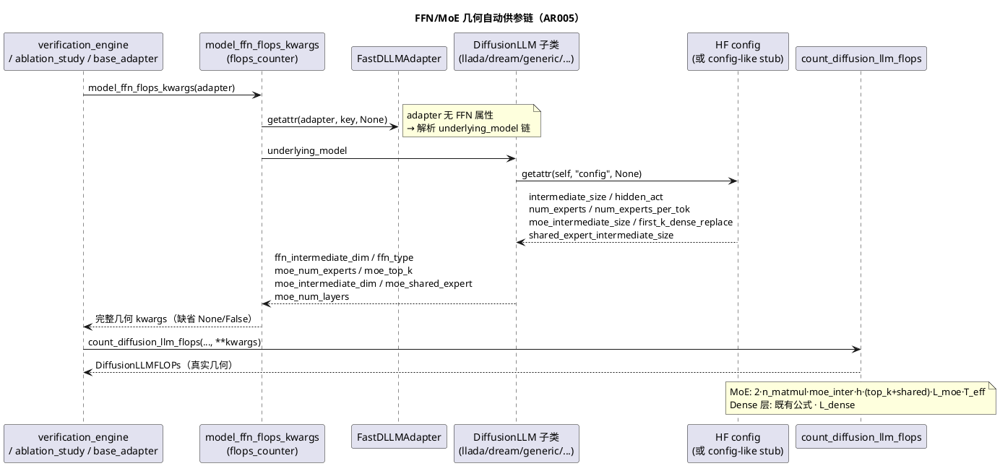
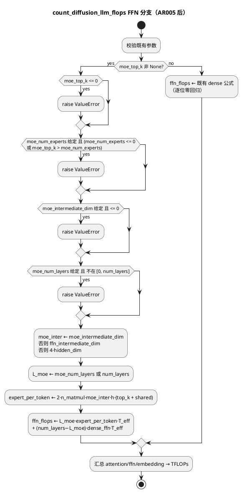
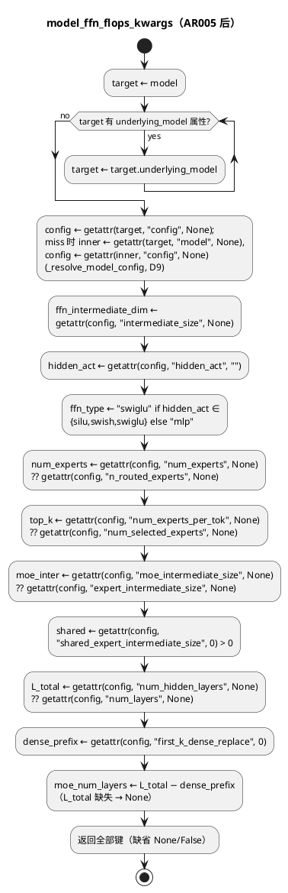

# 1 AR概述

| 组件名称 | actfold/utils（flops_counter）+ actfold/models（base）+ speculative/eval 调用点 |
| --- | --- |
| AR系统流水号 | AR005 |
| AR描述 | FFN/MoE FLOPs 几何修正收口（P3-4）：真实 HF config 的 FFN 几何（中间维/SwiGLU 拓扑/MoE 属性族）自动流到全部 `model_ffn_flops_kwargs` 调用点；`count_diffusion_llm_flops` 补齐 MoE per-token expert 计量（routed top-k ± shared，含 dense/MoE 混合层数）；无属性路径逐位零回归 |

# 2 动态行为

## 交互时序图



# 3 功能点分解

| 序号 | 功能点名称 | 功能点描述 | srs 追溯 |
| --- | --- | --- | --- |
| 1 | MoE FLOPs 计量 | `count_diffusion_llm_flops` 新增 `moe_num_experts/moe_top_k/moe_intermediate_dim/moe_shared_expert/moe_num_layers` 参数；per-token expert FLOPs = `2·n_matmul·moe_inter·h·(top_k+shared)`；dense/MoE 混合层数支持（`moe_num_layers`，默认全层） | §3.2 |
| 2 | FFN 几何 config 提取 | `DiffusionLLM` base 具体（非抽象）属性：`ffn_intermediate_dim`/`ffn_type`/MoE 属性族，鸭子类型读 `self.config`，缺失回退 | §3.1 |
| 3 | helper 链解析 | `model_ffn_flops_kwargs` 解析 `underlying_model` 包装链；返回字典新 MoE 键（默认 None/False，键只增不改） | §3.1 |
| 4 | SwiGLU 族判定 | `hidden_act` ∈ {silu, swish, swiglu}（LLaMA 系 gate/up/down 3 矩阵）→ `"swiglu"`；其余 → `"mlp"` | §3.1 |
| 5 | 端到端供参实证 | engine/ablation/base_adapter 三调用点经 config-like stub 拿到真实几何；合成模型零回归 | §3.3 |
| 6 | 文档收口 | AGENTS #33 修订、CHANGELOG、指南 P3-4 ✅ + 第十二部分回链、TFLOPs 口径注记 | §3.4 |

# 4 实现设计

## 4.1 功能实现思路

**方案对比（核心问题：几何属性放哪、如何穿透 adapter 包装）：**

- **方案 A：helper 集中链解析（推荐）** —— 几何提取逻辑全放
  `flops_counter.py`（`model_ffn_flops_kwargs` 内解析 `underlying_model` 链后
  getattr 并集），`DiffusionLLM` base 只加具体属性读 `self.config`。
  优点：单一改动点（helper 是三调用点公共入口）、adapter 零改动、
  AblationStudy 的裸 adapter 场景天然覆盖（链解析到 raw nn.Module → 默认）；
  缺点：helper 知道 `underlying_model` 约定（轻微耦合，AGENTS #35 已有契约）。
- **方案 B：adapter 属性转发** —— `FastDLLMAdapter` 加 6 个 property 转发
  `_model`。优点：调用点不动；缺点：提取逻辑分散（base 一份、转发一份）、
  裸 nn.Module（无 config）仍要在 adapter 里再做鸭子类型、AblationStudy
  包装层不透明。
- **方案 C：模型注册表声明式几何** —— 每个模型家族在 registry 里登记
  geometry 提取器。优点：显式；缺点：家族分发违背 srs 约束（鸭子并集、
  未知家族安全回退），过度设计。

**选定方案 A。** 无法满足"未知家族 → dense 安全回退"的方案 C 排除；B 的
分散逻辑在 AblationStudy（AGENTS #35 传裸 adapter + underlying_model）场景
下不可靠。

## 4.2 功能实现设计

### 4.2.1 流程图



`model_ffn_flops_kwargs` 提取流程：



### 4.2.2 流程说明

1. **触发键是 `moe_top_k`**：per-token FLOPs 只依赖 top-k（每 token 激活
   top_k 个专家），`moe_num_experts` 仅用于容量校验（`top_k <= num_experts`）
   ——单独给 `num_experts` 不激活 MoE 计量（req 门控 WARN-② 收口：域校验
   可执行、语义明确）。
2. **dense/MoE 混合**（req 门控 WARN-① 收口）：`moe_num_layers` 默认
   `num_layers`（全 MoE，Qwen2-MoE 情形）；config 有
   `first_k_dense_replace`（DeepSeek 系）时 `moe_num_layers =
   num_hidden_layers − first_k_dense_replace`，前缀 dense 层按 dense 几何
   计。
3. **shared expert**：`shared_expert_intermediate_size > 0` 判存在，等价
   +1 个恒激活专家（其中间维与 routed 专家可能不同，此处按 routed
   `moe_inter` 近似——文档注记；差异 <5% 量级）。
4. **SwiGLU 判定**：HF `hidden_act` 为 `silu`/`swish`/`swiglu` 且 LLaMA 系
   gate/up/down 结构 → 3 矩阵；`gelu*`/`relu*` → 2 矩阵。未知名 →
   `"mlp"`（保守，不高于现状高估）。
5. **回退链**：`moe_intermediate_dim` → `ffn_intermediate_dim` →
   `4·hidden_dim`；全部 None → 与现行输出逐位一致。
6. **router FLOPs 忽略**：~`h·num_experts` 每 token，< expert FFN 的 1%，
   文档注记（AGENTS #33）。

## 4.3 接口描述

### 4.3.1 `count_diffusion_llm_flops`（扩展，flops_counter.py）

```python
def count_diffusion_llm_flops(
    num_layers: int,
    hidden_dim: int,
    num_heads: int,
    seq_len: int,
    vocab_size: int,
    num_steps: int,
    reuse_ratio: float = 0.0,
    ffn_intermediate_dim: int | None = None,
    ffn_type: str = "mlp",
    include_attention_t2: bool = False,
    moe_num_experts: int | None = None,
    moe_top_k: int | None = None,
    moe_intermediate_dim: int | None = None,
    moe_shared_expert: bool = False,
    moe_num_layers: int | None = None,
) -> DiffusionLLMFLOPs:
```

- 新参数全带默认值（None/False），缺省路径与现行逐位一致；
- `ffn_type` 语义扩展为"专家/FFN 激活拓扑"（MoE 时描述每个专家的矩阵数）；
- Raises：`moe_top_k <= 0`；`moe_num_experts` 给定且（`moe_num_experts <= 0`
  或 `moe_top_k > moe_num_experts`）；`moe_intermediate_dim <= 0`；
  `moe_num_layers` 给定且不在 `[0, num_layers]` → ValueError。

### 4.3.2 `model_ffn_flops_kwargs`（扩展）

```python
def model_ffn_flops_kwargs(model: Any) -> dict[str, Any]:
    # 返回键（只增不改）：
    # ffn_intermediate_dim: int | None   # 原有
    # ffn_type: str                       # 原有（"mlp"/"swiglu"）
    # moe_num_experts: int | None         # 新
    # moe_top_k: int | None               # 新
    # moe_intermediate_dim: int | None    # 新
    # moe_shared_expert: bool             # 新
    # moe_num_layers: int | None          # 新
```

- 解析 `underlying_model` 链（`while hasattr(target, "underlying_model")`）
  到被包装模型再取属性；链上任何一层直接暴露属性也接受（getattr 并集：
  先查 target 本身，miss 才下钻）。
- **实现偏离记录（review D4）**：实际实现先钻透 `underlying_model` 链
  （有界 `range(8)` 深度，防自引用环），仅对**链尾 target** 做属性并查 +
  `_resolve_model_config` 直读。当前代码库无中间层暴露几何的类
  （`FastDLLMAdapter` 不暴露），无行为影响；若未来出现中间层暴露几何的
  包装器，需改为逐层并查。

### 4.3.3 `DiffusionLLM` base 具体属性（models/base.py）

**config 获取链（门控 Critical 修复）**：真实子类（CausalLMDiffusionLLM /
GenericDiffusionLLM 及 LLaDA/Dream/FastDLLM 家族）的 HF config 位于
`self.model.config`（causal_lm.py:63 / generic.py:70 局部变量直读，
无 `self.config` 赋值）。base 新增**具体转发 property**：

```python
@property
def config(self) -> Any:
    """HF config of the loaded model, if available (None otherwise)."""
    model = getattr(self, "model", None)
    return getattr(model, "config", None) if model is not None else None
```

```python
@property
def ffn_intermediate_dim(self) -> int | None: ...      # _extract_ffn_geometry(self.config)
@property
def ffn_type(self) -> str: ...                          # hidden_act SwiGLU 族判定
@property
def moe_num_experts(self) -> int | None: ...
@property
def moe_top_k(self) -> int | None: ...
@property
def moe_intermediate_dim(self) -> int | None: ...
@property
def moe_shared_expert(self) -> bool: ...
@property
def moe_num_layers(self) -> int | None: ...             # num_hidden_layers − first_k_dense_replace
```

- 全部具体（非抽象）property，经 `self.config`（上述转发链）取值；
  config 缺失/属性缺失 → None/False/None（不抛错）；
- `model_ffn_flops_kwargs` 的链尾 config 解析用**同一条链**
  （`_resolve_model_config(target)`：`getattr(target, "config", None)` →
  miss 则 `getattr(getattr(target, "model", None), "config", None)`），
  保证 base-property 路径与 helper 直读路径喂给
  `_extract_ffn_geometry` 的是**同一个 config 对象**（D4 前提显式成立）；
  该解析同时覆盖裸 HF nn.Module（`.config` 直有）与"包装了 HF 模型但非
  DiffusionLLM"的对象（`.model.config`）。

**优先级顺序（helper 内，对每个几何键）**：target 自身属性（如
DiffusionLLM 的 7 个 property）→ miss → `_resolve_model_config(target)` 直读
config 提取。

### 4.3.4 `FastDLLMAdapter`：零改动

链解析在 helper 内完成（方案 A）。

## 4.4 代码设计

```
actfold/
├── utils/flops_counter.py      # count_diffusion_llm_flops MoE 扩展 + model_ffn_flops_kwargs
│                                #   链解析 + _extract_ffn_geometry(config) 私有共享函数
├── models/base.py               # DiffusionLLM 7 个具体几何 property（调 _extract_ffn_geometry）
└── (speculative/verification_engine.py、eval/ablation_study.py、eval/base_adapter.py：零改动)
tests/
├── test_flops_counter.py        # 扩展：MoE 公式/校验/零回归（UT-401~406, EX-701~705）
├── test_models.py               # 扩展：base 属性 + SwiGLU 判定（UT-407~410）
└── test_verification_engine.py  # 扩展：config stub 端到端供参（IT-411）
```

- 模块边界：几何提取单一实现在 `_extract_ffn_geometry`（flops_counter 内，
  base property 复用）——避免 base 与 helper 双份判定逻辑漂移；
- 三调用点零改动是本设计的核心收益（helper 是公共入口）；
- MVP 考量：MoE 公式 + config 并集提取为最小可用集；真实 MoE checkpoint
  实测留 RERUN_CHECKLIST（Out of Scope）。

# 5 重构设计

无独立重构；`ffn_type` docstring 语义微扩（"FFN/专家激活拓扑"），调用面
（`"mlp"`/`"swiglu"` 字面值）不变。

# 6 测试设计

## 6.1 单元测试（UT）

| ID | 测试 | 断言 |
| --- | --- | --- |
| UT-401 | MoE per-token 公式精确 | `moe_num_experts=8, top_k=2, moe_inter=I, swiglu, L, T, steps` → ffn_tflops == 手算 `2·3·I·h·2·L·T·steps/1e12`（reuse=0） |
| UT-402 | shared expert 系数 | 同上 + `moe_shared_expert=True` → 系数 (2+1)；单独 shared（top_k 缺失）不激活 |
| UT-403 | dense/MoE 混合层数 | `moe_num_layers=2`（L=4）→ 2 层 MoE + 2 层 dense 公式之和；`first_k_dense_replace` 链路（stub config）同值 |
| UT-404 | reuse_ratio 语义不变 | MoE 参数 + `reuse_ratio=0.5` → T_eff 减半作用在 MoE/dense 两段 |
| UT-405 | 缺省零回归 | 不传 MoE 参数 → 输出与现行（4h/mlp）逐位一致（含 attention/embedding 分量） |
| UT-406 | moe_inter 回退链 | `moe_intermediate_dim=None` + `ffn_intermediate_dim=I` → moe_inter=I；两者均 None → 4h |
| UT-407 | SwiGLU 族判定 | `hidden_act ∈ {silu, swish, swiglu}` → "swiglu"；`{gelu, gelu_new, relu, ""}` → "mlp"（`_extract_ffn_geometry` 直测） |
| UT-408 | base 属性提取 | DiffusionLLM 子类 stub **仅经 `.model.config` 暴露几何**（真实路径证明，非 `.config` 直挂）→ 7 属性逐一正确；config 缺失（model None）→ 全回退不抛错 |
| UT-409 | helper 链解析 | adapter(underlying_model=DiffusionLLM stub，几何仅在 `.model.config`) → 取到真实几何（真实 checkpoint 路径）；裸 nn.Module → 默认；嵌套两层包装 → 穿透；`num_experts ?? n_routed_experts` / `num_experts_per_tok ?? num_selected_experts` / `moe_intermediate_size ?? expert_intermediate_size` 别名并集 |
| UT-410 | 键只增不改 | 返回字典含全部 7 键，既有 2 键值语义不变（无属性时 ffn_intermediate_dim=None、ffn_type="mlp"） |

## 6.2 接口测试

| ID | 测试 | 断言 |
| --- | --- | --- |
| IT-411 | engine 端到端供参 | config-like stub **经 `.model.config`**（真实 DiffusionLLM 路径）构造 → FastDLLMAdapter 进 engine，`verify_branch` 的 result.tflops == 用真实几何手算 `count_diffusion_llm_flops(..., **kwargs)`（≠ 4h 默认值） |
| IT-412 | ablation/base_adapter 供参 | 两调用点以同一 stub（monkeypatch 或直接构造）确认 kwargs 注入（可直接对 `_flops_budget`/TFLOPs 上报路径单测或以 helper+手算等价断言） |

## 6.3 业务场景测试（BS）

| ID | 场景 | 断言 |
| --- | --- | --- |
| BS-601 | 全量零回归 | 703 passed / 3 skipped / 3 deselected 不变 |
| BS-602 | demo 基线 | 85.5% / 2.35e-03 / 93.75% 精确一致（合成模型走默认几何） |
| BS-603 | 质量门 | mypy（AGENTS 标准命令）clean、pyflakes clean、100 列 |

## 6.4 异常场景测试（EX）

| ID | 场景 | 断言 |
| --- | --- | --- |
| EX-701 | `moe_top_k=0`/负数 | ValueError |
| EX-702 | `moe_top_k > moe_num_experts`（两者均给定）/ `moe_num_experts <= 0`（top_k 给定时） | ValueError |
| EX-703 | `moe_intermediate_dim <= 0` | ValueError |
| EX-704 | `moe_num_layers` 越界（<0 或 >num_layers） | ValueError |
| EX-705 | config 属性全缺失/半缺失 | 不抛错、回退默认（dense 计量），含 `intermediate_size` 存在但 MoE 属性缺失 → dense SwiGLU 正常计 |

## 6.5 覆盖率口径

post-hoc：`coverage run -m pytest tests\test_flops_counter.py tests\test_models.py -q` +
`coverage report --include=actfold/utils/flops_counter.py,actfold/models/base.py`，
目标 statements ≥ 90%（既有 flops_counter 高覆盖延续）。

# 7 需求追溯（G 矩阵）

| srs 验收标准 | 设计/测试 |
| --- | --- |
| §3.1-1 config stub → helper 返回真实几何 | 4.3.2/4.3.3 + UT-407/408/409/410 |
| §3.1-2 裸 nn.Module → 默认零回归 | 4.2.2-5 + UT-405/409 + BS-601 |
| §3.2-1 MoE 手算公式 | 4.2.1 + UT-401/402/403 |
| §3.2-2 缺省 dense 逐位一致 | UT-405 |
| §3.2-3 top_k 域校验 | 4.2.2-1 + EX-701/702（含 `moe_num_experts <= 0`） |
| §3.3-1 engine 真实几何 TFLOPs | IT-411 |
| §3.3-2 合成模型零回归 | UT-405 + BS-601/602 |
| §3.4 文档齐全 | T004（grep 可验证：AGENTS #33 修订/CHANGELOG/指南 ✅+回链） |

# 8 设计决策表

| ID | 决策 | 理由 |
| --- | --- | --- |
| D1 | 方案 A：helper 集中链解析（`underlying_model` while 穿透） | 单一改动点、三调用点零改动、AblationStudy 裸 adapter 天然覆盖 |
| D2 | `moe_top_k` 是 MoE 计量触发键；`num_experts` 仅容量校验 | per-token FLOPs 只依赖 top_k；语义明确（req WARN-②） |
| D3 | `moe_num_layers` 默认全层；`first_k_dense_replace` 自动推导 | 覆盖 Qwen2-MoE（全 MoE）与 DeepSeek 系（前 k 层 dense），消除全层假设高估（req WARN-①） |
| D4 | 几何提取单一实现 `_extract_ffn_geometry(config)`，base property 复用 | 避免 base/helper 双份判定漂移 |
| D5 | SwiGLU 族 = {silu, swish, swiglu}（HF hidden_act 字符串） | LLaMA/Qwen 系标准约定；未知名 → mlp（保守低估方向） |
| D6 | shared expert 按 routed `moe_inter` 近似（+1 专家） | 中间维差异 <5% 量级，文档注记；避免第 8 个参数 |
| D7 | HF 属性并集鸭子类型（num_experts ?? n_routed_experts 等三组别名） | 不做家族分发（srs 约束），未知家族安全回退 dense |
| D8 | router FLOPs 忽略（<1%，文档注记） | 量级论证，避免伪精度 |
| D9 | config 获取链：base 新增 `config` 转发 property（`self.model.config`），helper 链尾 `_resolve_model_config` 同链复用 | 真实子类 config 在 `self.model.config`（门控 Critical 实证）；两路径同一 config 对象保证 D4 一致性前提 |
